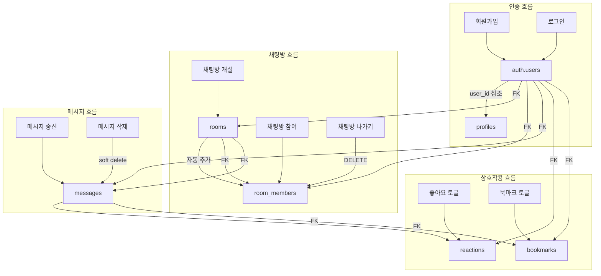
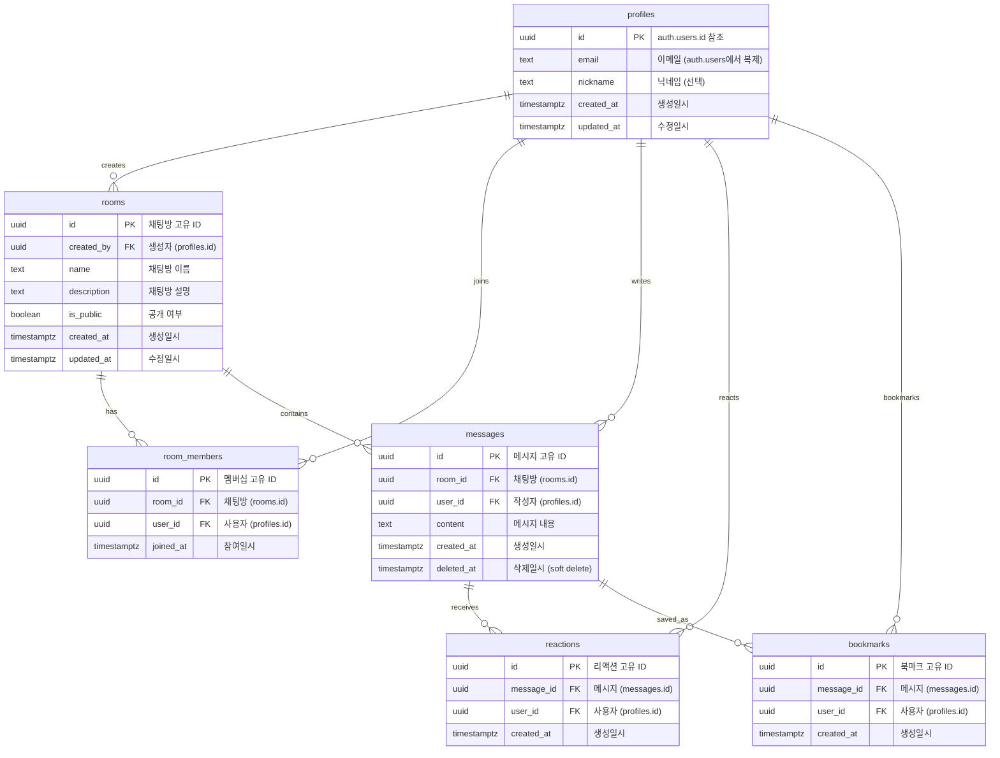
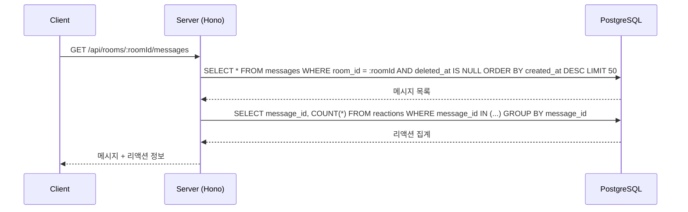
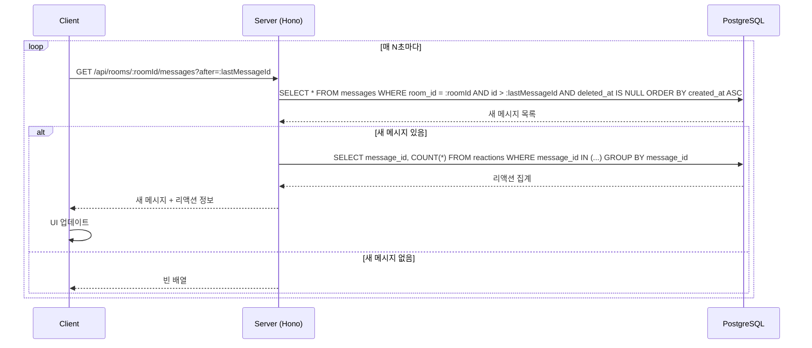

# Database Schema 및 Dataflow 문서

## 1. 데이터베이스 관점 Dataflow 개요



---

## 2. ERD (Entity Relationship Diagram)



---

## 3. 테이블 상세 정의

### 3.1 profiles 테이블

Supabase Auth의 `auth.users` 테이블과 연동되는 사용자 프로필 테이블입니다.

| 컬럼 | 타입 | 제약조건 | 설명 |
|------|------|----------|------|
| id | UUID | PK, FK(auth.users.id) | 사용자 고유 ID |
| email | TEXT | NOT NULL | 이메일 주소 |
| nickname | TEXT | NULL | 닉네임 (선택) |
| created_at | TIMESTAMPTZ | NOT NULL, DEFAULT now() | 생성일시 |
| updated_at | TIMESTAMPTZ | NOT NULL, DEFAULT now() | 수정일시 |

**인덱스:**
- `profiles_pkey`: PRIMARY KEY (id)
- `profiles_email_idx`: UNIQUE (email)

---

### 3.2 rooms 테이블

채팅방 정보를 저장하는 테이블입니다.

| 컬럼 | 타입 | 제약조건 | 설명 |
|------|------|----------|------|
| id | UUID | PK, DEFAULT gen_random_uuid() | 채팅방 고유 ID |
| created_by | UUID | NOT NULL, FK(profiles.id) | 생성자 ID |
| name | TEXT | NOT NULL | 채팅방 이름 |
| description | TEXT | NULL | 채팅방 설명 |
| is_public | BOOLEAN | NOT NULL, DEFAULT true | 공개 여부 |
| created_at | TIMESTAMPTZ | NOT NULL, DEFAULT now() | 생성일시 |
| updated_at | TIMESTAMPTZ | NOT NULL, DEFAULT now() | 수정일시 |

**인덱스:**
- `rooms_pkey`: PRIMARY KEY (id)
- `rooms_created_by_idx`: INDEX (created_by)
- `rooms_is_public_idx`: INDEX (is_public) - 공개 방 목록 조회용
- `rooms_created_at_idx`: INDEX (created_at DESC) - 최신순 정렬용

---

### 3.3 room_members 테이블

채팅방 참여자 정보를 저장하는 N:M 관계 테이블입니다.

| 컬럼 | 타입 | 제약조건 | 설명 |
|------|------|----------|------|
| id | UUID | PK, DEFAULT gen_random_uuid() | 멤버십 고유 ID |
| room_id | UUID | NOT NULL, FK(rooms.id) ON DELETE CASCADE | 채팅방 ID |
| user_id | UUID | NOT NULL, FK(profiles.id) ON DELETE CASCADE | 사용자 ID |
| joined_at | TIMESTAMPTZ | NOT NULL, DEFAULT now() | 참여일시 |

**인덱스:**
- `room_members_pkey`: PRIMARY KEY (id)
- `room_members_room_user_idx`: UNIQUE (room_id, user_id) - 중복 참여 방지
- `room_members_user_id_idx`: INDEX (user_id) - 사용자별 참여 방 조회용

---

### 3.4 messages 테이블

채팅 메시지를 저장하는 테이블입니다. Soft delete를 지원합니다.

| 컬럼 | 타입 | 제약조건 | 설명 |
|------|------|----------|------|
| id | UUID | PK, DEFAULT gen_random_uuid() | 메시지 고유 ID |
| room_id | UUID | NOT NULL, FK(rooms.id) ON DELETE CASCADE | 채팅방 ID |
| user_id | UUID | NOT NULL, FK(profiles.id) ON DELETE CASCADE | 작성자 ID |
| content | TEXT | NOT NULL | 메시지 내용 |
| created_at | TIMESTAMPTZ | NOT NULL, DEFAULT now() | 생성일시 |
| deleted_at | TIMESTAMPTZ | NULL | 삭제일시 (soft delete) |

**인덱스:**
- `messages_pkey`: PRIMARY KEY (id)
- `messages_room_created_idx`: INDEX (room_id, created_at DESC) - 채팅방별 메시지 조회용
- `messages_user_id_idx`: INDEX (user_id) - 작성자별 메시지 조회용
- `messages_polling_idx`: INDEX (room_id, id) WHERE deleted_at IS NULL - 폴링 최적화용

---

### 3.5 reactions 테이블

메시지 좋아요(리액션)를 저장하는 테이블입니다.

| 컬럼 | 타입 | 제약조건 | 설명 |
|------|------|----------|------|
| id | UUID | PK, DEFAULT gen_random_uuid() | 리액션 고유 ID |
| message_id | UUID | NOT NULL, FK(messages.id) ON DELETE CASCADE | 메시지 ID |
| user_id | UUID | NOT NULL, FK(profiles.id) ON DELETE CASCADE | 사용자 ID |
| created_at | TIMESTAMPTZ | NOT NULL, DEFAULT now() | 생성일시 |

**인덱스:**
- `reactions_pkey`: PRIMARY KEY (id)
- `reactions_message_user_idx`: UNIQUE (message_id, user_id) - 중복 리액션 방지
- `reactions_message_id_idx`: INDEX (message_id) - 메시지별 리액션 집계용

---

### 3.6 bookmarks 테이블

사용자의 메시지 북마크를 저장하는 테이블입니다.

| 컬럼 | 타입 | 제약조건 | 설명 |
|------|------|----------|------|
| id | UUID | PK, DEFAULT gen_random_uuid() | 북마크 고유 ID |
| message_id | UUID | NOT NULL, FK(messages.id) ON DELETE CASCADE | 메시지 ID |
| user_id | UUID | NOT NULL, FK(profiles.id) ON DELETE CASCADE | 사용자 ID |
| created_at | TIMESTAMPTZ | NOT NULL, DEFAULT now() | 생성일시 |

**인덱스:**
- `bookmarks_pkey`: PRIMARY KEY (id)
- `bookmarks_message_user_idx`: UNIQUE (message_id, user_id) - 중복 북마크 방지
- `bookmarks_user_id_idx`: INDEX (user_id, created_at DESC) - 사용자별 북마크 목록 조회용

---

## 4. API 엔드포인트별 데이터 흐름

### 4.1 인증 관련

#### 회원가입 (POST /api/auth/signup)
```
Request → Supabase Auth (auth.users INSERT) → profiles INSERT → Response
```

#### 로그인 (POST /api/auth/login)
```
Request → Supabase Auth (auth.users SELECT) → Session 발급 → Response
```

---

### 4.2 채팅방 관련

#### 채팅방 목록 조회 (GET /api/rooms)
```
Request → rooms SELECT (WHERE is_public = true OR user in room_members) → Response
```

#### 채팅방 상세 조회 (GET /api/rooms/:roomId)
```
Request → rooms SELECT → room_members SELECT (멤버 목록) → Response
```

#### 채팅방 생성 (POST /api/rooms)
```
Request → rooms INSERT → room_members INSERT (생성자 자동 추가) → Response
```

#### 채팅방 참여 (POST /api/rooms/:roomId/join)
```
Request → rooms SELECT (존재 확인) → room_members INSERT → Response
```

#### 채팅방 나가기 (DELETE /api/rooms/:roomId/leave)
```
Request → room_members DELETE → Response
```

---

### 4.3 메시지 관련

#### 메시지 목록 조회 (GET /api/rooms/:roomId/messages)
```
Request → messages SELECT (WHERE deleted_at IS NULL)
       → reactions COUNT (집계)
       → bookmarks SELECT (현재 사용자 북마크 여부)
       → Response
```

#### 메시지 전송 (POST /api/rooms/:roomId/messages)
```
Request → room_members SELECT (참여 확인) → messages INSERT → Response
```

#### 메시지 삭제 (DELETE /api/messages/:messageId)
```
Request → messages SELECT (작성자 확인) → messages UPDATE (deleted_at = now()) → Response
```

---

### 4.4 리액션 관련

#### 좋아요 토글 (POST /api/messages/:messageId/reactions)
```
Request → reactions SELECT (기존 리액션 확인)
       → [있으면] reactions DELETE
       → [없으면] reactions INSERT
       → reactions COUNT (집계)
       → Response
```

---

### 4.5 북마크 관련

#### 북마크 목록 조회 (GET /api/bookmarks)
```
Request → bookmarks SELECT (user_id 기준)
       → messages SELECT (원본 메시지 정보)
       → rooms SELECT (채팅방 정보)
       → Response
```

#### 북마크 토글 (POST /api/messages/:messageId/bookmarks)
```
Request → bookmarks SELECT (기존 북마크 확인)
       → [있으면] bookmarks DELETE
       → [없으면] bookmarks INSERT
       → Response
```

---

## 5. 폴링 기반 메시지 동기화 흐름

### 5.1 초기 로드


### 5.2 폴링 (증분 조회)


### 5.3 폴링 쿼리 최적화

폴링 효율성을 위해 `messages_polling_idx` 인덱스를 활용합니다:

```sql
-- 증분 조회 쿼리 (after 파라미터 사용)
SELECT id, room_id, user_id, content, created_at
FROM messages
WHERE room_id = :room_id
  AND id > :last_message_id
  AND deleted_at IS NULL
ORDER BY created_at ASC
LIMIT 100;
```

---

## 6. 제약사항 및 설계 결정

### 6.1 Soft Delete
- 메시지는 물리적 삭제 대신 `deleted_at` 컬럼을 사용한 soft delete 적용
- 삭제된 메시지에 연결된 reactions/bookmarks는 CASCADE로 처리하지 않고 유지
- 북마크 목록에서 삭제된 메시지는 "삭제된 메시지" 로 표시

### 6.2 인덱스 전략
- 읽기 작업이 빈번한 조회에 대해 복합 인덱스 적용
- 폴링 쿼리 최적화를 위한 부분 인덱스 (WHERE deleted_at IS NULL) 적용
- UNIQUE 제약조건으로 중복 데이터 방지 (room_members, reactions, bookmarks)

### 6.3 RLS 비활성화
- Row Level Security(RLS)는 비활성화
- 모든 접근 제어는 Hono 미들웨어 계층에서 처리
- Service Role Key를 사용한 서버 측 데이터 접근

### 6.4 외래 키 CASCADE
- `rooms` 삭제 시: 관련 `room_members`, `messages` 자동 삭제
- `messages` 삭제 시: 관련 `reactions`, `bookmarks` 자동 삭제
- `profiles` 삭제 시: 관련 모든 데이터 자동 삭제
