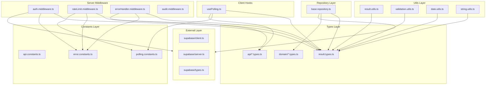

# 공통 모듈 설계 및 구현 계획서

## 1. 개요

### 1.1 목적
폴링 기반 채팅 애플리케이션의 페이지 단위 개발에 앞서, 재사용 가능한 공통 모듈을 TDD 프로세스에 따라 설계하고 구현한다.

### 1.2 기술 스택
| 구분 | 기술 |
|------|------|
| Frontend | Next.js App Router (React 18) + Flux + Context API |
| Server | Hono (@hono/vercel) |
| BaaS | Supabase (PostgreSQL, Auth, SDK/REST API) |
| Test Framework | Vitest + React Testing Library |
| Deployment | Vercel |

### 1.3 모듈 목록

| 우선순위 | 모듈 | 위치 | 설명 |
|----------|------|------|------|
| P0 | Result 타입 | `src/types/common/result.types.ts` | 함수형 에러 처리 패턴 |
| P0 | 도메인 타입 | `src/types/domain/*.types.ts` | 엔티티 타입 정의 |
| P0 | API 타입 | `src/types/api/*.types.ts` | 요청/응답 타입 정의 |
| P0 | 상수 정의 | `src/constants/*.constants.ts` | 폴링, API, 에러 상수 |
| P0 | 유틸리티 함수 | `src/utils/*.utils.ts` | 순수 헬퍼 함수 |
| P0 | Supabase 클라이언트 | `src/external/supabase/*.ts` | 클라이언트 팩토리 |
| P1 | Base Repository | `src/repositories/base.repository.ts` | 공통 Repository 인터페이스 |
| P1 | Hono 미들웨어 | `src/server/middleware/*.ts` | 인증, Rate Limit, 에러 핸들링 |
| P1 | 폴링 훅 | `src/hooks/usePolling.ts` | 공통 폴링 로직 |

---

## 2. 모듈 관계 다이어그램



---

## 3. 상세 구현 계획 (TDD 기반)

### 3.1 Result 타입 및 유틸리티

#### 3.1.1 파일 위치
- 타입: `src/types/common/result.types.ts`
- 유틸: `src/utils/result.utils.ts`
- 테스트: `tests/unit/utils/result.utils.test.ts`

#### 3.1.2 테스트 시나리오

##### 정상 케이스
| 시나리오 | Given | When | Then |
|----------|-------|------|------|
| ok 생성 | 값 'hello' | ok('hello') 호출 | { success: true, data: 'hello' } |
| err 생성 | 에러 'INVALID' | err('INVALID') 호출 | { success: false, error: 'INVALID' } |
| isOk 판별 | ok 결과 | isOk(result) 호출 | true |
| isErr 판별 | err 결과 | isErr(result) 호출 | true |
| map 성공 | ok(5) | map(r, x => x * 2) | ok(10) |
| map 실패 | err('E') | map(r, x => x * 2) | err('E') |
| flatMap 성공 | ok(5) | flatMap(r, x => ok(x * 2)) | ok(10) |
| unwrapOr 성공 | ok(5) | unwrapOr(r, 0) | 5 |
| unwrapOr 실패 | err('E') | unwrapOr(r, 0) | 0 |

#### 3.1.3 TDD 구현 순서

**Phase 1: Result 타입 정의**
```
1. RED: result.types.ts 테스트 작성 (타입 컴파일 테스트)
   - 파일: tests/unit/types/result.types.test.ts
   - 실행: npx vitest run tests/unit/types/result.types.test.ts
   - 예상: FAILED (타입 미존재)

2. GREEN: 최소 타입 정의
   - 파일: src/types/common/result.types.ts
   - 실행: npx vitest run tests/unit/types/result.types.test.ts
   - 예상: PASSED

3. REFACTOR: 타입 문서화 및 export 정리
```

**Phase 2: ok, err 함수**
```
1. RED: ok, err 함수 테스트 작성
   - 파일: tests/unit/utils/result.utils.test.ts
   - 테스트: ok('hello') => { success: true, data: 'hello' }
   - 실행: npx vitest run tests/unit/utils/result.utils.test.ts
   - 예상: FAILED

2. GREEN: ok, err 함수 구현
   - 파일: src/utils/result.utils.ts
   - 실행: npx vitest run tests/unit/utils/result.utils.test.ts
   - 예상: PASSED

3. REFACTOR: 함수 시그니처 개선
```

**Phase 3: isOk, isErr 타입 가드**
```
1. RED: isOk, isErr 테스트 작성
2. GREEN: 타입 가드 구현
3. REFACTOR: 코드 정리
```

**Phase 4: map, flatMap, unwrapOr**
```
1. RED: 각 함수별 테스트 작성
2. GREEN: 최소 구현
3. REFACTOR: 함수 합성 최적화
```

#### 3.1.4 구현 상세

```typescript
// src/types/common/result.types.ts
export type Ok<T> = {
  readonly success: true;
  readonly data: T;
};

export type Err<E> = {
  readonly success: false;
  readonly error: E;
};

export type Result<T, E = string> = Ok<T> | Err<E>;
```

```typescript
// src/utils/result.utils.ts
import type { Result, Ok, Err } from '@/types/common/result.types';

export const ok = <T>(data: T): Ok<T> => ({ success: true, data });

export const err = <E>(error: E): Err<E> => ({ success: false, error });

export const isOk = <T, E>(result: Result<T, E>): result is Ok<T> =>
  result.success;

export const isErr = <T, E>(result: Result<T, E>): result is Err<E> =>
  !result.success;

export const map = <T, U, E>(
  result: Result<T, E>,
  fn: (value: T) => U
): Result<U, E> =>
  isOk(result) ? ok(fn(result.data)) : result;

export const flatMap = <T, U, E>(
  result: Result<T, E>,
  fn: (value: T) => Result<U, E>
): Result<U, E> =>
  isOk(result) ? fn(result.data) : result;

export const unwrapOr = <T, E>(result: Result<T, E>, defaultValue: T): T =>
  isOk(result) ? result.data : defaultValue;
```

---

### 3.2 도메인 타입 정의

#### 3.2.1 파일 위치
- `src/types/domain/user.types.ts`
- `src/types/domain/room.types.ts`
- `src/types/domain/message.types.ts`
- `src/types/domain/reaction.types.ts`
- `src/types/domain/bookmark.types.ts`
- `src/types/domain/index.ts`

#### 3.2.2 테스트 시나리오 (타입 컴파일 테스트)

| 파일 | 테스트 항목 |
|------|------------|
| user.types.ts | User 타입이 id, email, nickname, createdAt, updatedAt 필드 포함 |
| room.types.ts | Room 타입이 id, name, description, isPublic, createdBy, createdAt 필드 포함 |
| message.types.ts | Message 타입이 id, roomId, userId, content, createdAt, deletedAt 필드 포함 |
| reaction.types.ts | Reaction 타입이 id, messageId, userId, createdAt 필드 포함 |
| bookmark.types.ts | Bookmark 타입이 id, messageId, userId, createdAt 필드 포함 |

#### 3.2.3 TDD 구현 순서

**Phase 1: User 타입**
```
1. RED: User 타입 테스트 작성
   - 파일: tests/unit/types/domain/user.types.test.ts
   - 실행: npx vitest run tests/unit/types/domain/user.types.test.ts
   - 예상: FAILED

2. GREEN: User 타입 정의
   - 파일: src/types/domain/user.types.ts
   - 실행: npx vitest run tests/unit/types/domain/user.types.test.ts
   - 예상: PASSED

3. REFACTOR: JSDoc 문서화 추가
```

**Phase 2-5: Room, Message, Reaction, Bookmark 타입**
```
동일한 TDD 사이클 반복
```

#### 3.2.4 구현 상세

```typescript
// src/types/domain/user.types.ts
export interface User {
  readonly id: string;
  readonly email: string;
  readonly nickname: string | null;
  readonly createdAt: string;
  readonly updatedAt: string;
}

export interface UserProfile extends Pick<User, 'id' | 'nickname'> {}
```

```typescript
// src/types/domain/room.types.ts
export interface Room {
  readonly id: string;
  readonly createdBy: string;
  readonly name: string;
  readonly description: string | null;
  readonly isPublic: boolean;
  readonly createdAt: string;
  readonly updatedAt: string;
}

export interface RoomMember {
  readonly id: string;
  readonly roomId: string;
  readonly userId: string;
  readonly joinedAt: string;
}

export interface RoomWithMemberCount extends Room {
  readonly memberCount: number;
}
```

```typescript
// src/types/domain/message.types.ts
export interface Message {
  readonly id: string;
  readonly roomId: string;
  readonly userId: string;
  readonly content: string;
  readonly createdAt: string;
  readonly deletedAt: string | null;
}

export interface MessageWithAuthor extends Message {
  readonly author: {
    readonly id: string;
    readonly nickname: string | null;
  };
}

export interface MessageWithReactions extends MessageWithAuthor {
  readonly reactionCount: number;
  readonly hasReacted: boolean;
  readonly hasBookmarked: boolean;
}
```

```typescript
// src/types/domain/reaction.types.ts
export interface Reaction {
  readonly id: string;
  readonly messageId: string;
  readonly userId: string;
  readonly createdAt: string;
}
```

```typescript
// src/types/domain/bookmark.types.ts
export interface Bookmark {
  readonly id: string;
  readonly messageId: string;
  readonly userId: string;
  readonly createdAt: string;
}

export interface BookmarkWithMessage extends Bookmark {
  readonly message: {
    readonly id: string;
    readonly content: string;
    readonly createdAt: string;
    readonly deletedAt: string | null;
    readonly room: {
      readonly id: string;
      readonly name: string;
    };
  };
}
```

---

### 3.3 API 타입 정의

#### 3.3.1 파일 위치
- `src/types/api/request.types.ts`
- `src/types/api/response.types.ts`
- `src/types/api/index.ts`

#### 3.3.2 테스트 시나리오

| 타입 | 테스트 항목 |
|------|------------|
| ApiResponse | success, data, error 필드 포함 |
| PaginatedResponse | items, total, page, limit 필드 포함 |
| LoginRequest | email, password 필드 포함 |
| CreateRoomRequest | name, description, isPublic 필드 포함 |
| SendMessageRequest | content 필드 포함 |

#### 3.3.3 구현 상세

```typescript
// src/types/api/response.types.ts
export interface ApiResponse<T> {
  readonly success: boolean;
  readonly data?: T;
  readonly error?: {
    readonly code: string;
    readonly message: string;
  };
}

export interface PaginatedResponse<T> {
  readonly items: readonly T[];
  readonly total: number;
  readonly page: number;
  readonly limit: number;
  readonly hasMore: boolean;
}

export interface PollingResponse<T> {
  readonly items: readonly T[];
  readonly lastId: string | null;
  readonly hasMore: boolean;
}
```

```typescript
// src/types/api/request.types.ts
export interface LoginRequest {
  readonly email: string;
  readonly password: string;
}

export interface SignupRequest {
  readonly email: string;
  readonly password: string;
  readonly passwordConfirm: string;
}

export interface CreateRoomRequest {
  readonly name: string;
  readonly description?: string;
  readonly isPublic: boolean;
}

export interface SendMessageRequest {
  readonly content: string;
}

export interface GetMessagesRequest {
  readonly after?: string;
  readonly limit?: number;
}
```

---

### 3.4 상수 정의

#### 3.4.1 파일 위치
- `src/constants/api.constants.ts`
- `src/constants/polling.constants.ts`
- `src/constants/error.constants.ts`
- `src/constants/index.ts`

#### 3.4.2 테스트 시나리오

| 상수 | 테스트 항목 |
|------|------------|
| API_BASE_URL | '/api' 값 확인 |
| POLLING_INTERVAL | 3000ms 값 확인 |
| ERROR_CODES | UNAUTHORIZED, FORBIDDEN 등 코드 존재 확인 |

#### 3.4.3 구현 상세

```typescript
// src/constants/api.constants.ts
export const API_BASE_URL = '/api' as const;

export const API_ENDPOINTS = {
  AUTH: {
    LOGIN: `${API_BASE_URL}/auth/login`,
    SIGNUP: `${API_BASE_URL}/auth/signup`,
    LOGOUT: `${API_BASE_URL}/auth/logout`,
  },
  ROOMS: {
    LIST: `${API_BASE_URL}/rooms`,
    DETAIL: (roomId: string) => `${API_BASE_URL}/rooms/${roomId}`,
    MESSAGES: (roomId: string) => `${API_BASE_URL}/rooms/${roomId}/messages`,
    JOIN: (roomId: string) => `${API_BASE_URL}/rooms/${roomId}/join`,
    LEAVE: (roomId: string) => `${API_BASE_URL}/rooms/${roomId}/leave`,
  },
  MESSAGES: {
    DELETE: (messageId: string) => `${API_BASE_URL}/messages/${messageId}`,
    REACTIONS: (messageId: string) => `${API_BASE_URL}/messages/${messageId}/reactions`,
  },
  BOOKMARKS: {
    LIST: `${API_BASE_URL}/bookmarks`,
    DELETE: (bookmarkId: string) => `${API_BASE_URL}/bookmarks/${bookmarkId}`,
  },
} as const;

export const HTTP_STATUS = {
  OK: 200,
  CREATED: 201,
  NO_CONTENT: 204,
  BAD_REQUEST: 400,
  UNAUTHORIZED: 401,
  FORBIDDEN: 403,
  NOT_FOUND: 404,
  TOO_MANY_REQUESTS: 429,
  INTERNAL_SERVER_ERROR: 500,
} as const;
```

```typescript
// src/constants/polling.constants.ts
export const POLLING_INTERVAL = 3000 as const; // 3초
export const POLLING_RETRY_DELAY = 5000 as const; // 재시도 대기 5초
export const POLLING_MAX_RETRIES = 3 as const;
export const MESSAGE_FETCH_LIMIT = 50 as const;
export const INITIAL_MESSAGE_LIMIT = 50 as const;
```

```typescript
// src/constants/error.constants.ts
export const ERROR_CODES = {
  // Auth
  UNAUTHORIZED: 'UNAUTHORIZED',
  INVALID_CREDENTIALS: 'INVALID_CREDENTIALS',
  EMAIL_ALREADY_EXISTS: 'EMAIL_ALREADY_EXISTS',
  SESSION_EXPIRED: 'SESSION_EXPIRED',

  // Validation
  INVALID_INPUT: 'INVALID_INPUT',
  INVALID_EMAIL_FORMAT: 'INVALID_EMAIL_FORMAT',
  PASSWORD_TOO_SHORT: 'PASSWORD_TOO_SHORT',
  PASSWORD_MISMATCH: 'PASSWORD_MISMATCH',

  // Room
  ROOM_NOT_FOUND: 'ROOM_NOT_FOUND',
  ROOM_ACCESS_DENIED: 'ROOM_ACCESS_DENIED',
  ALREADY_MEMBER: 'ALREADY_MEMBER',
  NOT_A_MEMBER: 'NOT_A_MEMBER',

  // Message
  MESSAGE_NOT_FOUND: 'MESSAGE_NOT_FOUND',
  MESSAGE_TOO_LONG: 'MESSAGE_TOO_LONG',
  EMPTY_MESSAGE: 'EMPTY_MESSAGE',
  NOT_MESSAGE_OWNER: 'NOT_MESSAGE_OWNER',

  // Rate Limit
  RATE_LIMIT_EXCEEDED: 'RATE_LIMIT_EXCEEDED',

  // General
  INTERNAL_ERROR: 'INTERNAL_ERROR',
  NETWORK_ERROR: 'NETWORK_ERROR',
} as const;

export type ErrorCode = typeof ERROR_CODES[keyof typeof ERROR_CODES];

export const ERROR_MESSAGES: Record<ErrorCode, string> = {
  [ERROR_CODES.UNAUTHORIZED]: '인증이 필요합니다',
  [ERROR_CODES.INVALID_CREDENTIALS]: '이메일 또는 비밀번호가 올바르지 않습니다',
  [ERROR_CODES.EMAIL_ALREADY_EXISTS]: '이미 사용 중인 이메일입니다',
  [ERROR_CODES.SESSION_EXPIRED]: '세션이 만료되었습니다. 다시 로그인해주세요',
  [ERROR_CODES.INVALID_INPUT]: '입력값이 올바르지 않습니다',
  [ERROR_CODES.INVALID_EMAIL_FORMAT]: '올바른 이메일 형식을 입력해주세요',
  [ERROR_CODES.PASSWORD_TOO_SHORT]: '비밀번호는 최소 8자 이상이어야 합니다',
  [ERROR_CODES.PASSWORD_MISMATCH]: '비밀번호가 일치하지 않습니다',
  [ERROR_CODES.ROOM_NOT_FOUND]: '존재하지 않는 채팅방입니다',
  [ERROR_CODES.ROOM_ACCESS_DENIED]: '접근 권한이 없습니다',
  [ERROR_CODES.ALREADY_MEMBER]: '이미 참여 중인 채팅방입니다',
  [ERROR_CODES.NOT_A_MEMBER]: '채팅방 멤버가 아닙니다',
  [ERROR_CODES.MESSAGE_NOT_FOUND]: '존재하지 않는 메시지입니다',
  [ERROR_CODES.MESSAGE_TOO_LONG]: '메시지는 2000자 이내로 입력해주세요',
  [ERROR_CODES.EMPTY_MESSAGE]: '메시지 내용을 입력해주세요',
  [ERROR_CODES.NOT_MESSAGE_OWNER]: '본인의 메시지만 삭제할 수 있습니다',
  [ERROR_CODES.RATE_LIMIT_EXCEEDED]: '잠시 후 다시 시도해주세요',
  [ERROR_CODES.INTERNAL_ERROR]: '일시적인 오류가 발생했습니다',
  [ERROR_CODES.NETWORK_ERROR]: '네트워크 연결을 확인해주세요',
};
```

---

### 3.5 유틸리티 함수

#### 3.5.1 파일 위치
- `src/utils/validation.utils.ts`
- `src/utils/date.utils.ts`
- `src/utils/string.utils.ts`
- `src/utils/index.ts`
- 테스트: `tests/unit/utils/*.test.ts`

#### 3.5.2 validation.utils.ts 테스트 시나리오

##### 정상 케이스
| 함수 | Given | When | Then |
|------|-------|------|------|
| isValidEmail | 'test@example.com' | isValidEmail 호출 | true |
| isValidEmail | 'invalid-email' | isValidEmail 호출 | false |
| isValidPassword | '12345678' | isValidPassword 호출 | true |
| isValidPassword | '1234' | isValidPassword 호출 | false |
| isNotEmpty | 'hello' | isNotEmpty 호출 | true |
| isNotEmpty | '' | isNotEmpty 호출 | false |
| isNotEmpty | '   ' | isNotEmpty 호출 | false |
| isWithinLength | 'hi', 10 | isWithinLength 호출 | true |
| isWithinLength | 'hello world', 5 | isWithinLength 호출 | false |

##### 경계 케이스
| 함수 | Given | When | Then |
|------|-------|------|------|
| isValidPassword | '12345678' (정확히 8자) | isValidPassword 호출 | true |
| isValidPassword | '1234567' (7자) | isValidPassword 호출 | false |
| isWithinLength | 'hello', 5 | isWithinLength(str, 5) | true |

#### 3.5.3 TDD 구현 순서

**Phase 1: isValidEmail**
```
1. RED: 테스트 작성
   - 파일: tests/unit/utils/validation.utils.test.ts
   - 실행: npx vitest run tests/unit/utils/validation.utils.test.ts
   - 예상: FAILED

2. GREEN: 최소 구현
   - 파일: src/utils/validation.utils.ts
   - 실행: npx vitest run tests/unit/utils/validation.utils.test.ts
   - 예상: PASSED

3. REFACTOR: 정규식 최적화
```

**Phase 2: isValidPassword**
```
1. RED: 테스트 작성 (최소 길이 검증)
2. GREEN: 최소 구현
3. REFACTOR: 상수 분리
```

**Phase 3: isNotEmpty, isWithinLength**
```
동일한 TDD 사이클 반복
```

#### 3.5.4 구현 상세

```typescript
// src/utils/validation.utils.ts
import type { Result } from '@/types/common/result.types';
import { ok, err } from './result.utils';

const EMAIL_REGEX = /^[^\s@]+@[^\s@]+\.[^\s@]+$/;
const MIN_PASSWORD_LENGTH = 8;
const MAX_MESSAGE_LENGTH = 2000;
const MAX_ROOM_NAME_LENGTH = 50;

export const isValidEmail = (email: string): boolean =>
  EMAIL_REGEX.test(email);

export const isValidPassword = (password: string): boolean =>
  password.length >= MIN_PASSWORD_LENGTH;

export const isNotEmpty = (value: string): boolean =>
  value.trim().length > 0;

export const isWithinLength = (value: string, maxLength: number): boolean =>
  value.length <= maxLength;

export const validateEmail = (email: string): Result<string, string> =>
  isValidEmail(email) ? ok(email) : err('INVALID_EMAIL_FORMAT');

export const validatePassword = (password: string): Result<string, string> =>
  isValidPassword(password) ? ok(password) : err('PASSWORD_TOO_SHORT');

export const validatePasswordMatch = (
  password: string,
  confirm: string
): Result<string, string> =>
  password === confirm ? ok(password) : err('PASSWORD_MISMATCH');

export const validateMessageContent = (content: string): Result<string, string> => {
  if (!isNotEmpty(content)) {
    return err('EMPTY_MESSAGE');
  }
  if (!isWithinLength(content, MAX_MESSAGE_LENGTH)) {
    return err('MESSAGE_TOO_LONG');
  }
  return ok(content.trim());
};

export const validateRoomName = (name: string): Result<string, string> => {
  if (!isNotEmpty(name)) {
    return err('INVALID_INPUT');
  }
  if (!isWithinLength(name, MAX_ROOM_NAME_LENGTH)) {
    return err('INVALID_INPUT');
  }
  return ok(name.trim());
};
```

#### 3.5.5 date.utils.ts 테스트 시나리오

| 함수 | Given | When | Then |
|------|-------|------|------|
| formatRelativeTime | 30초 전 시간 | formatRelativeTime 호출 | '방금 전' |
| formatRelativeTime | 5분 전 시간 | formatRelativeTime 호출 | '5분 전' |
| formatRelativeTime | 2시간 전 시간 | formatRelativeTime 호출 | '2시간 전' |
| formatRelativeTime | 1일 전 시간 | formatRelativeTime 호출 | '1일 전' |
| formatDateTime | ISO 문자열 | formatDateTime 호출 | 'YYYY.MM.DD HH:mm' |
| isValidISOString | 유효한 ISO | isValidISOString 호출 | true |
| isValidISOString | 'invalid' | isValidISOString 호출 | false |

```typescript
// src/utils/date.utils.ts
const SECOND = 1000;
const MINUTE = SECOND * 60;
const HOUR = MINUTE * 60;
const DAY = HOUR * 24;

export const formatRelativeTime = (isoString: string): string => {
  const date = new Date(isoString);
  const now = new Date();
  const diff = now.getTime() - date.getTime();

  if (diff < MINUTE) return '방금 전';
  if (diff < HOUR) return `${Math.floor(diff / MINUTE)}분 전`;
  if (diff < DAY) return `${Math.floor(diff / HOUR)}시간 전`;
  if (diff < DAY * 7) return `${Math.floor(diff / DAY)}일 전`;

  return formatDateTime(isoString);
};

export const formatDateTime = (isoString: string): string => {
  const date = new Date(isoString);
  const year = date.getFullYear();
  const month = String(date.getMonth() + 1).padStart(2, '0');
  const day = String(date.getDate()).padStart(2, '0');
  const hours = String(date.getHours()).padStart(2, '0');
  const minutes = String(date.getMinutes()).padStart(2, '0');

  return `${year}.${month}.${day} ${hours}:${minutes}`;
};

export const isValidISOString = (value: string): boolean => {
  const date = new Date(value);
  return !isNaN(date.getTime());
};

export const toISOString = (date: Date): string => date.toISOString();
```

#### 3.5.6 string.utils.ts 테스트 시나리오

| 함수 | Given | When | Then |
|------|-------|------|------|
| truncate | 'hello world', 5 | truncate 호출 | 'hello...' |
| truncate | 'hi', 5 | truncate 호출 | 'hi' |
| sanitize | '<script>alert()</script>' | sanitize 호출 | 스크립트 제거 |
| generateId | - | generateId 호출 | UUID 형식 문자열 |

```typescript
// src/utils/string.utils.ts
export const truncate = (str: string, maxLength: number): string =>
  str.length > maxLength ? `${str.slice(0, maxLength)}...` : str;

export const sanitize = (str: string): string =>
  str
    .replace(/</g, '&lt;')
    .replace(/>/g, '&gt;')
    .replace(/"/g, '&quot;')
    .replace(/'/g, '&#x27;');

export const generateId = (): string =>
  crypto.randomUUID();

export const capitalize = (str: string): string =>
  str.charAt(0).toUpperCase() + str.slice(1);
```

---

### 3.6 Supabase 클라이언트 팩토리

#### 3.6.1 파일 위치
- `src/external/supabase/client.ts` (브라우저용)
- `src/external/supabase/server.ts` (서버용)
- `src/external/supabase/types.ts` (Supabase 타입)
- `src/external/supabase/index.ts`

#### 3.6.2 테스트 시나리오

| 함수 | Given | When | Then |
|------|-------|------|------|
| createBrowserClient | 환경변수 설정 | createBrowserClient 호출 | Supabase 클라이언트 반환 |
| createServerClient | 환경변수 설정 | createServerClient 호출 | Supabase 클라이언트 반환 |

#### 3.6.3 구현 상세

```typescript
// src/external/supabase/client.ts
import { createBrowserClient as createSupabaseBrowserClient } from '@supabase/ssr';
import type { Database } from './types';

export const createBrowserClient = () =>
  createSupabaseBrowserClient<Database>(
    process.env.NEXT_PUBLIC_SUPABASE_URL!,
    process.env.NEXT_PUBLIC_SUPABASE_PUBLISHABLE_KEY!
  );
```

```typescript
// src/external/supabase/server.ts
import { createClient } from '@supabase/supabase-js';
import type { Database } from './types';

export const createServerClient = () =>
  createClient<Database>(
    process.env.NEXT_PUBLIC_SUPABASE_URL!,
    process.env.SUPABASE_SERVICE_ROLE_KEY!,
    {
      auth: {
        autoRefreshToken: false,
        persistSession: false,
      },
    }
  );
```

```typescript
// src/external/supabase/types.ts
export type Json =
  | string
  | number
  | boolean
  | null
  | { [key: string]: Json | undefined }
  | Json[];

export interface Database {
  public: {
    Tables: {
      profiles: {
        Row: {
          id: string;
          email: string;
          nickname: string | null;
          created_at: string;
          updated_at: string;
        };
        Insert: {
          id: string;
          email: string;
          nickname?: string | null;
          created_at?: string;
          updated_at?: string;
        };
        Update: {
          id?: string;
          email?: string;
          nickname?: string | null;
          updated_at?: string;
        };
      };
      rooms: {
        Row: {
          id: string;
          created_by: string;
          name: string;
          description: string | null;
          is_public: boolean;
          created_at: string;
          updated_at: string;
        };
        Insert: {
          id?: string;
          created_by: string;
          name: string;
          description?: string | null;
          is_public?: boolean;
          created_at?: string;
          updated_at?: string;
        };
        Update: {
          name?: string;
          description?: string | null;
          is_public?: boolean;
          updated_at?: string;
        };
      };
      room_members: {
        Row: {
          id: string;
          room_id: string;
          user_id: string;
          joined_at: string;
        };
        Insert: {
          id?: string;
          room_id: string;
          user_id: string;
          joined_at?: string;
        };
        Update: never;
      };
      messages: {
        Row: {
          id: string;
          room_id: string;
          user_id: string;
          content: string;
          created_at: string;
          deleted_at: string | null;
        };
        Insert: {
          id?: string;
          room_id: string;
          user_id: string;
          content: string;
          created_at?: string;
          deleted_at?: string | null;
        };
        Update: {
          content?: string;
          deleted_at?: string | null;
        };
      };
      reactions: {
        Row: {
          id: string;
          message_id: string;
          user_id: string;
          created_at: string;
        };
        Insert: {
          id?: string;
          message_id: string;
          user_id: string;
          created_at?: string;
        };
        Update: never;
      };
      bookmarks: {
        Row: {
          id: string;
          message_id: string;
          user_id: string;
          created_at: string;
        };
        Insert: {
          id?: string;
          message_id: string;
          user_id: string;
          created_at?: string;
        };
        Update: never;
      };
    };
  };
}
```

---

### 3.7 Base Repository

#### 3.7.1 파일 위치
- `src/repositories/base.repository.ts`
- 테스트: `tests/unit/repositories/base.repository.test.ts`

#### 3.7.2 테스트 시나리오

| 함수 | Given | When | Then |
|------|-------|------|------|
| findById | 존재하는 ID | findById 호출 | Ok<Entity> |
| findById | 존재하지 않는 ID | findById 호출 | Err<'NOT_FOUND'> |
| findAll | - | findAll 호출 | Ok<Entity[]> |
| create | 유효한 데이터 | create 호출 | Ok<Entity> |
| update | 존재하는 ID | update 호출 | Ok<Entity> |
| delete | 존재하는 ID | delete 호출 | Ok<void> |

#### 3.7.3 구현 상세

```typescript
// src/repositories/base.repository.ts
import type { SupabaseClient } from '@supabase/supabase-js';
import type { Result } from '@/types/common/result.types';
import { ok, err } from '@/utils/result.utils';
import type { Database } from '@/external/supabase/types';

export type TableName = keyof Database['public']['Tables'];

export interface BaseRepository<T, TInsert, TUpdate> {
  findById(id: string): Promise<Result<T, string>>;
  findAll(options?: QueryOptions): Promise<Result<T[], string>>;
  create(data: TInsert): Promise<Result<T, string>>;
  update(id: string, data: TUpdate): Promise<Result<T, string>>;
  delete(id: string): Promise<Result<void, string>>;
}

export interface QueryOptions {
  limit?: number;
  offset?: number;
  orderBy?: string;
  ascending?: boolean;
}

export const createBaseRepository = <
  T extends { id: string },
  TInsert,
  TUpdate
>(
  client: SupabaseClient<Database>,
  tableName: TableName
): BaseRepository<T, TInsert, TUpdate> => {
  const findById = async (id: string): Promise<Result<T, string>> => {
    const { data, error } = await client
      .from(tableName)
      .select('*')
      .eq('id', id)
      .single();

    if (error) {
      return err(error.code === 'PGRST116' ? 'NOT_FOUND' : 'INTERNAL_ERROR');
    }
    return ok(data as T);
  };

  const findAll = async (options: QueryOptions = {}): Promise<Result<T[], string>> => {
    let query = client.from(tableName).select('*');

    if (options.orderBy) {
      query = query.order(options.orderBy, { ascending: options.ascending ?? false });
    }
    if (options.limit) {
      query = query.limit(options.limit);
    }
    if (options.offset) {
      query = query.range(options.offset, options.offset + (options.limit ?? 10) - 1);
    }

    const { data, error } = await query;

    if (error) {
      return err('INTERNAL_ERROR');
    }
    return ok((data ?? []) as T[]);
  };

  const create = async (insertData: TInsert): Promise<Result<T, string>> => {
    const { data, error } = await client
      .from(tableName)
      .insert(insertData as never)
      .select()
      .single();

    if (error) {
      return err('INTERNAL_ERROR');
    }
    return ok(data as T);
  };

  const update = async (id: string, updateData: TUpdate): Promise<Result<T, string>> => {
    const { data, error } = await client
      .from(tableName)
      .update(updateData as never)
      .eq('id', id)
      .select()
      .single();

    if (error) {
      return err(error.code === 'PGRST116' ? 'NOT_FOUND' : 'INTERNAL_ERROR');
    }
    return ok(data as T);
  };

  const deleteById = async (id: string): Promise<Result<void, string>> => {
    const { error } = await client
      .from(tableName)
      .delete()
      .eq('id', id);

    if (error) {
      return err('INTERNAL_ERROR');
    }
    return ok(undefined);
  };

  return {
    findById,
    findAll,
    create,
    update,
    delete: deleteById,
  };
};
```

---

### 3.8 Hono 미들웨어

#### 3.8.1 파일 위치
- `src/server/middleware/auth.middleware.ts`
- `src/server/middleware/rateLimit.middleware.ts`
- `src/server/middleware/errorHandler.middleware.ts`
- `src/server/middleware/audit.middleware.ts`
- `src/server/middleware/index.ts`

#### 3.8.2 auth.middleware.ts 테스트 시나리오

| 시나리오 | Given | When | Then |
|----------|-------|------|------|
| 유효한 세션 | Authorization 헤더 존재 | 미들웨어 실행 | next() 호출, user 컨텍스트 설정 |
| 세션 없음 | Authorization 헤더 없음 | 미들웨어 실행 | 401 응답 |
| 만료된 세션 | 만료된 토큰 | 미들웨어 실행 | 401 응답 |

#### 3.8.3 구현 상세

```typescript
// src/server/middleware/auth.middleware.ts
import { createMiddleware } from 'hono/factory';
import { HTTPException } from 'hono/http-exception';
import { createServerClient } from '@/external/supabase/server';
import { ERROR_CODES } from '@/constants/error.constants';
import { HTTP_STATUS } from '@/constants/api.constants';

export type AuthUser = {
  id: string;
  email: string;
};

export type AuthVariables = {
  user: AuthUser;
};

export const authMiddleware = createMiddleware<{ Variables: AuthVariables }>(
  async (c, next) => {
    const authHeader = c.req.header('Authorization');

    if (!authHeader?.startsWith('Bearer ')) {
      throw new HTTPException(HTTP_STATUS.UNAUTHORIZED, {
        message: ERROR_CODES.UNAUTHORIZED,
      });
    }

    const token = authHeader.slice(7);
    const supabase = createServerClient();

    const { data: { user }, error } = await supabase.auth.getUser(token);

    if (error || !user) {
      throw new HTTPException(HTTP_STATUS.UNAUTHORIZED, {
        message: ERROR_CODES.SESSION_EXPIRED,
      });
    }

    c.set('user', {
      id: user.id,
      email: user.email!,
    });

    await next();
  }
);
```

```typescript
// src/server/middleware/rateLimit.middleware.ts
import { createMiddleware } from 'hono/factory';
import { HTTPException } from 'hono/http-exception';
import { ERROR_CODES } from '@/constants/error.constants';
import { HTTP_STATUS } from '@/constants/api.constants';

type RateLimitOptions = {
  windowMs: number;
  maxRequests: number;
};

const rateLimitStore = new Map<string, { count: number; resetTime: number }>();

export const rateLimitMiddleware = (options: RateLimitOptions) =>
  createMiddleware(async (c, next) => {
    const clientIp = c.req.header('x-forwarded-for') ?? 'unknown';
    const now = Date.now();
    const record = rateLimitStore.get(clientIp);

    if (record) {
      if (now > record.resetTime) {
        rateLimitStore.set(clientIp, { count: 1, resetTime: now + options.windowMs });
      } else if (record.count >= options.maxRequests) {
        throw new HTTPException(HTTP_STATUS.TOO_MANY_REQUESTS, {
          message: ERROR_CODES.RATE_LIMIT_EXCEEDED,
        });
      } else {
        record.count += 1;
      }
    } else {
      rateLimitStore.set(clientIp, { count: 1, resetTime: now + options.windowMs });
    }

    await next();
  });
```

```typescript
// src/server/middleware/errorHandler.middleware.ts
import type { Context } from 'hono';
import { HTTPException } from 'hono/http-exception';
import type { ApiResponse } from '@/types/api/response.types';
import { ERROR_MESSAGES, type ErrorCode } from '@/constants/error.constants';
import { HTTP_STATUS } from '@/constants/api.constants';

export const errorHandler = (err: Error, c: Context) => {
  console.error('[Error]', err);

  if (err instanceof HTTPException) {
    const errorCode = err.message as ErrorCode;
    const response: ApiResponse<never> = {
      success: false,
      error: {
        code: errorCode,
        message: ERROR_MESSAGES[errorCode] ?? '알 수 없는 오류가 발생했습니다',
      },
    };
    return c.json(response, err.status);
  }

  const response: ApiResponse<never> = {
    success: false,
    error: {
      code: 'INTERNAL_ERROR',
      message: '일시적인 오류가 발생했습니다',
    },
  };
  return c.json(response, HTTP_STATUS.INTERNAL_SERVER_ERROR);
};
```

```typescript
// src/server/middleware/audit.middleware.ts
import { createMiddleware } from 'hono/factory';

export const auditMiddleware = createMiddleware(async (c, next) => {
  const startTime = Date.now();
  const method = c.req.method;
  const path = c.req.path;

  await next();

  const duration = Date.now() - startTime;
  const status = c.res.status;

  console.log(
    JSON.stringify({
      timestamp: new Date().toISOString(),
      method,
      path,
      status,
      duration,
    })
  );
});
```

---

### 3.9 폴링 훅 (usePolling)

#### 3.9.1 파일 위치
- `src/hooks/usePolling.ts`
- 테스트: `tests/unit/hooks/usePolling.test.ts`

#### 3.9.2 테스트 시나리오

| 시나리오 | Given | When | Then |
|----------|-------|------|------|
| 폴링 시작 | enabled=true | 훅 마운트 | 주기적 fetch 호출 |
| 폴링 중지 | enabled=false | 훅 업데이트 | fetch 호출 중지 |
| 수동 리프레시 | - | refresh 호출 | 즉시 fetch 호출 |
| 에러 처리 | fetch 실패 | 폴링 실행 | onError 콜백 호출 |
| 클린업 | - | 훅 언마운트 | 인터벌 정리 |

#### 3.9.3 구현 상세

```typescript
// src/hooks/usePolling.ts
'use client';

import { useEffect, useRef, useCallback, useState } from 'react';
import { POLLING_INTERVAL, POLLING_MAX_RETRIES } from '@/constants/polling.constants';
import type { Result } from '@/types/common/result.types';
import { isOk } from '@/utils/result.utils';

export interface UsePollingOptions<T> {
  fetcher: () => Promise<Result<T, string>>;
  interval?: number;
  enabled?: boolean;
  onSuccess?: (data: T) => void;
  onError?: (error: string) => void;
  maxRetries?: number;
}

export interface UsePollingResult<T> {
  data: T | null;
  error: string | null;
  isLoading: boolean;
  refresh: () => Promise<void>;
}

export const usePolling = <T>({
  fetcher,
  interval = POLLING_INTERVAL,
  enabled = true,
  onSuccess,
  onError,
  maxRetries = POLLING_MAX_RETRIES,
}: UsePollingOptions<T>): UsePollingResult<T> => {
  const [data, setData] = useState<T | null>(null);
  const [error, setError] = useState<string | null>(null);
  const [isLoading, setIsLoading] = useState(false);
  const retryCount = useRef(0);
  const intervalRef = useRef<NodeJS.Timeout | null>(null);

  const fetchData = useCallback(async () => {
    setIsLoading(true);
    try {
      const result = await fetcher();

      if (isOk(result)) {
        setData(result.data);
        setError(null);
        retryCount.current = 0;
        onSuccess?.(result.data);
      } else {
        retryCount.current += 1;
        if (retryCount.current >= maxRetries) {
          setError(result.error);
          onError?.(result.error);
        }
      }
    } catch (e) {
      retryCount.current += 1;
      const errorMessage = e instanceof Error ? e.message : 'NETWORK_ERROR';
      if (retryCount.current >= maxRetries) {
        setError(errorMessage);
        onError?.(errorMessage);
      }
    } finally {
      setIsLoading(false);
    }
  }, [fetcher, maxRetries, onSuccess, onError]);

  useEffect(() => {
    if (!enabled) {
      if (intervalRef.current) {
        clearInterval(intervalRef.current);
        intervalRef.current = null;
      }
      return;
    }

    // 초기 fetch
    fetchData();

    // 폴링 인터벌 설정
    intervalRef.current = setInterval(fetchData, interval);

    return () => {
      if (intervalRef.current) {
        clearInterval(intervalRef.current);
        intervalRef.current = null;
      }
    };
  }, [enabled, interval, fetchData]);

  const refresh = useCallback(async () => {
    await fetchData();
  }, [fetchData]);

  return {
    data,
    error,
    isLoading,
    refresh,
  };
};
```

---

## 4. 테스트 환경 설정

### 4.1 테스트 프레임워크 선정

| 항목 | 선택 | 근거 |
|------|------|------|
| Unit Test | Vitest | Next.js 공식 지원, 빠른 실행 속도, ESM 네이티브 지원 |
| Component Test | React Testing Library | 사용자 관점 테스트, 구현 세부사항 테스트 방지 |
| Integration Test | Vitest + MSW | API 모킹을 통한 통합 테스트 |
| E2E Test | Playwright | 크로스 브라우저 지원, CI 친화적 |

### 4.2 프로젝트 설정

```typescript
// vitest.config.ts
import { defineConfig } from 'vitest/config';
import react from '@vitejs/plugin-react';
import path from 'path';

export default defineConfig({
  plugins: [react()],
  test: {
    environment: 'jsdom',
    globals: true,
    setupFiles: ['./tests/setup.ts'],
    include: ['tests/**/*.test.{ts,tsx}'],
    coverage: {
      provider: 'v8',
      reporter: ['text', 'json', 'html'],
      exclude: [
        'node_modules/',
        'tests/',
        '**/*.d.ts',
        '**/*.config.*',
        '**/index.ts',
      ],
      thresholds: {
        global: {
          branches: 80,
          functions: 80,
          lines: 80,
          statements: 80,
        },
      },
    },
  },
  resolve: {
    alias: {
      '@': path.resolve(__dirname, './src'),
    },
  },
});
```

```typescript
// tests/setup.ts
import '@testing-library/jest-dom/vitest';
import { vi } from 'vitest';

// 환경 변수 모킹
vi.stubEnv('NEXT_PUBLIC_SUPABASE_URL', 'https://test.supabase.co');
vi.stubEnv('NEXT_PUBLIC_SUPABASE_PUBLISHABLE_KEY', 'test-anon-key');
vi.stubEnv('SUPABASE_SERVICE_ROLE_KEY', 'test-service-role-key');

// crypto.randomUUID 폴리필
if (!globalThis.crypto?.randomUUID) {
  Object.defineProperty(globalThis, 'crypto', {
    value: {
      randomUUID: () => 'test-uuid-' + Math.random().toString(36).slice(2),
    },
  });
}
```

### 4.3 디렉토리 구조

```
tests/
├── setup.ts                    # 전역 설정
├── helpers/                    # 테스트 헬퍼
│   ├── factories.ts           # 테스트 데이터 팩토리
│   └── mocks.ts              # 공통 모킹
├── unit/                       # 단위 테스트 (70%)
│   ├── types/
│   │   └── domain/
│   ├── utils/
│   │   ├── result.utils.test.ts
│   │   ├── validation.utils.test.ts
│   │   ├── date.utils.test.ts
│   │   └── string.utils.test.ts
│   ├── repositories/
│   │   └── base.repository.test.ts
│   └── hooks/
│       └── usePolling.test.ts
├── integration/               # 통합 테스트 (20%)
│   ├── middleware/
│   │   ├── auth.middleware.test.ts
│   │   └── rateLimit.middleware.test.ts
│   └── api/
│       └── routes.test.ts
└── e2e/                       # E2E 테스트 (10%)
    └── auth.spec.ts
```

---

## 5. 구현 순서 및 체크리스트

### 5.1 Phase 1: 기초 타입 및 유틸리티 (1-2일)

#### Step 1.1: Result 타입 및 유틸리티
- [ ] RED: `tests/unit/utils/result.utils.test.ts` 작성
- [ ] GREEN: `src/types/common/result.types.ts` 구현
- [ ] GREEN: `src/utils/result.utils.ts` 구현
- [ ] REFACTOR: 타입 문서화

#### Step 1.2: 상수 정의
- [ ] RED: `tests/unit/constants/` 테스트 작성
- [ ] GREEN: `src/constants/api.constants.ts` 구현
- [ ] GREEN: `src/constants/polling.constants.ts` 구현
- [ ] GREEN: `src/constants/error.constants.ts` 구현
- [ ] REFACTOR: export 정리

#### Step 1.3: 유틸리티 함수
- [ ] RED: `tests/unit/utils/validation.utils.test.ts` 작성
- [ ] GREEN: `src/utils/validation.utils.ts` 구현
- [ ] RED: `tests/unit/utils/date.utils.test.ts` 작성
- [ ] GREEN: `src/utils/date.utils.ts` 구현
- [ ] RED: `tests/unit/utils/string.utils.test.ts` 작성
- [ ] GREEN: `src/utils/string.utils.ts` 구현
- [ ] REFACTOR: 함수 합성 최적화

### 5.2 Phase 2: 도메인 및 API 타입 (1일)

#### Step 2.1: 도메인 타입
- [ ] RED: 타입 컴파일 테스트 작성
- [ ] GREEN: `src/types/domain/user.types.ts` 구현
- [ ] GREEN: `src/types/domain/room.types.ts` 구현
- [ ] GREEN: `src/types/domain/message.types.ts` 구현
- [ ] GREEN: `src/types/domain/reaction.types.ts` 구현
- [ ] GREEN: `src/types/domain/bookmark.types.ts` 구현
- [ ] REFACTOR: index.ts export 정리

#### Step 2.2: API 타입
- [ ] RED: 타입 컴파일 테스트 작성
- [ ] GREEN: `src/types/api/request.types.ts` 구현
- [ ] GREEN: `src/types/api/response.types.ts` 구현
- [ ] REFACTOR: index.ts export 정리

### 5.3 Phase 3: 외부 서비스 연동 (1일)

#### Step 3.1: Supabase 클라이언트
- [ ] RED: 클라이언트 생성 테스트 작성
- [ ] GREEN: `src/external/supabase/types.ts` 구현
- [ ] GREEN: `src/external/supabase/client.ts` 구현
- [ ] GREEN: `src/external/supabase/server.ts` 구현
- [ ] REFACTOR: index.ts export 정리

### 5.4 Phase 4: Repository 및 미들웨어 (2일)

#### Step 4.1: Base Repository
- [ ] RED: `tests/unit/repositories/base.repository.test.ts` 작성
- [ ] GREEN: `src/repositories/base.repository.ts` 구현
- [ ] REFACTOR: 에러 핸들링 개선

#### Step 4.2: Hono 미들웨어
- [ ] RED: `tests/integration/middleware/auth.middleware.test.ts` 작성
- [ ] GREEN: `src/server/middleware/auth.middleware.ts` 구현
- [ ] RED: `tests/integration/middleware/rateLimit.middleware.test.ts` 작성
- [ ] GREEN: `src/server/middleware/rateLimit.middleware.ts` 구현
- [ ] GREEN: `src/server/middleware/errorHandler.middleware.ts` 구현
- [ ] GREEN: `src/server/middleware/audit.middleware.ts` 구현
- [ ] REFACTOR: 미들웨어 합성 최적화

### 5.5 Phase 5: 클라이언트 훅 (1일)

#### Step 5.1: usePolling 훅
- [ ] RED: `tests/unit/hooks/usePolling.test.ts` 작성
- [ ] GREEN: `src/hooks/usePolling.ts` 구현
- [ ] REFACTOR: 메모이제이션 최적화

---

## 6. 검증 체크리스트

### 6.1 TDD 프로세스 준수
- [ ] 모든 구현 코드 작성 전에 테스트를 먼저 작성했는가?
- [ ] RED Phase: 각 테스트가 실패하는 것을 확인했는가?
- [ ] GREEN Phase: 최소한의 코드로 테스트를 통과시켰는가?
- [ ] REFACTOR Phase: 리팩토링 후 테스트가 계속 통과하는지 확인했는가?

### 6.2 테스트 품질 (FIRST 원칙)
- [ ] Fast: 전체 테스트 스위트가 10초 이내에 실행되는가?
- [ ] Independent: 각 테스트가 독립적으로 실행 가능한가?
- [ ] Repeatable: 동일한 환경에서 항상 같은 결과가 나오는가?
- [ ] Self-validating: 테스트 결과가 Pass/Fail로 명확한가?
- [ ] Timely: 테스트가 구현 직전에 작성되었는가?

### 6.3 테스트 커버리지
- [ ] 단위 테스트 커버리지 80% 이상
- [ ] 공통 모듈 (utils, types) 100% 커버리지
- [ ] 정상 케이스, 경계 케이스, 에러 케이스 모두 포함

### 6.4 코드 품질
- [ ] 함수형 프로그래밍 원칙 준수 (순수 함수, 불변성)
- [ ] 하드코딩된 값 없음 (상수 분리)
- [ ] 명확한 네이밍 컨벤션
- [ ] 타입 정의 완료 (any 사용 금지)
- [ ] JSDoc 주석 작성

### 6.5 안티패턴 회피
- [ ] 구현 세부사항을 테스트하지 않았는가?
- [ ] 테스트가 구현 변경에 쉽게 깨지지 않는가?
- [ ] Mock이 과도하게 사용되지 않았는가?
- [ ] 테스트 간 공유 상태가 없는가?

---

## 7. 의존성 패키지

```json
{
  "devDependencies": {
    "@testing-library/react": "^15.0.0",
    "@testing-library/jest-dom": "^6.0.0",
    "@vitejs/plugin-react": "^4.0.0",
    "vitest": "^2.0.0",
    "msw": "^2.0.0",
    "@types/node": "^20.0.0"
  },
  "dependencies": {
    "@supabase/supabase-js": "^2.0.0",
    "@supabase/ssr": "^0.5.0",
    "hono": "^4.0.0",
    "@hono/vercel": "^1.0.0"
  }
}
```

---

## 8. 변경 이력

| 버전 | 날짜 | 작성자 | 변경 내용 |
|------|------|--------|-----------|
| 1.0 | 2025-11-23 | - | 최초 작성 |
