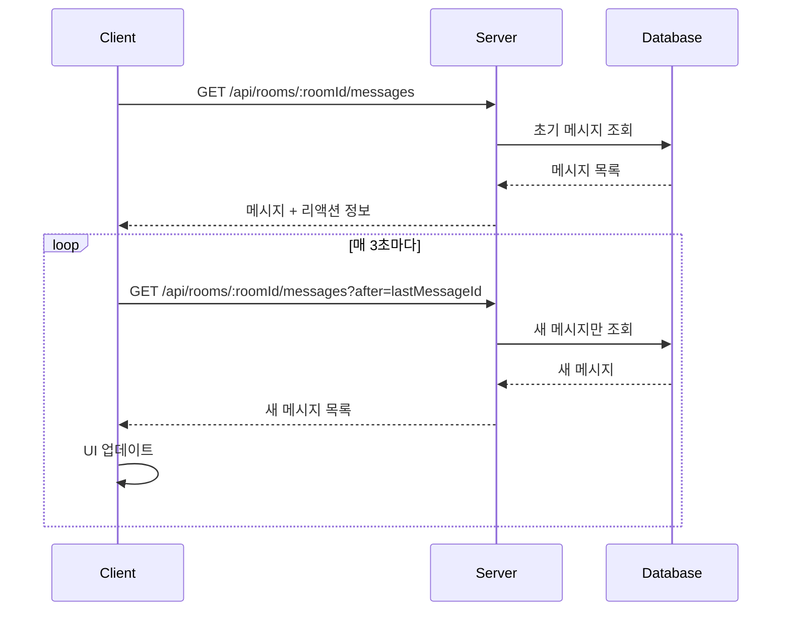

# 채팅방 상세 페이지 구현 계획

## 1. 개요

채팅방 내 메시지 목록, 입력, 리액션, 북마크 기능을 제공하는 페이지입니다.

### 페이지 정보
- **경로**: `/rooms/[roomId]`
- **인증 필요**: O (인증 필요)
- **상태관리**: ChatContext (메시지, 폴링, 리액션, 북마크)

---

## 2. 구현할 파일 목록

```
src/app/(main)/rooms/[roomId]/
├── page.tsx                     # 채팅방 상세 페이지
└── layout.tsx                   # ChatProvider 레이아웃

src/components/features/chat/
├── ChatRoom.tsx                 # 채팅방 전체 컴포넌트
├── ChatHeader.tsx               # 채팅방 헤더
├── MessageList.tsx              # 메시지 목록
├── MessageItem.tsx              # 개별 메시지
├── PendingMessageItem.tsx       # 전송 중 메시지
├── MessageInput.tsx             # 메시지 입력
├── ReactionButton.tsx           # 리액션 버튼
├── BookmarkButton.tsx           # 북마크 버튼
├── DeleteMessageButton.tsx      # 메시지 삭제 버튼
└── index.ts                     # 내보내기
```

---

## 3. 상세 구현 내용

### 3.1 ChatProvider 레이아웃 (app/(main)/rooms/[roomId]/layout.tsx)

```typescript
// src/app/(main)/rooms/[roomId]/layout.tsx
import { ChatProvider } from '@/contexts/ChatContext';

export default function RoomDetailLayout({
  children,
}: {
  children: React.ReactNode;
}) {
  return <ChatProvider>{children}</ChatProvider>;
}
```

### 3.2 채팅방 상세 페이지 (app/(main)/rooms/[roomId]/page.tsx)

```typescript
// src/app/(main)/rooms/[roomId]/page.tsx
'use client';

import { useEffect } from 'react';
import { useParams } from 'next/navigation';
import { useChat } from '@/hooks/useChat';
import { ChatRoom } from '@/components/features/chat/ChatRoom';
import { Spinner } from '@/components/ui/Spinner';
import { ErrorMessage } from '@/components/ui/ErrorMessage';

export default function RoomDetailPage(): JSX.Element {
  const params = useParams();
  const roomId = params.roomId as string;
  const { state, actions } = useChat();

  // 채팅방 입장
  useEffect(() => {
    actions.enterRoom(roomId);

    // 퇴장 처리
    return () => {
      actions.leaveRoom();
    };
  }, [roomId, actions]);

  // 로딩 상태
  if (state.isLoading && !state.currentRoom) {
    return (
      <div className="flex items-center justify-center h-[calc(100vh-200px)]">
        <Spinner size="lg" className="text-blue-600" />
      </div>
    );
  }

  // 에러 상태
  if (state.error && !state.currentRoom) {
    return (
      <div className="flex items-center justify-center h-[calc(100vh-200px)]">
        <ErrorMessage
          message={state.error.message}
          onRetry={() => actions.enterRoom(roomId)}
        />
      </div>
    );
  }

  // 채팅방을 찾을 수 없음
  if (!state.currentRoom) {
    return (
      <div className="flex items-center justify-center h-[calc(100vh-200px)]">
        <p className="text-gray-500">채팅방을 찾을 수 없습니다.</p>
      </div>
    );
  }

  return <ChatRoom />;
}
```

### 3.3 ChatRoom 컴포넌트

```typescript
// src/components/features/chat/ChatRoom.tsx
'use client';

import { useChat } from '@/hooks/useChat';
import { ChatHeader } from './ChatHeader';
import { MessageList } from './MessageList';
import { MessageInput } from './MessageInput';

export const ChatRoom = (): JSX.Element => {
  const { state } = useChat();

  if (!state.currentRoom) return <></>;

  return (
    <div className="flex flex-col h-[calc(100vh-140px)] bg-white rounded-lg border border-gray-200 shadow-sm">
      {/* 헤더 */}
      <ChatHeader room={state.currentRoom} />

      {/* 메시지 목록 */}
      <MessageList />

      {/* 메시지 입력 */}
      <MessageInput />
    </div>
  );
};
```

### 3.4 ChatHeader 컴포넌트

```typescript
// src/components/features/chat/ChatHeader.tsx
'use client';

import { useRouter } from 'next/navigation';
import { RoomDetail } from '@/types/domain/room.types';
import { Badge } from '@/components/ui/Badge';
import { Button } from '@/components/ui/Button';

interface ChatHeaderProps {
  readonly room: RoomDetail;
}

export const ChatHeader = ({ room }: ChatHeaderProps): JSX.Element => {
  const router = useRouter();

  return (
    <div className="flex items-center justify-between px-4 py-3 border-b border-gray-200 bg-gray-50">
      <div className="flex items-center gap-3">
        {/* 뒤로 가기 */}
        <button
          onClick={() => router.push('/rooms')}
          className="p-1 hover:bg-gray-200 rounded-full transition-colors"
          aria-label="채팅방 목록으로 돌아가기"
        >
          <svg className="w-5 h-5 text-gray-600" fill="none" stroke="currentColor" viewBox="0 0 24 24">
            <path strokeLinecap="round" strokeLinejoin="round" strokeWidth={2} d="M15 19l-7-7 7-7" />
          </svg>
        </button>

        {/* 방 정보 */}
        <div>
          <div className="flex items-center gap-2">
            <h1 className="font-semibold text-gray-900">{room.name}</h1>
            <Badge variant={room.isPublic ? 'primary' : 'default'} className="text-xs">
              {room.isPublic ? '공개' : '비공개'}
            </Badge>
          </div>
          {room.description && (
            <p className="text-xs text-gray-500 mt-0.5">{room.description}</p>
          )}
        </div>
      </div>

      {/* 참여자 수 */}
      <div className="flex items-center gap-1 text-sm text-gray-500">
        <svg className="w-4 h-4" fill="none" stroke="currentColor" viewBox="0 0 24 24">
          <path strokeLinecap="round" strokeLinejoin="round" strokeWidth={2} d="M12 4.354a4 4 0 110 5.292M15 21H3v-1a6 6 0 0112 0v1zm0 0h6v-1a6 6 0 00-9-5.197M13 7a4 4 0 11-8 0 4 4 0 018 0z" />
        </svg>
        <span>{room.memberCount}명</span>
      </div>
    </div>
  );
};
```

### 3.5 MessageList 컴포넌트

```typescript
// src/components/features/chat/MessageList.tsx
'use client';

import { useEffect, useRef } from 'react';
import { useChat } from '@/hooks/useChat';
import { MessageItem } from './MessageItem';
import { PendingMessageItem } from './PendingMessageItem';
import { Spinner } from '@/components/ui/Spinner';

export const MessageList = (): JSX.Element => {
  const { state } = useChat();
  const messagesEndRef = useRef<HTMLDivElement>(null);
  const containerRef = useRef<HTMLDivElement>(null);

  // 새 메시지 시 스크롤
  useEffect(() => {
    if (messagesEndRef.current) {
      messagesEndRef.current.scrollIntoView({ behavior: 'smooth' });
    }
  }, [state.messages.length, state.pendingMessages.length]);

  return (
    <div
      ref={containerRef}
      className="flex-1 overflow-y-auto px-4 py-4 space-y-4"
    >
      {/* 로딩 인디케이터 */}
      {state.isLoading && state.messages.length === 0 && (
        <div className="flex justify-center py-4">
          <Spinner size="md" className="text-blue-600" />
        </div>
      )}

      {/* 메시지 목록 */}
      {state.messages.length === 0 && !state.isLoading ? (
        <div className="flex flex-col items-center justify-center h-full text-gray-500">
          <svg className="w-12 h-12 mb-2" fill="none" stroke="currentColor" viewBox="0 0 24 24">
            <path strokeLinecap="round" strokeLinejoin="round" strokeWidth={2} d="M8 12h.01M12 12h.01M16 12h.01M21 12c0 4.418-4.03 8-9 8a9.863 9.863 0 01-4.255-.949L3 20l1.395-3.72C3.512 15.042 3 13.574 3 12c0-4.418 4.03-8 9-8s9 3.582 9 8z" />
          </svg>
          <p>아직 메시지가 없습니다</p>
          <p className="text-sm">첫 번째 메시지를 보내보세요!</p>
        </div>
      ) : (
        <>
          {state.messages.map((message) => (
            <MessageItem key={message.id} message={message} />
          ))}

          {/* 전송 중인 메시지 */}
          {state.pendingMessages.map((pending) => (
            <PendingMessageItem key={pending.tempId} pending={pending} />
          ))}
        </>
      )}

      {/* 폴링 상태 표시 */}
      {state.isPolling && (
        <div className="flex justify-center">
          <span className="text-xs text-gray-400">새 메시지 확인 중...</span>
        </div>
      )}

      <div ref={messagesEndRef} />
    </div>
  );
};
```

### 3.6 MessageItem 컴포넌트

```typescript
// src/components/features/chat/MessageItem.tsx
'use client';

import { useAuth } from '@/hooks/useAuth';
import { Message } from '@/types/domain/message.types';
import { Avatar } from '@/components/ui/Avatar';
import { ReactionButton } from './ReactionButton';
import { BookmarkButton } from './BookmarkButton';
import { DeleteMessageButton } from './DeleteMessageButton';
import { formatRelativeTime } from '@/utils/date.utils';

interface MessageItemProps {
  readonly message: Message;
}

export const MessageItem = ({ message }: MessageItemProps): JSX.Element => {
  const { state: authState } = useAuth();
  const isOwnMessage = authState.user?.id === message.userId;

  // 삭제된 메시지
  if (message.deletedAt) {
    return (
      <div className="flex justify-center">
        <span className="text-sm text-gray-400 italic">삭제된 메시지입니다</span>
      </div>
    );
  }

  return (
    <div className={`flex gap-3 ${isOwnMessage ? 'flex-row-reverse' : ''}`}>
      {/* 아바타 */}
      {!isOwnMessage && (
        <Avatar
          name={message.user.nickname ?? message.user.email}
          size="sm"
          className="flex-shrink-0"
        />
      )}

      {/* 메시지 내용 */}
      <div className={`flex flex-col ${isOwnMessage ? 'items-end' : 'items-start'} max-w-[70%]`}>
        {/* 작성자 이름 (다른 사람 메시지만) */}
        {!isOwnMessage && (
          <span className="text-xs text-gray-500 mb-1">
            {message.user.nickname ?? message.user.email}
          </span>
        )}

        {/* 메시지 버블 */}
        <div
          className={`px-4 py-2 rounded-2xl ${
            isOwnMessage
              ? 'bg-blue-600 text-white'
              : 'bg-gray-100 text-gray-900'
          }`}
        >
          <p className="text-sm whitespace-pre-wrap break-words">
            {message.content}
          </p>
        </div>

        {/* 메타 정보 및 액션 */}
        <div className={`flex items-center gap-2 mt-1 ${isOwnMessage ? 'flex-row-reverse' : ''}`}>
          <span className="text-xs text-gray-400">
            {formatRelativeTime(message.createdAt)}
          </span>

          {/* 액션 버튼 */}
          <div className="flex items-center gap-1">
            <ReactionButton
              messageId={message.id}
              isReacted={message.isReactedByMe}
              count={message.reactionsCount}
            />
            <BookmarkButton
              messageId={message.id}
              isBookmarked={message.isBookmarkedByMe}
            />
            {isOwnMessage && (
              <DeleteMessageButton messageId={message.id} />
            )}
          </div>
        </div>
      </div>
    </div>
  );
};
```

### 3.7 PendingMessageItem 컴포넌트

```typescript
// src/components/features/chat/PendingMessageItem.tsx
'use client';

import { useChat } from '@/hooks/useChat';
import { PendingMessage } from '@/contexts/ChatContext';
import { Button } from '@/components/ui/Button';
import { Spinner } from '@/components/ui/Spinner';

interface PendingMessageItemProps {
  readonly pending: PendingMessage;
}

export const PendingMessageItem = ({ pending }: PendingMessageItemProps): JSX.Element => {
  const { actions } = useChat();

  const isFailed = pending.status === 'failed';

  return (
    <div className="flex gap-3 flex-row-reverse">
      <div className="flex flex-col items-end max-w-[70%]">
        {/* 메시지 버블 */}
        <div
          className={`px-4 py-2 rounded-2xl ${
            isFailed ? 'bg-red-100 text-red-900' : 'bg-blue-400 text-white'
          }`}
        >
          <p className="text-sm whitespace-pre-wrap break-words">
            {pending.content}
          </p>
        </div>

        {/* 상태 표시 */}
        <div className="flex items-center gap-2 mt-1">
          {pending.status === 'sending' && (
            <div className="flex items-center gap-1 text-xs text-gray-400">
              <Spinner size="sm" />
              <span>전송 중...</span>
            </div>
          )}

          {isFailed && (
            <div className="flex items-center gap-2">
              <span className="text-xs text-red-500">전송 실패</span>
              <button
                onClick={() => actions.retryMessage(pending.tempId)}
                className="text-xs text-blue-600 hover:underline"
              >
                재시도
              </button>
              <button
                onClick={() => actions.cancelMessage(pending.tempId)}
                className="text-xs text-gray-500 hover:underline"
              >
                취소
              </button>
            </div>
          )}
        </div>
      </div>
    </div>
  );
};
```

### 3.8 MessageInput 컴포넌트

```typescript
// src/components/features/chat/MessageInput.tsx
'use client';

import { useCallback, FormEvent, KeyboardEvent } from 'react';
import { useChat } from '@/hooks/useChat';
import { Button } from '@/components/ui/Button';

const MAX_MESSAGE_LENGTH = 2000;

export const MessageInput = (): JSX.Element => {
  const { state, actions } = useChat();

  const handleSubmit = useCallback(
    (e: FormEvent) => {
      e.preventDefault();
      if (state.messageInput.trim() && !state.isSending) {
        actions.sendMessage(state.messageInput);
      }
    },
    [state.messageInput, state.isSending, actions]
  );

  const handleKeyDown = useCallback(
    (e: KeyboardEvent<HTMLTextAreaElement>) => {
      if (e.key === 'Enter' && !e.shiftKey) {
        e.preventDefault();
        if (state.messageInput.trim() && !state.isSending) {
          actions.sendMessage(state.messageInput);
        }
      }
    },
    [state.messageInput, state.isSending, actions]
  );

  const remainingChars = MAX_MESSAGE_LENGTH - state.messageInput.length;
  const isNearLimit = remainingChars <= 100;

  return (
    <form
      onSubmit={handleSubmit}
      className="border-t border-gray-200 px-4 py-3 bg-gray-50"
    >
      <div className="flex items-end gap-2">
        <div className="flex-1 relative">
          <textarea
            value={state.messageInput}
            onChange={(e) => actions.setMessageInput(e.target.value)}
            onKeyDown={handleKeyDown}
            placeholder="메시지를 입력하세요... (Shift+Enter로 줄바꿈)"
            disabled={state.isSending}
            maxLength={MAX_MESSAGE_LENGTH}
            rows={1}
            className="w-full px-4 py-2.5 border border-gray-300 rounded-lg resize-none focus:outline-none focus:ring-2 focus:ring-blue-500 focus:border-blue-500 disabled:bg-gray-100"
            style={{ maxHeight: '120px', minHeight: '44px' }}
          />

          {/* 글자 수 표시 */}
          {isNearLimit && (
            <span
              className={`absolute right-2 bottom-2 text-xs ${
                remainingChars <= 0 ? 'text-red-500' : 'text-gray-400'
              }`}
            >
              {remainingChars}
            </span>
          )}
        </div>

        <Button
          type="submit"
          disabled={!state.messageInput.trim() || state.isSending}
          isLoading={state.isSending}
          className="flex-shrink-0"
        >
          <svg className="w-5 h-5" fill="none" stroke="currentColor" viewBox="0 0 24 24">
            <path strokeLinecap="round" strokeLinejoin="round" strokeWidth={2} d="M12 19l9 2-9-18-9 18 9-2zm0 0v-8" />
          </svg>
        </Button>
      </div>
    </form>
  );
};
```

### 3.9 ReactionButton 컴포넌트

```typescript
// src/components/features/chat/ReactionButton.tsx
'use client';

import { useCallback } from 'react';
import { useChat } from '@/hooks/useChat';

interface ReactionButtonProps {
  readonly messageId: string;
  readonly isReacted: boolean;
  readonly count: number;
}

export const ReactionButton = ({
  messageId,
  isReacted,
  count,
}: ReactionButtonProps): JSX.Element => {
  const { actions } = useChat();

  const handleClick = useCallback(() => {
    actions.toggleReaction(messageId);
  }, [messageId, actions]);

  return (
    <button
      onClick={handleClick}
      className={`flex items-center gap-0.5 px-1.5 py-0.5 rounded text-xs transition-colors ${
        isReacted
          ? 'text-red-500 bg-red-50 hover:bg-red-100'
          : 'text-gray-400 hover:text-red-500 hover:bg-red-50'
      }`}
      aria-label={isReacted ? '좋아요 취소' : '좋아요'}
    >
      <svg
        className="w-3.5 h-3.5"
        fill={isReacted ? 'currentColor' : 'none'}
        stroke="currentColor"
        viewBox="0 0 24 24"
      >
        <path
          strokeLinecap="round"
          strokeLinejoin="round"
          strokeWidth={2}
          d="M4.318 6.318a4.5 4.5 0 000 6.364L12 20.364l7.682-7.682a4.5 4.5 0 00-6.364-6.364L12 7.636l-1.318-1.318a4.5 4.5 0 00-6.364 0z"
        />
      </svg>
      {count > 0 && <span>{count}</span>}
    </button>
  );
};
```

### 3.10 BookmarkButton 컴포넌트

```typescript
// src/components/features/chat/BookmarkButton.tsx
'use client';

import { useCallback } from 'react';
import { useChat } from '@/hooks/useChat';

interface BookmarkButtonProps {
  readonly messageId: string;
  readonly isBookmarked: boolean;
}

export const BookmarkButton = ({
  messageId,
  isBookmarked,
}: BookmarkButtonProps): JSX.Element => {
  const { actions } = useChat();

  const handleClick = useCallback(() => {
    actions.toggleBookmark(messageId);
  }, [messageId, actions]);

  return (
    <button
      onClick={handleClick}
      className={`p-1 rounded transition-colors ${
        isBookmarked
          ? 'text-yellow-500 bg-yellow-50 hover:bg-yellow-100'
          : 'text-gray-400 hover:text-yellow-500 hover:bg-yellow-50'
      }`}
      aria-label={isBookmarked ? '북마크 해제' : '북마크'}
    >
      <svg
        className="w-3.5 h-3.5"
        fill={isBookmarked ? 'currentColor' : 'none'}
        stroke="currentColor"
        viewBox="0 0 24 24"
      >
        <path
          strokeLinecap="round"
          strokeLinejoin="round"
          strokeWidth={2}
          d="M5 5a2 2 0 012-2h10a2 2 0 012 2v16l-7-3.5L5 21V5z"
        />
      </svg>
    </button>
  );
};
```

### 3.11 DeleteMessageButton 컴포넌트

```typescript
// src/components/features/chat/DeleteMessageButton.tsx
'use client';

import { useCallback, useState } from 'react';
import { useChat } from '@/hooks/useChat';

interface DeleteMessageButtonProps {
  readonly messageId: string;
}

export const DeleteMessageButton = ({
  messageId,
}: DeleteMessageButtonProps): JSX.Element => {
  const { actions } = useChat();
  const [isConfirming, setIsConfirming] = useState(false);

  const handleClick = useCallback(() => {
    if (isConfirming) {
      actions.deleteMessage(messageId);
      setIsConfirming(false);
    } else {
      setIsConfirming(true);
      // 3초 후 자동 취소
      setTimeout(() => setIsConfirming(false), 3000);
    }
  }, [isConfirming, messageId, actions]);

  return (
    <button
      onClick={handleClick}
      className={`p-1 rounded transition-colors ${
        isConfirming
          ? 'text-red-500 bg-red-50'
          : 'text-gray-400 hover:text-red-500 hover:bg-red-50'
      }`}
      aria-label={isConfirming ? '삭제 확인' : '메시지 삭제'}
      title={isConfirming ? '다시 클릭하여 삭제' : '삭제'}
    >
      <svg className="w-3.5 h-3.5" fill="none" stroke="currentColor" viewBox="0 0 24 24">
        <path
          strokeLinecap="round"
          strokeLinejoin="round"
          strokeWidth={2}
          d="M19 7l-.867 12.142A2 2 0 0116.138 21H7.862a2 2 0 01-1.995-1.858L5 7m5 4v6m4-6v6m1-10V4a1 1 0 00-1-1h-4a1 1 0 00-1 1v3M4 7h16"
        />
      </svg>
    </button>
  );
};
```

---

## 4. 기능 요구사항

### 4.1 메시지 목록
- 메시지 목록 표시 (스크롤)
- 3초 주기 폴링으로 새 메시지 자동 갱신
- 새 메시지 도착 시 스크롤

### 4.2 메시지 전송
- 텍스트 메시지 전송
- Enter 키로 전송 (Shift+Enter는 줄바꿈)
- 최대 2000자 제한
- 낙관적 UI 업데이트
- 전송 실패 시 재시도/취소

### 4.3 리액션
- 좋아요 토글
- 낙관적 UI 업데이트
- 리액션 수 표시

### 4.4 북마크
- 북마크 토글
- 낙관적 UI 업데이트

### 4.5 메시지 삭제
- 본인 메시지만 삭제 가능
- 확인 후 삭제 (2단계)
- Soft delete (UI에서 "삭제된 메시지" 표시)

---

## 5. 폴링 흐름



---

## 6. 의존성 및 순서

### 6.1 의존성

- `@/contexts/ChatContext` - 채팅 상태 관리
- `@/hooks/useChat` - 채팅 훅
- `@/hooks/useAuth` - 인증 (본인 메시지 확인)
- `@/components/ui/*` - UI 컴포넌트
- `@/utils/date.utils` - 날짜 유틸

### 6.2 구현 순서

1. ChatContext 및 useChat 훅 구현
2. ChatHeader 컴포넌트 구현
3. MessageItem 컴포넌트 구현
4. ReactionButton, BookmarkButton, DeleteMessageButton 구현
5. PendingMessageItem 컴포넌트 구현
6. MessageList 컴포넌트 구현
7. MessageInput 컴포넌트 구현
8. ChatRoom 컴포넌트 조립
9. 페이지 및 API 연동

---

## 7. 테스트 계획

### 7.1 단위 테스트

- MessageItem 렌더링 테스트
- 리액션/북마크 토글 테스트
- 메시지 입력 유효성 테스트

### 7.2 통합 테스트

- 채팅방 입장/퇴장 테스트
- 메시지 전송 플로우 테스트
- 폴링 동작 테스트

---

## 8. 변경 이력

| 버전 | 날짜 | 변경 내용 |
|------|------|-----------|
| 1.0 | 2025-11-23 | 최초 작성 |
