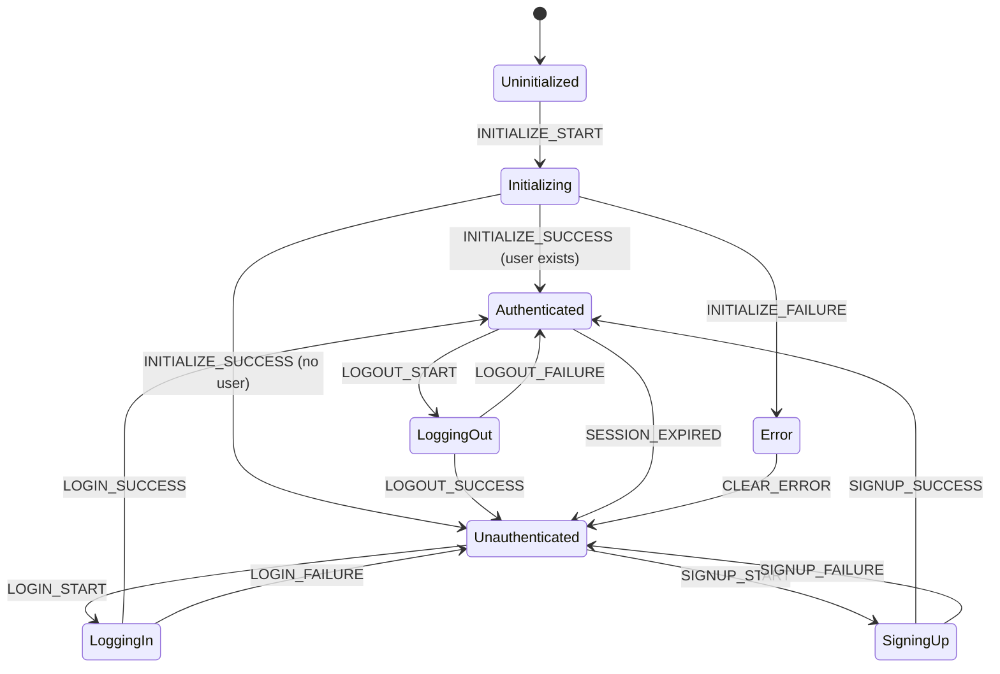

# AuthContext 상태관리 설계

## 1. 개요

AuthContext는 사용자 인증 상태를 전역적으로 관리하는 Context입니다. 로그인, 로그아웃, 회원가입, 세션 관리 등 인증 관련 모든 상태와 액션을 담당합니다.

### 적용 페이지
- `/login` - 로그인 페이지
- `/signup` - 회원가입 페이지
- 모든 인증 필요 페이지 (인증 상태 확인)

---

## 2. State 인터페이스 정의

```typescript
// src/types/domain/user.types.ts
export interface User {
  readonly id: string;
  readonly email: string;
  readonly nickname: string | null;
  readonly createdAt: string;
}

// src/contexts/AuthContext.tsx
export interface AuthState {
  // 사용자 정보
  readonly user: User | null;

  // 인증 상태
  readonly isAuthenticated: boolean;

  // 로딩 상태
  readonly isLoading: boolean;
  readonly isInitialized: boolean; // 초기 세션 확인 완료 여부

  // 에러 상태
  readonly error: AuthError | null;
}

export interface AuthError {
  readonly code: AuthErrorCode;
  readonly message: string;
}

export type AuthErrorCode =
  | 'INVALID_CREDENTIALS'
  | 'EMAIL_ALREADY_EXISTS'
  | 'WEAK_PASSWORD'
  | 'INVALID_EMAIL'
  | 'SESSION_EXPIRED'
  | 'NETWORK_ERROR'
  | 'UNKNOWN_ERROR';
```

### 초기 상태

```typescript
export const initialAuthState: AuthState = {
  user: null,
  isAuthenticated: false,
  isLoading: false,
  isInitialized: false,
  error: null,
};
```

---

## 3. Action 타입 정의

```typescript
// src/contexts/AuthContext.tsx
export type AuthAction =
  // 초기화 액션
  | { readonly type: 'INITIALIZE_START' }
  | { readonly type: 'INITIALIZE_SUCCESS'; readonly payload: User | null }
  | { readonly type: 'INITIALIZE_FAILURE'; readonly payload: AuthError }

  // 로그인 액션
  | { readonly type: 'LOGIN_START' }
  | { readonly type: 'LOGIN_SUCCESS'; readonly payload: User }
  | { readonly type: 'LOGIN_FAILURE'; readonly payload: AuthError }

  // 회원가입 액션
  | { readonly type: 'SIGNUP_START' }
  | { readonly type: 'SIGNUP_SUCCESS'; readonly payload: User }
  | { readonly type: 'SIGNUP_FAILURE'; readonly payload: AuthError }

  // 로그아웃 액션
  | { readonly type: 'LOGOUT_START' }
  | { readonly type: 'LOGOUT_SUCCESS' }
  | { readonly type: 'LOGOUT_FAILURE'; readonly payload: AuthError }

  // 에러 초기화
  | { readonly type: 'CLEAR_ERROR' }

  // 세션 만료
  | { readonly type: 'SESSION_EXPIRED' };
```

### Action Creator 함수

```typescript
// src/contexts/AuthContext.tsx
export const authActions = {
  // 초기화
  initializeStart: (): AuthAction => ({ type: 'INITIALIZE_START' }),
  initializeSuccess: (user: User | null): AuthAction => ({
    type: 'INITIALIZE_SUCCESS',
    payload: user,
  }),
  initializeFailure: (error: AuthError): AuthAction => ({
    type: 'INITIALIZE_FAILURE',
    payload: error,
  }),

  // 로그인
  loginStart: (): AuthAction => ({ type: 'LOGIN_START' }),
  loginSuccess: (user: User): AuthAction => ({
    type: 'LOGIN_SUCCESS',
    payload: user,
  }),
  loginFailure: (error: AuthError): AuthAction => ({
    type: 'LOGIN_FAILURE',
    payload: error,
  }),

  // 회원가입
  signupStart: (): AuthAction => ({ type: 'SIGNUP_START' }),
  signupSuccess: (user: User): AuthAction => ({
    type: 'SIGNUP_SUCCESS',
    payload: user,
  }),
  signupFailure: (error: AuthError): AuthAction => ({
    type: 'SIGNUP_FAILURE',
    payload: error,
  }),

  // 로그아웃
  logoutStart: (): AuthAction => ({ type: 'LOGOUT_START' }),
  logoutSuccess: (): AuthAction => ({ type: 'LOGOUT_SUCCESS' }),
  logoutFailure: (error: AuthError): AuthAction => ({
    type: 'LOGOUT_FAILURE',
    payload: error,
  }),

  // 기타
  clearError: (): AuthAction => ({ type: 'CLEAR_ERROR' }),
  sessionExpired: (): AuthAction => ({ type: 'SESSION_EXPIRED' }),
} as const;
```

---

## 4. Reducer 함수

```typescript
// src/contexts/AuthContext.tsx
export const authReducer = (state: AuthState, action: AuthAction): AuthState => {
  switch (action.type) {
    // 초기화
    case 'INITIALIZE_START':
      return {
        ...state,
        isLoading: true,
        error: null,
      };

    case 'INITIALIZE_SUCCESS':
      return {
        ...state,
        user: action.payload,
        isAuthenticated: action.payload !== null,
        isLoading: false,
        isInitialized: true,
        error: null,
      };

    case 'INITIALIZE_FAILURE':
      return {
        ...state,
        user: null,
        isAuthenticated: false,
        isLoading: false,
        isInitialized: true,
        error: action.payload,
      };

    // 로그인
    case 'LOGIN_START':
      return {
        ...state,
        isLoading: true,
        error: null,
      };

    case 'LOGIN_SUCCESS':
      return {
        ...state,
        user: action.payload,
        isAuthenticated: true,
        isLoading: false,
        error: null,
      };

    case 'LOGIN_FAILURE':
      return {
        ...state,
        user: null,
        isAuthenticated: false,
        isLoading: false,
        error: action.payload,
      };

    // 회원가입
    case 'SIGNUP_START':
      return {
        ...state,
        isLoading: true,
        error: null,
      };

    case 'SIGNUP_SUCCESS':
      return {
        ...state,
        user: action.payload,
        isAuthenticated: true,
        isLoading: false,
        error: null,
      };

    case 'SIGNUP_FAILURE':
      return {
        ...state,
        isLoading: false,
        error: action.payload,
      };

    // 로그아웃
    case 'LOGOUT_START':
      return {
        ...state,
        isLoading: true,
        error: null,
      };

    case 'LOGOUT_SUCCESS':
      return {
        ...initialAuthState,
        isInitialized: true,
      };

    case 'LOGOUT_FAILURE':
      return {
        ...state,
        isLoading: false,
        error: action.payload,
      };

    // 에러 초기화
    case 'CLEAR_ERROR':
      return {
        ...state,
        error: null,
      };

    // 세션 만료
    case 'SESSION_EXPIRED':
      return {
        ...initialAuthState,
        isInitialized: true,
        error: {
          code: 'SESSION_EXPIRED',
          message: '세션이 만료되었습니다. 다시 로그인해주세요.',
        },
      };

    default:
      return state;
  }
};
```

---

## 5. Provider 컴포넌트 구조

```typescript
// src/contexts/AuthContext.tsx
import { createContext, useReducer, useEffect, useCallback, ReactNode } from 'react';

// Context 타입 정의
export interface AuthContextValue {
  readonly state: AuthState;
  readonly dispatch: React.Dispatch<AuthAction>;
  readonly actions: {
    readonly login: (email: string, password: string) => Promise<void>;
    readonly signup: (email: string, password: string) => Promise<void>;
    readonly logout: () => Promise<void>;
    readonly clearError: () => void;
  };
}

// Context 생성
export const AuthContext = createContext<AuthContextValue | null>(null);

// Provider Props
interface AuthProviderProps {
  readonly children: ReactNode;
}

// Provider 컴포넌트
export const AuthProvider = ({ children }: AuthProviderProps): JSX.Element => {
  const [state, dispatch] = useReducer(authReducer, initialAuthState);

  // 초기 세션 확인
  useEffect(() => {
    const initializeAuth = async (): Promise<void> => {
      dispatch(authActions.initializeStart());

      try {
        const response = await fetch('/api/auth/session');

        if (response.ok) {
          const data = await response.json();
          dispatch(authActions.initializeSuccess(data.user));
        } else {
          dispatch(authActions.initializeSuccess(null));
        }
      } catch (error) {
        dispatch(authActions.initializeFailure({
          code: 'NETWORK_ERROR',
          message: '네트워크 오류가 발생했습니다.',
        }));
      }
    };

    initializeAuth();
  }, []);

  // 로그인 액션
  const login = useCallback(async (email: string, password: string): Promise<void> => {
    dispatch(authActions.loginStart());

    try {
      const response = await fetch('/api/auth/login', {
        method: 'POST',
        headers: { 'Content-Type': 'application/json' },
        body: JSON.stringify({ email, password }),
      });

      const data = await response.json();

      if (response.ok) {
        dispatch(authActions.loginSuccess(data.user));
      } else {
        dispatch(authActions.loginFailure({
          code: data.code || 'INVALID_CREDENTIALS',
          message: data.message || '로그인에 실패했습니다.',
        }));
      }
    } catch (error) {
      dispatch(authActions.loginFailure({
        code: 'NETWORK_ERROR',
        message: '네트워크 오류가 발생했습니다.',
      }));
    }
  }, []);

  // 회원가입 액션
  const signup = useCallback(async (email: string, password: string): Promise<void> => {
    dispatch(authActions.signupStart());

    try {
      const response = await fetch('/api/auth/signup', {
        method: 'POST',
        headers: { 'Content-Type': 'application/json' },
        body: JSON.stringify({ email, password }),
      });

      const data = await response.json();

      if (response.ok) {
        dispatch(authActions.signupSuccess(data.user));
      } else {
        dispatch(authActions.signupFailure({
          code: data.code || 'UNKNOWN_ERROR',
          message: data.message || '회원가입에 실패했습니다.',
        }));
      }
    } catch (error) {
      dispatch(authActions.signupFailure({
        code: 'NETWORK_ERROR',
        message: '네트워크 오류가 발생했습니다.',
      }));
    }
  }, []);

  // 로그아웃 액션
  const logout = useCallback(async (): Promise<void> => {
    dispatch(authActions.logoutStart());

    try {
      const response = await fetch('/api/auth/logout', {
        method: 'POST',
      });

      if (response.ok) {
        dispatch(authActions.logoutSuccess());
      } else {
        dispatch(authActions.logoutFailure({
          code: 'UNKNOWN_ERROR',
          message: '로그아웃에 실패했습니다.',
        }));
      }
    } catch (error) {
      dispatch(authActions.logoutFailure({
        code: 'NETWORK_ERROR',
        message: '네트워크 오류가 발생했습니다.',
      }));
    }
  }, []);

  // 에러 초기화
  const clearError = useCallback((): void => {
    dispatch(authActions.clearError());
  }, []);

  const contextValue: AuthContextValue = {
    state,
    dispatch,
    actions: {
      login,
      signup,
      logout,
      clearError,
    },
  };

  return (
    <AuthContext.Provider value={contextValue}>
      {children}
    </AuthContext.Provider>
  );
};
```

---

## 6. Custom Hook

```typescript
// src/hooks/useAuth.ts
import { useContext } from 'react';
import { AuthContext, AuthContextValue } from '@/contexts/AuthContext';

export const useAuth = (): AuthContextValue => {
  const context = useContext(AuthContext);

  if (context === null) {
    throw new Error('useAuth must be used within an AuthProvider');
  }

  return context;
};

// 편의를 위한 개별 훅
export const useAuthState = () => {
  const { state } = useAuth();
  return state;
};

export const useAuthActions = () => {
  const { actions } = useAuth();
  return actions;
};

export const useUser = () => {
  const { state } = useAuth();
  return state.user;
};

export const useIsAuthenticated = () => {
  const { state } = useAuth();
  return state.isAuthenticated;
};
```

---

## 7. 상태 흐름 다이어그램



---

## 8. 사용 예시

### 로그인 폼에서 사용

```typescript
// src/components/features/auth/LoginForm.tsx
import { useState, FormEvent } from 'react';
import { useAuth } from '@/hooks/useAuth';
import { useRouter } from 'next/navigation';

export const LoginForm = (): JSX.Element => {
  const router = useRouter();
  const { state, actions } = useAuth();
  const [email, setEmail] = useState('');
  const [password, setPassword] = useState('');

  const handleSubmit = async (e: FormEvent): Promise<void> => {
    e.preventDefault();
    await actions.login(email, password);

    if (!state.error) {
      router.push('/rooms');
    }
  };

  return (
    <form onSubmit={handleSubmit}>
      {state.error && (
        <div className="error-message">{state.error.message}</div>
      )}

      <input
        type="email"
        value={email}
        onChange={(e) => setEmail(e.target.value)}
        disabled={state.isLoading}
      />

      <input
        type="password"
        value={password}
        onChange={(e) => setPassword(e.target.value)}
        disabled={state.isLoading}
      />

      <button type="submit" disabled={state.isLoading}>
        {state.isLoading ? '로그인 중...' : '로그인'}
      </button>
    </form>
  );
};
```

### 인증 가드에서 사용

```typescript
// src/components/layout/AuthGuard.tsx
import { useAuth } from '@/hooks/useAuth';
import { useRouter } from 'next/navigation';
import { useEffect, ReactNode } from 'react';

interface AuthGuardProps {
  readonly children: ReactNode;
}

export const AuthGuard = ({ children }: AuthGuardProps): JSX.Element | null => {
  const router = useRouter();
  const { state } = useAuth();

  useEffect(() => {
    if (state.isInitialized && !state.isAuthenticated) {
      router.replace('/login');
    }
  }, [state.isInitialized, state.isAuthenticated, router]);

  // 초기화 중이거나 미인증 상태면 로딩 표시
  if (!state.isInitialized || !state.isAuthenticated) {
    return <div>Loading...</div>;
  }

  return <>{children}</>;
};
```

---

## 9. 설계 원칙

### 불변성 유지
- 모든 상태 업데이트는 스프레드 연산자를 사용하여 새 객체 생성
- readonly 타입을 사용하여 타입 레벨에서 불변성 보장

### 순수 리듀서
- 리듀서는 외부 상태에 의존하지 않음
- 동일한 입력에 대해 항상 동일한 출력 보장

### 단일 책임
- AuthContext는 인증 관련 상태만 관리
- API 호출 로직은 액션 함수 내부에 캡슐화

### 예측 가능한 상태 변화
- 모든 상태 변화는 액션을 통해서만 발생
- 액션 타입으로 상태 변화 추적 가능
