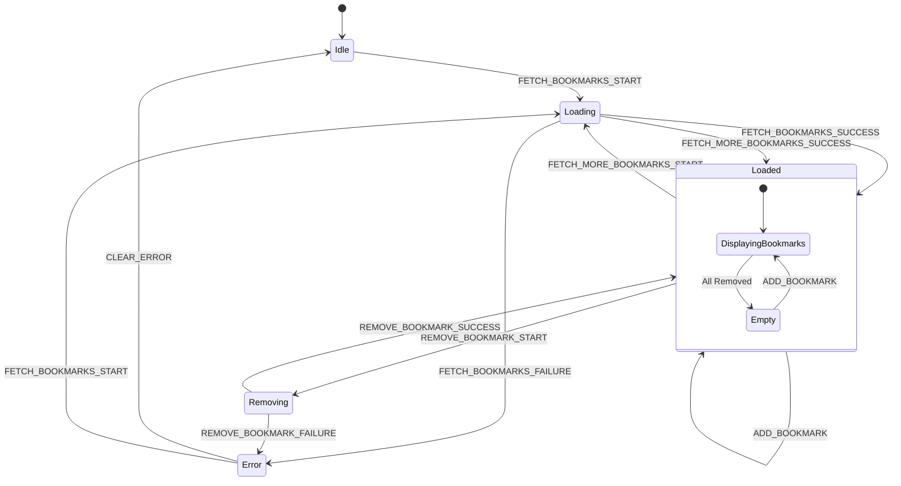

# BookmarkContext 상태관리 설계

## 1. 개요

BookmarkContext는 북마크 목록 페이지에서 사용자의 북마크된 메시지를 관리하는 Context입니다. 북마크 목록 조회, 북마크 해제, 원본 메시지로 이동 등의 기능을 담당합니다.

### 적용 페이지
- `/bookmarks` - 북마크 목록 페이지

---

## 2. State 인터페이스 정의

```typescript
// src/types/domain/bookmark.types.ts
export interface Bookmark {
  readonly id: string;
  readonly messageId: string;
  readonly userId: string;
  readonly createdAt: string;
  readonly message: BookmarkedMessage;
}

export interface BookmarkedMessage {
  readonly id: string;
  readonly content: string;
  readonly createdAt: string;
  readonly deletedAt: string | null;
  readonly user: MessageUser;
  readonly room: BookmarkedRoom;
}

export interface BookmarkedRoom {
  readonly id: string;
  readonly name: string;
}

export interface MessageUser {
  readonly id: string;
  readonly email: string;
  readonly nickname: string | null;
}

// src/contexts/BookmarkContext.tsx
export interface BookmarkState {
  // 북마크 목록
  readonly bookmarks: readonly Bookmark[];

  // 로딩 상태
  readonly isLoading: boolean;
  readonly isRemoving: ReadonlySet<string>; // 삭제 중인 북마크 ID 집합

  // 에러 상태
  readonly error: BookmarkError | null;

  // 페이지네이션
  readonly hasMore: boolean;
  readonly page: number;
}

export interface BookmarkError {
  readonly code: BookmarkErrorCode;
  readonly message: string;
}

export type BookmarkErrorCode =
  | 'FETCH_FAILED'
  | 'REMOVE_FAILED'
  | 'BOOKMARK_NOT_FOUND'
  | 'NETWORK_ERROR';
```

### 초기 상태

```typescript
export const initialBookmarkState: BookmarkState = {
  bookmarks: [],
  isLoading: false,
  isRemoving: new Set(),
  error: null,
  hasMore: true,
  page: 1,
};
```

---

## 3. Action 타입 정의

```typescript
// src/contexts/BookmarkContext.tsx
export type BookmarkAction =
  // 북마크 목록 조회
  | { readonly type: 'FETCH_BOOKMARKS_START' }
  | { readonly type: 'FETCH_BOOKMARKS_SUCCESS'; readonly payload: readonly Bookmark[] }
  | { readonly type: 'FETCH_BOOKMARKS_FAILURE'; readonly payload: BookmarkError }

  // 추가 로드 (페이지네이션)
  | { readonly type: 'FETCH_MORE_BOOKMARKS_START' }
  | {
      readonly type: 'FETCH_MORE_BOOKMARKS_SUCCESS';
      readonly payload: {
        readonly bookmarks: readonly Bookmark[];
        readonly hasMore: boolean;
      };
    }
  | { readonly type: 'FETCH_MORE_BOOKMARKS_FAILURE'; readonly payload: BookmarkError }

  // 북마크 해제
  | { readonly type: 'REMOVE_BOOKMARK_START'; readonly payload: string }
  | { readonly type: 'REMOVE_BOOKMARK_SUCCESS'; readonly payload: string }
  | { readonly type: 'REMOVE_BOOKMARK_FAILURE'; readonly payload: { bookmarkId: string; error: BookmarkError } }

  // 북마크 추가 (외부에서 추가된 경우)
  | { readonly type: 'ADD_BOOKMARK'; readonly payload: Bookmark }

  // 에러 초기화
  | { readonly type: 'CLEAR_ERROR' }

  // 상태 초기화
  | { readonly type: 'RESET_STATE' };
```

### Action Creator 함수

```typescript
// src/contexts/BookmarkContext.tsx
export const bookmarkActions = {
  // 북마크 목록 조회
  fetchBookmarksStart: (): BookmarkAction => ({ type: 'FETCH_BOOKMARKS_START' }),
  fetchBookmarksSuccess: (bookmarks: readonly Bookmark[]): BookmarkAction => ({
    type: 'FETCH_BOOKMARKS_SUCCESS',
    payload: bookmarks,
  }),
  fetchBookmarksFailure: (error: BookmarkError): BookmarkAction => ({
    type: 'FETCH_BOOKMARKS_FAILURE',
    payload: error,
  }),

  // 추가 로드
  fetchMoreBookmarksStart: (): BookmarkAction => ({ type: 'FETCH_MORE_BOOKMARKS_START' }),
  fetchMoreBookmarksSuccess: (bookmarks: readonly Bookmark[], hasMore: boolean): BookmarkAction => ({
    type: 'FETCH_MORE_BOOKMARKS_SUCCESS',
    payload: { bookmarks, hasMore },
  }),
  fetchMoreBookmarksFailure: (error: BookmarkError): BookmarkAction => ({
    type: 'FETCH_MORE_BOOKMARKS_FAILURE',
    payload: error,
  }),

  // 북마크 해제
  removeBookmarkStart: (bookmarkId: string): BookmarkAction => ({
    type: 'REMOVE_BOOKMARK_START',
    payload: bookmarkId,
  }),
  removeBookmarkSuccess: (bookmarkId: string): BookmarkAction => ({
    type: 'REMOVE_BOOKMARK_SUCCESS',
    payload: bookmarkId,
  }),
  removeBookmarkFailure: (bookmarkId: string, error: BookmarkError): BookmarkAction => ({
    type: 'REMOVE_BOOKMARK_FAILURE',
    payload: { bookmarkId, error },
  }),

  // 북마크 추가
  addBookmark: (bookmark: Bookmark): BookmarkAction => ({
    type: 'ADD_BOOKMARK',
    payload: bookmark,
  }),

  // 기타
  clearError: (): BookmarkAction => ({ type: 'CLEAR_ERROR' }),
  resetState: (): BookmarkAction => ({ type: 'RESET_STATE' }),
} as const;
```

---

## 4. Reducer 함수

```typescript
// src/contexts/BookmarkContext.tsx

// Set 불변 업데이트 헬퍼 함수
const addToSet = <T>(set: ReadonlySet<T>, item: T): ReadonlySet<T> => {
  const newSet = new Set(set);
  newSet.add(item);
  return newSet;
};

const removeFromSet = <T>(set: ReadonlySet<T>, item: T): ReadonlySet<T> => {
  const newSet = new Set(set);
  newSet.delete(item);
  return newSet;
};

// 북마크 정렬 헬퍼 함수 (최신순)
const sortBookmarksByCreatedAt = (bookmarks: readonly Bookmark[]): readonly Bookmark[] =>
  [...bookmarks].sort(
    (a, b) => new Date(b.createdAt).getTime() - new Date(a.createdAt).getTime()
  );

export const bookmarkReducer = (state: BookmarkState, action: BookmarkAction): BookmarkState => {
  switch (action.type) {
    // 북마크 목록 조회
    case 'FETCH_BOOKMARKS_START':
      return {
        ...state,
        isLoading: true,
        error: null,
      };

    case 'FETCH_BOOKMARKS_SUCCESS':
      return {
        ...state,
        bookmarks: sortBookmarksByCreatedAt(action.payload),
        isLoading: false,
        error: null,
        page: 1,
        hasMore: true,
      };

    case 'FETCH_BOOKMARKS_FAILURE':
      return {
        ...state,
        isLoading: false,
        error: action.payload,
      };

    // 추가 로드
    case 'FETCH_MORE_BOOKMARKS_START':
      return {
        ...state,
        isLoading: true,
        error: null,
      };

    case 'FETCH_MORE_BOOKMARKS_SUCCESS': {
      const newBookmarks = sortBookmarksByCreatedAt([
        ...state.bookmarks,
        ...action.payload.bookmarks,
      ]);
      return {
        ...state,
        bookmarks: newBookmarks,
        isLoading: false,
        hasMore: action.payload.hasMore,
        page: state.page + 1,
      };
    }

    case 'FETCH_MORE_BOOKMARKS_FAILURE':
      return {
        ...state,
        isLoading: false,
        error: action.payload,
      };

    // 북마크 해제 (낙관적 업데이트)
    case 'REMOVE_BOOKMARK_START':
      return {
        ...state,
        isRemoving: addToSet(state.isRemoving, action.payload),
      };

    case 'REMOVE_BOOKMARK_SUCCESS':
      return {
        ...state,
        bookmarks: state.bookmarks.filter((b) => b.id !== action.payload),
        isRemoving: removeFromSet(state.isRemoving, action.payload),
      };

    case 'REMOVE_BOOKMARK_FAILURE':
      return {
        ...state,
        isRemoving: removeFromSet(state.isRemoving, action.payload.bookmarkId),
        error: action.payload.error,
      };

    // 북마크 추가
    case 'ADD_BOOKMARK':
      return {
        ...state,
        bookmarks: sortBookmarksByCreatedAt([action.payload, ...state.bookmarks]),
      };

    // 에러 초기화
    case 'CLEAR_ERROR':
      return {
        ...state,
        error: null,
      };

    // 상태 초기화
    case 'RESET_STATE':
      return initialBookmarkState;

    default:
      return state;
  }
};
```

---

## 5. Provider 컴포넌트 구조

```typescript
// src/contexts/BookmarkContext.tsx
import { createContext, useReducer, useCallback, ReactNode } from 'react';

// Context 타입 정의
export interface BookmarkContextValue {
  readonly state: BookmarkState;
  readonly dispatch: React.Dispatch<BookmarkAction>;
  readonly actions: {
    readonly fetchBookmarks: () => Promise<void>;
    readonly fetchMoreBookmarks: () => Promise<void>;
    readonly removeBookmark: (bookmarkId: string) => Promise<void>;
    readonly clearError: () => void;
  };
}

// Context 생성
export const BookmarkContext = createContext<BookmarkContextValue | null>(null);

// Provider Props
interface BookmarkProviderProps {
  readonly children: ReactNode;
}

// Provider 컴포넌트
export const BookmarkProvider = ({ children }: BookmarkProviderProps): JSX.Element => {
  const [state, dispatch] = useReducer(bookmarkReducer, initialBookmarkState);

  // 북마크 목록 조회
  const fetchBookmarks = useCallback(async (): Promise<void> => {
    dispatch(bookmarkActions.fetchBookmarksStart());

    try {
      const response = await fetch('/api/bookmarks');

      if (response.ok) {
        const data = await response.json();
        dispatch(bookmarkActions.fetchBookmarksSuccess(data.bookmarks));
      } else {
        const error = await response.json();
        dispatch(bookmarkActions.fetchBookmarksFailure({
          code: error.code || 'FETCH_FAILED',
          message: error.message || '북마크 목록을 불러오는데 실패했습니다.',
        }));
      }
    } catch (error) {
      dispatch(bookmarkActions.fetchBookmarksFailure({
        code: 'NETWORK_ERROR',
        message: '네트워크 오류가 발생했습니다.',
      }));
    }
  }, []);

  // 추가 로드 (페이지네이션)
  const fetchMoreBookmarks = useCallback(async (): Promise<void> => {
    if (!state.hasMore || state.isLoading) {
      return;
    }

    dispatch(bookmarkActions.fetchMoreBookmarksStart());

    try {
      const nextPage = state.page + 1;
      const response = await fetch(`/api/bookmarks?page=${nextPage}`);

      if (response.ok) {
        const data = await response.json();
        dispatch(bookmarkActions.fetchMoreBookmarksSuccess(
          data.bookmarks,
          data.hasMore
        ));
      } else {
        const error = await response.json();
        dispatch(bookmarkActions.fetchMoreBookmarksFailure({
          code: error.code || 'FETCH_FAILED',
          message: error.message || '추가 북마크를 불러오는데 실패했습니다.',
        }));
      }
    } catch (error) {
      dispatch(bookmarkActions.fetchMoreBookmarksFailure({
        code: 'NETWORK_ERROR',
        message: '네트워크 오류가 발생했습니다.',
      }));
    }
  }, [state.hasMore, state.isLoading, state.page]);

  // 북마크 해제
  const removeBookmark = useCallback(async (bookmarkId: string): Promise<void> => {
    dispatch(bookmarkActions.removeBookmarkStart(bookmarkId));

    try {
      const response = await fetch(`/api/bookmarks/${bookmarkId}`, {
        method: 'DELETE',
      });

      if (response.ok) {
        dispatch(bookmarkActions.removeBookmarkSuccess(bookmarkId));
      } else {
        const error = await response.json();
        dispatch(bookmarkActions.removeBookmarkFailure(bookmarkId, {
          code: error.code || 'REMOVE_FAILED',
          message: error.message || '북마크 해제에 실패했습니다.',
        }));
      }
    } catch (error) {
      dispatch(bookmarkActions.removeBookmarkFailure(bookmarkId, {
        code: 'NETWORK_ERROR',
        message: '네트워크 오류가 발생했습니다.',
      }));
    }
  }, []);

  // 에러 초기화
  const clearError = useCallback((): void => {
    dispatch(bookmarkActions.clearError());
  }, []);

  const contextValue: BookmarkContextValue = {
    state,
    dispatch,
    actions: {
      fetchBookmarks,
      fetchMoreBookmarks,
      removeBookmark,
      clearError,
    },
  };

  return (
    <BookmarkContext.Provider value={contextValue}>
      {children}
    </BookmarkContext.Provider>
  );
};
```

---

## 6. Custom Hook

```typescript
// src/hooks/useBookmarks.ts
import { useContext, useEffect } from 'react';
import { BookmarkContext, BookmarkContextValue } from '@/contexts/BookmarkContext';

export const useBookmarks = (): BookmarkContextValue => {
  const context = useContext(BookmarkContext);

  if (context === null) {
    throw new Error('useBookmarks must be used within a BookmarkProvider');
  }

  return context;
};

// 자동 로드 기능이 포함된 훅
export const useBookmarksWithAutoFetch = (): BookmarkContextValue => {
  const context = useBookmarks();

  useEffect(() => {
    if (context.state.bookmarks.length === 0 && !context.state.isLoading) {
      context.actions.fetchBookmarks();
    }
  }, [context.state.bookmarks.length, context.state.isLoading, context.actions]);

  return context;
};

// 편의를 위한 개별 훅
export const useBookmarkList = () => {
  const { state } = useBookmarks();
  return state.bookmarks;
};

export const useRemoveBookmark = () => {
  const { state, actions } = useBookmarks();
  return {
    removeBookmark: actions.removeBookmark,
    isRemoving: state.isRemoving,
  };
};

// 특정 북마크가 삭제 중인지 확인하는 훅
export const useIsBookmarkRemoving = (bookmarkId: string): boolean => {
  const { state } = useBookmarks();
  return state.isRemoving.has(bookmarkId);
};
```

---

## 7. 상태 흐름 다이어그램



---

## 8. 사용 예시

### 북마크 목록 페이지에서 사용

```typescript
// src/app/(main)/bookmarks/page.tsx
'use client';

import { useBookmarksWithAutoFetch } from '@/hooks/useBookmarks';
import { BookmarkList } from '@/components/features/bookmark/BookmarkList';

export default function BookmarksPage(): JSX.Element {
  const { state } = useBookmarksWithAutoFetch();

  if (state.isLoading && state.bookmarks.length === 0) {
    return <div>북마크 목록을 불러오는 중...</div>;
  }

  if (state.error) {
    return <div className="error">{state.error.message}</div>;
  }

  return (
    <div className="bookmarks-page">
      <h1>북마크</h1>
      <BookmarkList />
    </div>
  );
}
```

### 북마크 목록 컴포넌트

```typescript
// src/components/features/bookmark/BookmarkList.tsx
import { useBookmarks } from '@/hooks/useBookmarks';
import { BookmarkItem } from './BookmarkItem';

export const BookmarkList = (): JSX.Element => {
  const { state, actions } = useBookmarks();

  if (state.bookmarks.length === 0) {
    return (
      <div className="empty-state">
        <p>북마크한 메시지가 없습니다.</p>
        <p>채팅방에서 마음에 드는 메시지를 북마크해보세요!</p>
      </div>
    );
  }

  return (
    <div className="bookmark-list">
      {state.bookmarks.map((bookmark) => (
        <BookmarkItem key={bookmark.id} bookmark={bookmark} />
      ))}

      {state.hasMore && (
        <button
          onClick={actions.fetchMoreBookmarks}
          disabled={state.isLoading}
        >
          {state.isLoading ? '로딩 중...' : '더 보기'}
        </button>
      )}
    </div>
  );
};
```

### 북마크 아이템 컴포넌트

```typescript
// src/components/features/bookmark/BookmarkItem.tsx
import Link from 'next/link';
import { useRemoveBookmark, useIsBookmarkRemoving } from '@/hooks/useBookmarks';
import { Bookmark } from '@/types/domain/bookmark.types';

interface BookmarkItemProps {
  readonly bookmark: Bookmark;
}

export const BookmarkItem = ({ bookmark }: BookmarkItemProps): JSX.Element => {
  const { removeBookmark } = useRemoveBookmark();
  const isRemoving = useIsBookmarkRemoving(bookmark.id);

  const isDeleted = bookmark.message.deletedAt !== null;

  const handleRemove = async (): Promise<void> => {
    if (!isRemoving) {
      await removeBookmark(bookmark.id);
    }
  };

  return (
    <div className={`bookmark-item ${isRemoving ? 'removing' : ''}`}>
      <div className="bookmark-content">
        {isDeleted ? (
          <p className="deleted-message">삭제된 메시지입니다.</p>
        ) : (
          <>
            <p className="message-content">{bookmark.message.content}</p>
            <div className="message-meta">
              <span className="author">
                {bookmark.message.user.nickname || bookmark.message.user.email}
              </span>
              <span className="room">{bookmark.message.room.name}</span>
              <span className="date">
                {new Date(bookmark.message.createdAt).toLocaleDateString()}
              </span>
            </div>
          </>
        )}
      </div>

      <div className="bookmark-actions">
        {!isDeleted && (
          <Link href={`/rooms/${bookmark.message.room.id}`}>
            원본 보기
          </Link>
        )}

        <button
          onClick={handleRemove}
          disabled={isRemoving}
          className="remove-button"
        >
          {isRemoving ? '삭제 중...' : '북마크 해제'}
        </button>
      </div>
    </div>
  );
};
```

---

## 9. ChatContext와의 연동

북마크는 ChatContext에서도 토글할 수 있으므로, 두 Context 간의 동기화가 필요합니다.

### 방법 1: 이벤트 기반 동기화

```typescript
// src/hooks/useBookmarkSync.ts
import { useEffect } from 'react';
import { useBookmarks } from '@/hooks/useBookmarks';

// 커스텀 이벤트를 통한 동기화
export const BOOKMARK_ADDED_EVENT = 'bookmark:added';
export const BOOKMARK_REMOVED_EVENT = 'bookmark:removed';

export const useBookmarkSync = (): void => {
  const { dispatch } = useBookmarks();

  useEffect(() => {
    const handleBookmarkAdded = (event: CustomEvent<Bookmark>) => {
      dispatch({ type: 'ADD_BOOKMARK', payload: event.detail });
    };

    const handleBookmarkRemoved = (event: CustomEvent<string>) => {
      dispatch({ type: 'REMOVE_BOOKMARK_SUCCESS', payload: event.detail });
    };

    window.addEventListener(BOOKMARK_ADDED_EVENT, handleBookmarkAdded as EventListener);
    window.addEventListener(BOOKMARK_REMOVED_EVENT, handleBookmarkRemoved as EventListener);

    return () => {
      window.removeEventListener(BOOKMARK_ADDED_EVENT, handleBookmarkAdded as EventListener);
      window.removeEventListener(BOOKMARK_REMOVED_EVENT, handleBookmarkRemoved as EventListener);
    };
  }, [dispatch]);
};
```

### 방법 2: 페이지 진입 시 새로고침

```typescript
// src/app/(main)/bookmarks/page.tsx
'use client';

import { useEffect } from 'react';
import { useBookmarks } from '@/hooks/useBookmarks';

export default function BookmarksPage(): JSX.Element {
  const { actions } = useBookmarks();

  // 페이지 진입 시 항상 최신 데이터 로드
  useEffect(() => {
    actions.fetchBookmarks();
  }, [actions]);

  // ... 나머지 구현
}
```

---

## 10. 설계 원칙

### 삭제된 메시지 처리
- 원본 메시지가 삭제되어도 북마크는 유지
- 삭제된 메시지는 "삭제된 메시지" 표시
- 삭제된 메시지의 원본 보기 링크는 숨김

### 낙관적 UI 업데이트
- 북마크 해제 시 즉시 UI에서 페이드아웃 처리
- 실패 시 다시 표시하고 에러 메시지 노출

### 페이지네이션
- 무한 스크롤 또는 더보기 버튼 지원
- hasMore 플래그로 추가 데이터 여부 확인

### Context 분리
- 북마크 목록은 ChatContext와 분리하여 관리
- 필요 시 이벤트 기반 동기화로 일관성 유지
