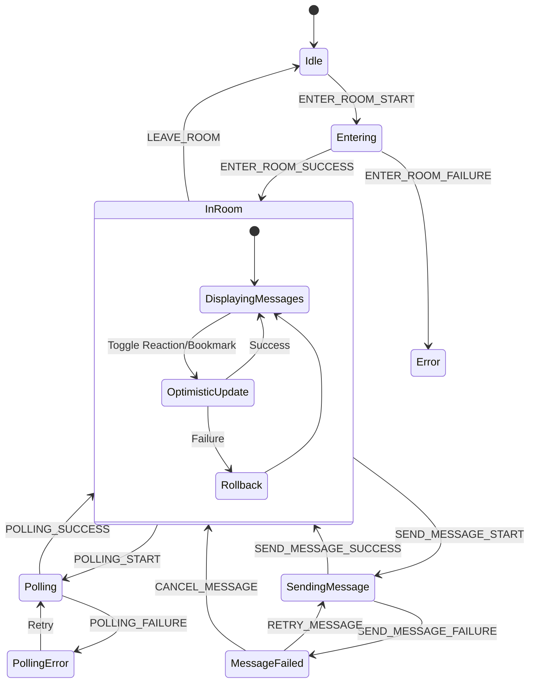

# ChatContext 상태관리 설계

## 1. 개요

ChatContext는 채팅방 상세 페이지에서 메시지, 리액션, 북마크 등 채팅 관련 상태를 관리하는 Context입니다. 폴링 기반 메시지 동기화를 담당하며, 낙관적 UI 업데이트를 지원합니다.

### 적용 페이지
- `/rooms/[roomId]` - 채팅방 상세 페이지

---

## 2. State 인터페이스 정의

```typescript
// src/types/domain/message.types.ts
export interface Message {
  readonly id: string;
  readonly roomId: string;
  readonly userId: string;
  readonly content: string;
  readonly createdAt: string;
  readonly deletedAt: string | null;
  readonly user: MessageUser;
  readonly reactionsCount: number;
  readonly isReactedByMe: boolean;
  readonly isBookmarkedByMe: boolean;
}

export interface MessageUser {
  readonly id: string;
  readonly email: string;
  readonly nickname: string | null;
}

export interface MessageCreateInput {
  readonly content: string;
}

// src/types/domain/room.types.ts (추가)
export interface RoomDetail {
  readonly id: string;
  readonly name: string;
  readonly description: string | null;
  readonly isPublic: boolean;
  readonly createdBy: string;
  readonly createdAt: string;
  readonly memberCount: number;
}

// src/contexts/ChatContext.tsx
export interface ChatState {
  // 현재 채팅방 정보
  readonly currentRoom: RoomDetail | null;
  readonly roomId: string | null;

  // 메시지 목록
  readonly messages: readonly Message[];

  // 폴링 상태
  readonly lastMessageId: string | null;
  readonly isPolling: boolean;
  readonly pollingError: ChatError | null;

  // 로딩 상태
  readonly isLoading: boolean;
  readonly isSending: boolean;

  // 메시지 입력 상태
  readonly messageInput: string;

  // 에러 상태
  readonly error: ChatError | null;

  // 낙관적 업데이트 추적
  readonly pendingMessages: readonly PendingMessage[];
}

export interface PendingMessage {
  readonly tempId: string;
  readonly content: string;
  readonly createdAt: string;
  readonly status: 'sending' | 'failed';
}

export interface ChatError {
  readonly code: ChatErrorCode;
  readonly message: string;
}

export type ChatErrorCode =
  | 'ROOM_NOT_FOUND'
  | 'FETCH_FAILED'
  | 'SEND_FAILED'
  | 'DELETE_FAILED'
  | 'REACTION_FAILED'
  | 'BOOKMARK_FAILED'
  | 'PERMISSION_DENIED'
  | 'NETWORK_ERROR';
```

### 초기 상태

```typescript
export const initialChatState: ChatState = {
  currentRoom: null,
  roomId: null,
  messages: [],
  lastMessageId: null,
  isPolling: false,
  pollingError: null,
  isLoading: false,
  isSending: false,
  messageInput: '',
  error: null,
  pendingMessages: [],
};
```

---

## 3. Action 타입 정의

```typescript
// src/contexts/ChatContext.tsx
export type ChatAction =
  // 채팅방 입장
  | { readonly type: 'ENTER_ROOM_START'; readonly payload: string }
  | { readonly type: 'ENTER_ROOM_SUCCESS'; readonly payload: { room: RoomDetail; messages: readonly Message[] } }
  | { readonly type: 'ENTER_ROOM_FAILURE'; readonly payload: ChatError }

  // 채팅방 퇴장
  | { readonly type: 'LEAVE_ROOM' }

  // 메시지 로드
  | { readonly type: 'FETCH_MESSAGES_START' }
  | { readonly type: 'FETCH_MESSAGES_SUCCESS'; readonly payload: readonly Message[] }
  | { readonly type: 'FETCH_MESSAGES_FAILURE'; readonly payload: ChatError }

  // 폴링 (새 메시지)
  | { readonly type: 'POLLING_START' }
  | { readonly type: 'POLLING_SUCCESS'; readonly payload: readonly Message[] }
  | { readonly type: 'POLLING_FAILURE'; readonly payload: ChatError }
  | { readonly type: 'POLLING_STOP' }

  // 메시지 전송
  | { readonly type: 'SEND_MESSAGE_START'; readonly payload: PendingMessage }
  | { readonly type: 'SEND_MESSAGE_SUCCESS'; readonly payload: { tempId: string; message: Message } }
  | { readonly type: 'SEND_MESSAGE_FAILURE'; readonly payload: { tempId: string; error: ChatError } }
  | { readonly type: 'RETRY_MESSAGE'; readonly payload: string }
  | { readonly type: 'CANCEL_MESSAGE'; readonly payload: string }

  // 메시지 삭제
  | { readonly type: 'DELETE_MESSAGE_START'; readonly payload: string }
  | { readonly type: 'DELETE_MESSAGE_SUCCESS'; readonly payload: string }
  | { readonly type: 'DELETE_MESSAGE_FAILURE'; readonly payload: { messageId: string; error: ChatError } }

  // 리액션
  | { readonly type: 'TOGGLE_REACTION_START'; readonly payload: string }
  | { readonly type: 'TOGGLE_REACTION_SUCCESS'; readonly payload: { messageId: string; isReacted: boolean; count: number } }
  | { readonly type: 'TOGGLE_REACTION_FAILURE'; readonly payload: { messageId: string; error: ChatError } }

  // 북마크
  | { readonly type: 'TOGGLE_BOOKMARK_START'; readonly payload: string }
  | { readonly type: 'TOGGLE_BOOKMARK_SUCCESS'; readonly payload: { messageId: string; isBookmarked: boolean } }
  | { readonly type: 'TOGGLE_BOOKMARK_FAILURE'; readonly payload: { messageId: string; error: ChatError } }

  // 메시지 입력
  | { readonly type: 'SET_MESSAGE_INPUT'; readonly payload: string }
  | { readonly type: 'CLEAR_MESSAGE_INPUT' }

  // 에러 초기화
  | { readonly type: 'CLEAR_ERROR' }

  // 상태 초기화
  | { readonly type: 'RESET_STATE' };
```

### Action Creator 함수

```typescript
// src/contexts/ChatContext.tsx
export const chatActions = {
  // 채팅방 입장
  enterRoomStart: (roomId: string): ChatAction => ({
    type: 'ENTER_ROOM_START',
    payload: roomId,
  }),
  enterRoomSuccess: (room: RoomDetail, messages: readonly Message[]): ChatAction => ({
    type: 'ENTER_ROOM_SUCCESS',
    payload: { room, messages },
  }),
  enterRoomFailure: (error: ChatError): ChatAction => ({
    type: 'ENTER_ROOM_FAILURE',
    payload: error,
  }),

  // 채팅방 퇴장
  leaveRoom: (): ChatAction => ({ type: 'LEAVE_ROOM' }),

  // 메시지 로드
  fetchMessagesStart: (): ChatAction => ({ type: 'FETCH_MESSAGES_START' }),
  fetchMessagesSuccess: (messages: readonly Message[]): ChatAction => ({
    type: 'FETCH_MESSAGES_SUCCESS',
    payload: messages,
  }),
  fetchMessagesFailure: (error: ChatError): ChatAction => ({
    type: 'FETCH_MESSAGES_FAILURE',
    payload: error,
  }),

  // 폴링
  pollingStart: (): ChatAction => ({ type: 'POLLING_START' }),
  pollingSuccess: (messages: readonly Message[]): ChatAction => ({
    type: 'POLLING_SUCCESS',
    payload: messages,
  }),
  pollingFailure: (error: ChatError): ChatAction => ({
    type: 'POLLING_FAILURE',
    payload: error,
  }),
  pollingStop: (): ChatAction => ({ type: 'POLLING_STOP' }),

  // 메시지 전송
  sendMessageStart: (pending: PendingMessage): ChatAction => ({
    type: 'SEND_MESSAGE_START',
    payload: pending,
  }),
  sendMessageSuccess: (tempId: string, message: Message): ChatAction => ({
    type: 'SEND_MESSAGE_SUCCESS',
    payload: { tempId, message },
  }),
  sendMessageFailure: (tempId: string, error: ChatError): ChatAction => ({
    type: 'SEND_MESSAGE_FAILURE',
    payload: { tempId, error },
  }),
  retryMessage: (tempId: string): ChatAction => ({
    type: 'RETRY_MESSAGE',
    payload: tempId,
  }),
  cancelMessage: (tempId: string): ChatAction => ({
    type: 'CANCEL_MESSAGE',
    payload: tempId,
  }),

  // 메시지 삭제
  deleteMessageStart: (messageId: string): ChatAction => ({
    type: 'DELETE_MESSAGE_START',
    payload: messageId,
  }),
  deleteMessageSuccess: (messageId: string): ChatAction => ({
    type: 'DELETE_MESSAGE_SUCCESS',
    payload: messageId,
  }),
  deleteMessageFailure: (messageId: string, error: ChatError): ChatAction => ({
    type: 'DELETE_MESSAGE_FAILURE',
    payload: { messageId, error },
  }),

  // 리액션
  toggleReactionStart: (messageId: string): ChatAction => ({
    type: 'TOGGLE_REACTION_START',
    payload: messageId,
  }),
  toggleReactionSuccess: (messageId: string, isReacted: boolean, count: number): ChatAction => ({
    type: 'TOGGLE_REACTION_SUCCESS',
    payload: { messageId, isReacted, count },
  }),
  toggleReactionFailure: (messageId: string, error: ChatError): ChatAction => ({
    type: 'TOGGLE_REACTION_FAILURE',
    payload: { messageId, error },
  }),

  // 북마크
  toggleBookmarkStart: (messageId: string): ChatAction => ({
    type: 'TOGGLE_BOOKMARK_START',
    payload: messageId,
  }),
  toggleBookmarkSuccess: (messageId: string, isBookmarked: boolean): ChatAction => ({
    type: 'TOGGLE_BOOKMARK_SUCCESS',
    payload: { messageId, isBookmarked },
  }),
  toggleBookmarkFailure: (messageId: string, error: ChatError): ChatAction => ({
    type: 'TOGGLE_BOOKMARK_FAILURE',
    payload: { messageId, error },
  }),

  // 메시지 입력
  setMessageInput: (value: string): ChatAction => ({
    type: 'SET_MESSAGE_INPUT',
    payload: value,
  }),
  clearMessageInput: (): ChatAction => ({ type: 'CLEAR_MESSAGE_INPUT' }),

  // 기타
  clearError: (): ChatAction => ({ type: 'CLEAR_ERROR' }),
  resetState: (): ChatAction => ({ type: 'RESET_STATE' }),
} as const;
```

---

## 4. Reducer 함수

```typescript
// src/contexts/ChatContext.tsx

// 메시지 정렬 헬퍼 함수 (순수 함수)
const sortMessagesByCreatedAt = (messages: readonly Message[]): readonly Message[] =>
  [...messages].sort(
    (a, b) => new Date(a.createdAt).getTime() - new Date(b.createdAt).getTime()
  );

// 마지막 메시지 ID 추출 헬퍼 함수
const getLastMessageId = (messages: readonly Message[]): string | null =>
  messages.length > 0 ? messages[messages.length - 1].id : null;

export const chatReducer = (state: ChatState, action: ChatAction): ChatState => {
  switch (action.type) {
    // 채팅방 입장
    case 'ENTER_ROOM_START':
      return {
        ...initialChatState,
        roomId: action.payload,
        isLoading: true,
      };

    case 'ENTER_ROOM_SUCCESS': {
      const sortedMessages = sortMessagesByCreatedAt(action.payload.messages);
      return {
        ...state,
        currentRoom: action.payload.room,
        messages: sortedMessages,
        lastMessageId: getLastMessageId(sortedMessages),
        isLoading: false,
        error: null,
      };
    }

    case 'ENTER_ROOM_FAILURE':
      return {
        ...state,
        isLoading: false,
        error: action.payload,
      };

    // 채팅방 퇴장
    case 'LEAVE_ROOM':
      return initialChatState;

    // 메시지 로드
    case 'FETCH_MESSAGES_START':
      return {
        ...state,
        isLoading: true,
        error: null,
      };

    case 'FETCH_MESSAGES_SUCCESS': {
      const sortedMessages = sortMessagesByCreatedAt(action.payload);
      return {
        ...state,
        messages: sortedMessages,
        lastMessageId: getLastMessageId(sortedMessages),
        isLoading: false,
        error: null,
      };
    }

    case 'FETCH_MESSAGES_FAILURE':
      return {
        ...state,
        isLoading: false,
        error: action.payload,
      };

    // 폴링
    case 'POLLING_START':
      return {
        ...state,
        isPolling: true,
        pollingError: null,
      };

    case 'POLLING_SUCCESS': {
      if (action.payload.length === 0) {
        return {
          ...state,
          isPolling: false,
        };
      }

      const newMessages = sortMessagesByCreatedAt([
        ...state.messages,
        ...action.payload,
      ]);

      return {
        ...state,
        messages: newMessages,
        lastMessageId: getLastMessageId(newMessages),
        isPolling: false,
        pollingError: null,
      };
    }

    case 'POLLING_FAILURE':
      return {
        ...state,
        isPolling: false,
        pollingError: action.payload,
      };

    case 'POLLING_STOP':
      return {
        ...state,
        isPolling: false,
      };

    // 메시지 전송
    case 'SEND_MESSAGE_START':
      return {
        ...state,
        pendingMessages: [...state.pendingMessages, action.payload],
        isSending: true,
        messageInput: '',
      };

    case 'SEND_MESSAGE_SUCCESS': {
      const newMessages = sortMessagesByCreatedAt([
        ...state.messages,
        action.payload.message,
      ]);

      return {
        ...state,
        messages: newMessages,
        lastMessageId: getLastMessageId(newMessages),
        pendingMessages: state.pendingMessages.filter(
          (pm) => pm.tempId !== action.payload.tempId
        ),
        isSending: state.pendingMessages.length > 1,
      };
    }

    case 'SEND_MESSAGE_FAILURE':
      return {
        ...state,
        pendingMessages: state.pendingMessages.map((pm) =>
          pm.tempId === action.payload.tempId
            ? { ...pm, status: 'failed' as const }
            : pm
        ),
        isSending: false,
        error: action.payload.error,
      };

    case 'RETRY_MESSAGE':
      return {
        ...state,
        pendingMessages: state.pendingMessages.map((pm) =>
          pm.tempId === action.payload
            ? { ...pm, status: 'sending' as const }
            : pm
        ),
        isSending: true,
      };

    case 'CANCEL_MESSAGE':
      return {
        ...state,
        pendingMessages: state.pendingMessages.filter(
          (pm) => pm.tempId !== action.payload
        ),
      };

    // 메시지 삭제
    case 'DELETE_MESSAGE_START':
      return {
        ...state,
        messages: state.messages.map((msg) =>
          msg.id === action.payload
            ? { ...msg, deletedAt: new Date().toISOString() }
            : msg
        ),
      };

    case 'DELETE_MESSAGE_SUCCESS':
      return {
        ...state,
        messages: state.messages.filter((msg) => msg.id !== action.payload),
      };

    case 'DELETE_MESSAGE_FAILURE':
      return {
        ...state,
        messages: state.messages.map((msg) =>
          msg.id === action.payload.messageId
            ? { ...msg, deletedAt: null }
            : msg
        ),
        error: action.payload.error,
      };

    // 리액션 (낙관적 업데이트)
    case 'TOGGLE_REACTION_START': {
      const targetMessage = state.messages.find((msg) => msg.id === action.payload);
      if (!targetMessage) return state;

      const newIsReacted = !targetMessage.isReactedByMe;
      const newCount = newIsReacted
        ? targetMessage.reactionsCount + 1
        : targetMessage.reactionsCount - 1;

      return {
        ...state,
        messages: state.messages.map((msg) =>
          msg.id === action.payload
            ? { ...msg, isReactedByMe: newIsReacted, reactionsCount: newCount }
            : msg
        ),
      };
    }

    case 'TOGGLE_REACTION_SUCCESS':
      return {
        ...state,
        messages: state.messages.map((msg) =>
          msg.id === action.payload.messageId
            ? {
                ...msg,
                isReactedByMe: action.payload.isReacted,
                reactionsCount: action.payload.count,
              }
            : msg
        ),
      };

    case 'TOGGLE_REACTION_FAILURE': {
      // 롤백: 이전 상태로 복원
      const targetMessage = state.messages.find(
        (msg) => msg.id === action.payload.messageId
      );
      if (!targetMessage) return { ...state, error: action.payload.error };

      const revertedIsReacted = !targetMessage.isReactedByMe;
      const revertedCount = revertedIsReacted
        ? targetMessage.reactionsCount + 1
        : targetMessage.reactionsCount - 1;

      return {
        ...state,
        messages: state.messages.map((msg) =>
          msg.id === action.payload.messageId
            ? { ...msg, isReactedByMe: revertedIsReacted, reactionsCount: revertedCount }
            : msg
        ),
        error: action.payload.error,
      };
    }

    // 북마크 (낙관적 업데이트)
    case 'TOGGLE_BOOKMARK_START': {
      const targetMessage = state.messages.find((msg) => msg.id === action.payload);
      if (!targetMessage) return state;

      return {
        ...state,
        messages: state.messages.map((msg) =>
          msg.id === action.payload
            ? { ...msg, isBookmarkedByMe: !msg.isBookmarkedByMe }
            : msg
        ),
      };
    }

    case 'TOGGLE_BOOKMARK_SUCCESS':
      return {
        ...state,
        messages: state.messages.map((msg) =>
          msg.id === action.payload.messageId
            ? { ...msg, isBookmarkedByMe: action.payload.isBookmarked }
            : msg
        ),
      };

    case 'TOGGLE_BOOKMARK_FAILURE': {
      // 롤백
      const targetMessage = state.messages.find(
        (msg) => msg.id === action.payload.messageId
      );
      if (!targetMessage) return { ...state, error: action.payload.error };

      return {
        ...state,
        messages: state.messages.map((msg) =>
          msg.id === action.payload.messageId
            ? { ...msg, isBookmarkedByMe: !msg.isBookmarkedByMe }
            : msg
        ),
        error: action.payload.error,
      };
    }

    // 메시지 입력
    case 'SET_MESSAGE_INPUT':
      return {
        ...state,
        messageInput: action.payload,
      };

    case 'CLEAR_MESSAGE_INPUT':
      return {
        ...state,
        messageInput: '',
      };

    // 에러 초기화
    case 'CLEAR_ERROR':
      return {
        ...state,
        error: null,
        pollingError: null,
      };

    // 상태 초기화
    case 'RESET_STATE':
      return initialChatState;

    default:
      return state;
  }
};
```

---

## 5. Provider 컴포넌트 구조

```typescript
// src/contexts/ChatContext.tsx
import { createContext, useReducer, useCallback, useEffect, useRef, ReactNode } from 'react';
import { POLLING_INTERVAL } from '@/constants/polling.constants';

// Context 타입 정의
export interface ChatContextValue {
  readonly state: ChatState;
  readonly dispatch: React.Dispatch<ChatAction>;
  readonly actions: {
    readonly enterRoom: (roomId: string) => Promise<void>;
    readonly leaveRoom: () => void;
    readonly sendMessage: (content: string) => Promise<void>;
    readonly deleteMessage: (messageId: string) => Promise<void>;
    readonly toggleReaction: (messageId: string) => Promise<void>;
    readonly toggleBookmark: (messageId: string) => Promise<void>;
    readonly setMessageInput: (value: string) => void;
    readonly retryMessage: (tempId: string) => Promise<void>;
    readonly cancelMessage: (tempId: string) => void;
    readonly clearError: () => void;
  };
}

// Context 생성
export const ChatContext = createContext<ChatContextValue | null>(null);

// Provider Props
interface ChatProviderProps {
  readonly children: ReactNode;
}

// 임시 ID 생성 함수
const generateTempId = (): string => `temp-${Date.now()}-${Math.random().toString(36).substr(2, 9)}`;

// Provider 컴포넌트
export const ChatProvider = ({ children }: ChatProviderProps): JSX.Element => {
  const [state, dispatch] = useReducer(chatReducer, initialChatState);
  const pollingIntervalRef = useRef<NodeJS.Timeout | null>(null);

  // 폴링 시작
  const startPolling = useCallback((roomId: string, lastMessageId: string | null) => {
    if (pollingIntervalRef.current) {
      clearInterval(pollingIntervalRef.current);
    }

    pollingIntervalRef.current = setInterval(async () => {
      dispatch(chatActions.pollingStart());

      try {
        const url = lastMessageId
          ? `/api/rooms/${roomId}/messages?after=${lastMessageId}`
          : `/api/rooms/${roomId}/messages`;

        const response = await fetch(url);

        if (response.ok) {
          const data = await response.json();
          dispatch(chatActions.pollingSuccess(data.messages));
        } else {
          dispatch(chatActions.pollingFailure({
            code: 'FETCH_FAILED',
            message: '새 메시지를 불러오는데 실패했습니다.',
          }));
        }
      } catch (error) {
        dispatch(chatActions.pollingFailure({
          code: 'NETWORK_ERROR',
          message: '네트워크 오류가 발생했습니다.',
        }));
      }
    }, POLLING_INTERVAL);
  }, []);

  // 폴링 중지
  const stopPolling = useCallback(() => {
    if (pollingIntervalRef.current) {
      clearInterval(pollingIntervalRef.current);
      pollingIntervalRef.current = null;
    }
    dispatch(chatActions.pollingStop());
  }, []);

  // 컴포넌트 언마운트 시 폴링 정리
  useEffect(() => {
    return () => {
      stopPolling();
    };
  }, [stopPolling]);

  // lastMessageId 변경 시 폴링 재시작
  useEffect(() => {
    if (state.roomId && state.lastMessageId) {
      startPolling(state.roomId, state.lastMessageId);
    }
  }, [state.roomId, state.lastMessageId, startPolling]);

  // 채팅방 입장
  const enterRoom = useCallback(async (roomId: string): Promise<void> => {
    stopPolling();
    dispatch(chatActions.enterRoomStart(roomId));

    try {
      const [roomResponse, messagesResponse] = await Promise.all([
        fetch(`/api/rooms/${roomId}`),
        fetch(`/api/rooms/${roomId}/messages`),
      ]);

      if (roomResponse.ok && messagesResponse.ok) {
        const roomData = await roomResponse.json();
        const messagesData = await messagesResponse.json();

        dispatch(chatActions.enterRoomSuccess(roomData.room, messagesData.messages));
        startPolling(roomId, messagesData.messages.length > 0
          ? messagesData.messages[messagesData.messages.length - 1].id
          : null);
      } else {
        dispatch(chatActions.enterRoomFailure({
          code: 'ROOM_NOT_FOUND',
          message: '채팅방을 찾을 수 없습니다.',
        }));
      }
    } catch (error) {
      dispatch(chatActions.enterRoomFailure({
        code: 'NETWORK_ERROR',
        message: '네트워크 오류가 발생했습니다.',
      }));
    }
  }, [startPolling, stopPolling]);

  // 채팅방 퇴장
  const leaveRoom = useCallback((): void => {
    stopPolling();
    dispatch(chatActions.leaveRoom());
  }, [stopPolling]);

  // 메시지 전송
  const sendMessage = useCallback(async (content: string): Promise<void> => {
    if (!state.roomId || !content.trim()) return;

    const tempId = generateTempId();
    const pendingMessage: PendingMessage = {
      tempId,
      content,
      createdAt: new Date().toISOString(),
      status: 'sending',
    };

    dispatch(chatActions.sendMessageStart(pendingMessage));

    try {
      const response = await fetch(`/api/rooms/${state.roomId}/messages`, {
        method: 'POST',
        headers: { 'Content-Type': 'application/json' },
        body: JSON.stringify({ content }),
      });

      const data = await response.json();

      if (response.ok) {
        dispatch(chatActions.sendMessageSuccess(tempId, data.message));
      } else {
        dispatch(chatActions.sendMessageFailure(tempId, {
          code: data.code || 'SEND_FAILED',
          message: data.message || '메시지 전송에 실패했습니다.',
        }));
      }
    } catch (error) {
      dispatch(chatActions.sendMessageFailure(tempId, {
        code: 'NETWORK_ERROR',
        message: '네트워크 오류가 발생했습니다.',
      }));
    }
  }, [state.roomId]);

  // 메시지 재전송
  const retryMessage = useCallback(async (tempId: string): Promise<void> => {
    const pendingMessage = state.pendingMessages.find((pm) => pm.tempId === tempId);
    if (!pendingMessage || !state.roomId) return;

    dispatch(chatActions.retryMessage(tempId));

    try {
      const response = await fetch(`/api/rooms/${state.roomId}/messages`, {
        method: 'POST',
        headers: { 'Content-Type': 'application/json' },
        body: JSON.stringify({ content: pendingMessage.content }),
      });

      const data = await response.json();

      if (response.ok) {
        dispatch(chatActions.sendMessageSuccess(tempId, data.message));
      } else {
        dispatch(chatActions.sendMessageFailure(tempId, {
          code: data.code || 'SEND_FAILED',
          message: data.message || '메시지 전송에 실패했습니다.',
        }));
      }
    } catch (error) {
      dispatch(chatActions.sendMessageFailure(tempId, {
        code: 'NETWORK_ERROR',
        message: '네트워크 오류가 발생했습니다.',
      }));
    }
  }, [state.pendingMessages, state.roomId]);

  // 메시지 전송 취소
  const cancelMessage = useCallback((tempId: string): void => {
    dispatch(chatActions.cancelMessage(tempId));
  }, []);

  // 메시지 삭제
  const deleteMessage = useCallback(async (messageId: string): Promise<void> => {
    dispatch(chatActions.deleteMessageStart(messageId));

    try {
      const response = await fetch(`/api/messages/${messageId}`, {
        method: 'DELETE',
      });

      if (response.ok) {
        dispatch(chatActions.deleteMessageSuccess(messageId));
      } else {
        const data = await response.json();
        dispatch(chatActions.deleteMessageFailure(messageId, {
          code: data.code || 'DELETE_FAILED',
          message: data.message || '메시지 삭제에 실패했습니다.',
        }));
      }
    } catch (error) {
      dispatch(chatActions.deleteMessageFailure(messageId, {
        code: 'NETWORK_ERROR',
        message: '네트워크 오류가 발생했습니다.',
      }));
    }
  }, []);

  // 리액션 토글
  const toggleReaction = useCallback(async (messageId: string): Promise<void> => {
    dispatch(chatActions.toggleReactionStart(messageId));

    try {
      const message = state.messages.find((m) => m.id === messageId);
      const method = message?.isReactedByMe ? 'DELETE' : 'POST';

      const response = await fetch(`/api/messages/${messageId}/reactions`, {
        method,
      });

      const data = await response.json();

      if (response.ok) {
        dispatch(chatActions.toggleReactionSuccess(
          messageId,
          data.isReacted,
          data.count
        ));
      } else {
        dispatch(chatActions.toggleReactionFailure(messageId, {
          code: data.code || 'REACTION_FAILED',
          message: data.message || '리액션 처리에 실패했습니다.',
        }));
      }
    } catch (error) {
      dispatch(chatActions.toggleReactionFailure(messageId, {
        code: 'NETWORK_ERROR',
        message: '네트워크 오류가 발생했습니다.',
      }));
    }
  }, [state.messages]);

  // 북마크 토글
  const toggleBookmark = useCallback(async (messageId: string): Promise<void> => {
    dispatch(chatActions.toggleBookmarkStart(messageId));

    try {
      const message = state.messages.find((m) => m.id === messageId);
      const method = message?.isBookmarkedByMe ? 'DELETE' : 'POST';
      const url = message?.isBookmarkedByMe
        ? `/api/bookmarks?messageId=${messageId}`
        : '/api/bookmarks';

      const response = await fetch(url, {
        method,
        headers: method === 'POST' ? { 'Content-Type': 'application/json' } : undefined,
        body: method === 'POST' ? JSON.stringify({ messageId }) : undefined,
      });

      const data = await response.json();

      if (response.ok) {
        dispatch(chatActions.toggleBookmarkSuccess(messageId, data.isBookmarked));
      } else {
        dispatch(chatActions.toggleBookmarkFailure(messageId, {
          code: data.code || 'BOOKMARK_FAILED',
          message: data.message || '북마크 처리에 실패했습니다.',
        }));
      }
    } catch (error) {
      dispatch(chatActions.toggleBookmarkFailure(messageId, {
        code: 'NETWORK_ERROR',
        message: '네트워크 오류가 발생했습니다.',
      }));
    }
  }, [state.messages]);

  // 메시지 입력
  const setMessageInput = useCallback((value: string): void => {
    dispatch(chatActions.setMessageInput(value));
  }, []);

  // 에러 초기화
  const clearError = useCallback((): void => {
    dispatch(chatActions.clearError());
  }, []);

  const contextValue: ChatContextValue = {
    state,
    dispatch,
    actions: {
      enterRoom,
      leaveRoom,
      sendMessage,
      deleteMessage,
      toggleReaction,
      toggleBookmark,
      setMessageInput,
      retryMessage,
      cancelMessage,
      clearError,
    },
  };

  return (
    <ChatContext.Provider value={contextValue}>
      {children}
    </ChatContext.Provider>
  );
};
```

---

## 6. Custom Hook

```typescript
// src/hooks/useChat.ts
import { useContext, useEffect } from 'react';
import { ChatContext, ChatContextValue } from '@/contexts/ChatContext';

export const useChat = (): ChatContextValue => {
  const context = useContext(ChatContext);

  if (context === null) {
    throw new Error('useChat must be used within a ChatProvider');
  }

  return context;
};

// 채팅방 자동 입장/퇴장 훅
export const useChatRoom = (roomId: string): ChatContextValue => {
  const context = useChat();

  useEffect(() => {
    context.actions.enterRoom(roomId);

    return () => {
      context.actions.leaveRoom();
    };
  }, [roomId, context.actions]);

  return context;
};

// 메시지 목록 훅
export const useMessages = () => {
  const { state } = useChat();
  return {
    messages: state.messages,
    pendingMessages: state.pendingMessages,
    isLoading: state.isLoading,
  };
};

// 메시지 입력 훅
export const useMessageInput = () => {
  const { state, actions } = useChat();
  return {
    value: state.messageInput,
    setValue: actions.setMessageInput,
    send: () => actions.sendMessage(state.messageInput),
    isSending: state.isSending,
  };
};

// 폴링 상태 훅
export const usePollingStatus = () => {
  const { state } = useChat();
  return {
    isPolling: state.isPolling,
    pollingError: state.pollingError,
  };
};
```

---

## 7. 폴링 관련 상수

```typescript
// src/constants/polling.constants.ts
export const POLLING_INTERVAL = 3000; // 3초
export const POLLING_RETRY_DELAY = 5000; // 5초 (에러 시 재시도 간격)
export const MAX_POLLING_ERRORS = 3; // 최대 연속 에러 횟수
```

---

## 8. 상태 흐름 다이어그램



---

## 9. 사용 예시

### 채팅방 페이지에서 사용

```typescript
// src/app/(main)/rooms/[roomId]/page.tsx
'use client';

import { useChatRoom } from '@/hooks/useChat';
import { MessageList } from '@/components/features/chat/MessageList';
import { MessageInput } from '@/components/features/chat/MessageInput';

interface ChatRoomPageProps {
  params: { roomId: string };
}

export default function ChatRoomPage({ params }: ChatRoomPageProps): JSX.Element {
  const { state } = useChatRoom(params.roomId);

  if (state.isLoading) {
    return <div>채팅방을 불러오는 중...</div>;
  }

  if (state.error) {
    return <div className="error">{state.error.message}</div>;
  }

  if (!state.currentRoom) {
    return <div>채팅방을 찾을 수 없습니다.</div>;
  }

  return (
    <div className="chat-room">
      <header>
        <h1>{state.currentRoom.name}</h1>
        <p>{state.currentRoom.description}</p>
      </header>

      <MessageList />
      <MessageInput />
    </div>
  );
}
```

### 메시지 목록 컴포넌트

```typescript
// src/components/features/chat/MessageList.tsx
import { useMessages } from '@/hooks/useChat';
import { MessageItem } from './MessageItem';
import { PendingMessageItem } from './PendingMessageItem';

export const MessageList = (): JSX.Element => {
  const { messages, pendingMessages, isLoading } = useMessages();

  return (
    <div className="message-list">
      {messages.map((message) => (
        <MessageItem key={message.id} message={message} />
      ))}

      {pendingMessages.map((pending) => (
        <PendingMessageItem key={pending.tempId} pending={pending} />
      ))}

      {isLoading && <div className="loading">로딩 중...</div>}
    </div>
  );
};
```

### 메시지 입력 컴포넌트

```typescript
// src/components/features/chat/MessageInput.tsx
import { FormEvent } from 'react';
import { useMessageInput } from '@/hooks/useChat';

export const MessageInput = (): JSX.Element => {
  const { value, setValue, send, isSending } = useMessageInput();

  const handleSubmit = (e: FormEvent): void => {
    e.preventDefault();
    if (value.trim() && !isSending) {
      send();
    }
  };

  return (
    <form onSubmit={handleSubmit} className="message-input">
      <input
        type="text"
        value={value}
        onChange={(e) => setValue(e.target.value)}
        placeholder="메시지를 입력하세요..."
        disabled={isSending}
      />
      <button type="submit" disabled={isSending || !value.trim()}>
        {isSending ? '전송 중...' : '전송'}
      </button>
    </form>
  );
};
```

---

## 10. 설계 원칙

### 낙관적 UI 업데이트
- 리액션, 북마크는 서버 응답 전에 UI 먼저 업데이트
- 실패 시 이전 상태로 롤백

### 폴링 기반 동기화
- 3초 주기로 새 메시지 폴링
- lastMessageId 기반 증분 조회로 효율성 확보
- 채팅방 퇴장 시 폴링 자동 정리

### 펜딩 메시지 관리
- 전송 중/실패한 메시지를 별도로 관리
- 재전송, 취소 기능 제공

### 채팅방 생명주기 관리
- useChatRoom 훅으로 입장/퇴장 자동 처리
- 컴포넌트 언마운트 시 리소스 정리
