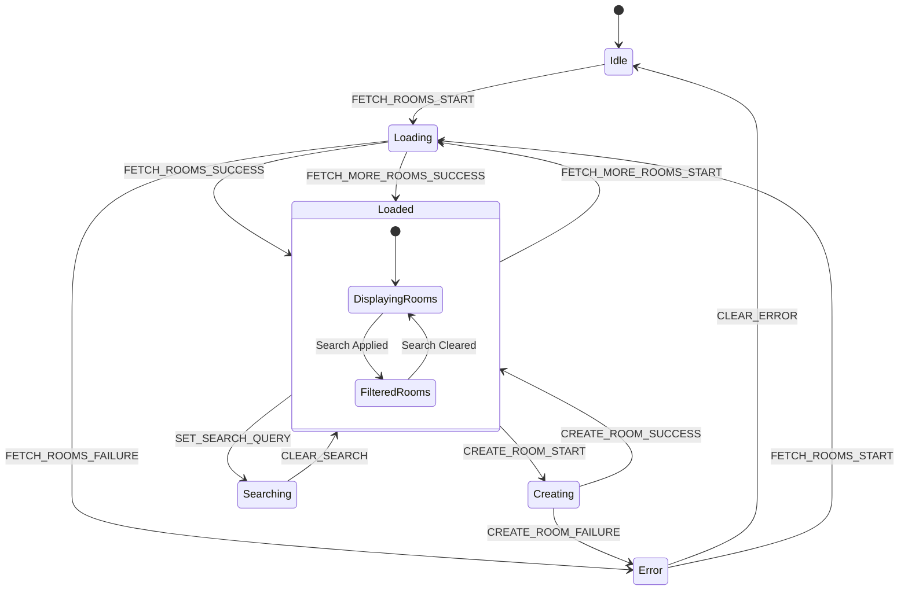

# RoomContext 상태관리 설계

## 1. 개요

RoomContext는 채팅방 목록과 관련된 상태를 전역적으로 관리하는 Context입니다. 채팅방 목록 조회, 검색, 방 생성 등의 기능을 담당합니다.

### 적용 페이지
- `/rooms` - 채팅방 목록 페이지

---

## 2. State 인터페이스 정의

```typescript
// src/types/domain/room.types.ts
export interface Room {
  readonly id: string;
  readonly name: string;
  readonly description: string | null;
  readonly isPublic: boolean;
  readonly createdBy: string;
  readonly createdAt: string;
  readonly memberCount?: number;
}

export interface RoomCreateInput {
  readonly name: string;
  readonly description?: string;
  readonly isPublic: boolean;
}

// src/contexts/RoomContext.tsx
export interface RoomState {
  // 채팅방 목록
  readonly rooms: readonly Room[];

  // 검색/필터 상태
  readonly searchQuery: string;
  readonly filteredRooms: readonly Room[];

  // 로딩 상태
  readonly isLoading: boolean;
  readonly isCreating: boolean;

  // 에러 상태
  readonly error: RoomError | null;

  // 페이지네이션 (선택적)
  readonly hasMore: boolean;
  readonly page: number;
}

export interface RoomError {
  readonly code: RoomErrorCode;
  readonly message: string;
}

export type RoomErrorCode =
  | 'FETCH_FAILED'
  | 'CREATE_FAILED'
  | 'ROOM_NOT_FOUND'
  | 'INVALID_INPUT'
  | 'PERMISSION_DENIED'
  | 'NETWORK_ERROR';
```

### 초기 상태

```typescript
export const initialRoomState: RoomState = {
  rooms: [],
  searchQuery: '',
  filteredRooms: [],
  isLoading: false,
  isCreating: false,
  error: null,
  hasMore: true,
  page: 1,
};
```

---

## 3. Action 타입 정의

```typescript
// src/contexts/RoomContext.tsx
export type RoomAction =
  // 채팅방 목록 조회
  | { readonly type: 'FETCH_ROOMS_START' }
  | { readonly type: 'FETCH_ROOMS_SUCCESS'; readonly payload: readonly Room[] }
  | { readonly type: 'FETCH_ROOMS_FAILURE'; readonly payload: RoomError }

  // 채팅방 추가 로드 (페이지네이션)
  | { readonly type: 'FETCH_MORE_ROOMS_START' }
  | {
      readonly type: 'FETCH_MORE_ROOMS_SUCCESS';
      readonly payload: {
        readonly rooms: readonly Room[];
        readonly hasMore: boolean;
      };
    }
  | { readonly type: 'FETCH_MORE_ROOMS_FAILURE'; readonly payload: RoomError }

  // 채팅방 생성
  | { readonly type: 'CREATE_ROOM_START' }
  | { readonly type: 'CREATE_ROOM_SUCCESS'; readonly payload: Room }
  | { readonly type: 'CREATE_ROOM_FAILURE'; readonly payload: RoomError }

  // 검색
  | { readonly type: 'SET_SEARCH_QUERY'; readonly payload: string }
  | { readonly type: 'CLEAR_SEARCH' }

  // 채팅방 업데이트 (외부 변경 반영)
  | { readonly type: 'UPDATE_ROOM'; readonly payload: Room }
  | { readonly type: 'REMOVE_ROOM'; readonly payload: string }

  // 에러 초기화
  | { readonly type: 'CLEAR_ERROR' }

  // 상태 초기화
  | { readonly type: 'RESET_STATE' };
```

### Action Creator 함수

```typescript
// src/contexts/RoomContext.tsx
export const roomActions = {
  // 채팅방 목록 조회
  fetchRoomsStart: (): RoomAction => ({ type: 'FETCH_ROOMS_START' }),
  fetchRoomsSuccess: (rooms: readonly Room[]): RoomAction => ({
    type: 'FETCH_ROOMS_SUCCESS',
    payload: rooms,
  }),
  fetchRoomsFailure: (error: RoomError): RoomAction => ({
    type: 'FETCH_ROOMS_FAILURE',
    payload: error,
  }),

  // 추가 로드
  fetchMoreRoomsStart: (): RoomAction => ({ type: 'FETCH_MORE_ROOMS_START' }),
  fetchMoreRoomsSuccess: (rooms: readonly Room[], hasMore: boolean): RoomAction => ({
    type: 'FETCH_MORE_ROOMS_SUCCESS',
    payload: { rooms, hasMore },
  }),
  fetchMoreRoomsFailure: (error: RoomError): RoomAction => ({
    type: 'FETCH_MORE_ROOMS_FAILURE',
    payload: error,
  }),

  // 채팅방 생성
  createRoomStart: (): RoomAction => ({ type: 'CREATE_ROOM_START' }),
  createRoomSuccess: (room: Room): RoomAction => ({
    type: 'CREATE_ROOM_SUCCESS',
    payload: room,
  }),
  createRoomFailure: (error: RoomError): RoomAction => ({
    type: 'CREATE_ROOM_FAILURE',
    payload: error,
  }),

  // 검색
  setSearchQuery: (query: string): RoomAction => ({
    type: 'SET_SEARCH_QUERY',
    payload: query,
  }),
  clearSearch: (): RoomAction => ({ type: 'CLEAR_SEARCH' }),

  // 채팅방 업데이트
  updateRoom: (room: Room): RoomAction => ({
    type: 'UPDATE_ROOM',
    payload: room,
  }),
  removeRoom: (roomId: string): RoomAction => ({
    type: 'REMOVE_ROOM',
    payload: roomId,
  }),

  // 기타
  clearError: (): RoomAction => ({ type: 'CLEAR_ERROR' }),
  resetState: (): RoomAction => ({ type: 'RESET_STATE' }),
} as const;
```

---

## 4. Reducer 함수

```typescript
// src/contexts/RoomContext.tsx

// 검색 필터링 헬퍼 함수 (순수 함수)
const filterRoomsByQuery = (
  rooms: readonly Room[],
  query: string
): readonly Room[] => {
  if (query.trim() === '') {
    return rooms;
  }

  const lowerQuery = query.toLowerCase();
  return rooms.filter(
    (room) =>
      room.name.toLowerCase().includes(lowerQuery) ||
      (room.description?.toLowerCase().includes(lowerQuery) ?? false)
  );
};

export const roomReducer = (state: RoomState, action: RoomAction): RoomState => {
  switch (action.type) {
    // 채팅방 목록 조회
    case 'FETCH_ROOMS_START':
      return {
        ...state,
        isLoading: true,
        error: null,
      };

    case 'FETCH_ROOMS_SUCCESS':
      return {
        ...state,
        rooms: action.payload,
        filteredRooms: filterRoomsByQuery(action.payload, state.searchQuery),
        isLoading: false,
        error: null,
        page: 1,
        hasMore: true,
      };

    case 'FETCH_ROOMS_FAILURE':
      return {
        ...state,
        isLoading: false,
        error: action.payload,
      };

    // 추가 로드 (페이지네이션)
    case 'FETCH_MORE_ROOMS_START':
      return {
        ...state,
        isLoading: true,
        error: null,
      };

    case 'FETCH_MORE_ROOMS_SUCCESS': {
      const newRooms = [...state.rooms, ...action.payload.rooms];
      return {
        ...state,
        rooms: newRooms,
        filteredRooms: filterRoomsByQuery(newRooms, state.searchQuery),
        isLoading: false,
        hasMore: action.payload.hasMore,
        page: state.page + 1,
      };
    }

    case 'FETCH_MORE_ROOMS_FAILURE':
      return {
        ...state,
        isLoading: false,
        error: action.payload,
      };

    // 채팅방 생성
    case 'CREATE_ROOM_START':
      return {
        ...state,
        isCreating: true,
        error: null,
      };

    case 'CREATE_ROOM_SUCCESS': {
      const newRooms = [action.payload, ...state.rooms];
      return {
        ...state,
        rooms: newRooms,
        filteredRooms: filterRoomsByQuery(newRooms, state.searchQuery),
        isCreating: false,
        error: null,
      };
    }

    case 'CREATE_ROOM_FAILURE':
      return {
        ...state,
        isCreating: false,
        error: action.payload,
      };

    // 검색
    case 'SET_SEARCH_QUERY':
      return {
        ...state,
        searchQuery: action.payload,
        filteredRooms: filterRoomsByQuery(state.rooms, action.payload),
      };

    case 'CLEAR_SEARCH':
      return {
        ...state,
        searchQuery: '',
        filteredRooms: state.rooms,
      };

    // 채팅방 업데이트
    case 'UPDATE_ROOM': {
      const updatedRooms = state.rooms.map((room) =>
        room.id === action.payload.id ? action.payload : room
      );
      return {
        ...state,
        rooms: updatedRooms,
        filteredRooms: filterRoomsByQuery(updatedRooms, state.searchQuery),
      };
    }

    case 'REMOVE_ROOM': {
      const remainingRooms = state.rooms.filter(
        (room) => room.id !== action.payload
      );
      return {
        ...state,
        rooms: remainingRooms,
        filteredRooms: filterRoomsByQuery(remainingRooms, state.searchQuery),
      };
    }

    // 에러 초기화
    case 'CLEAR_ERROR':
      return {
        ...state,
        error: null,
      };

    // 상태 초기화
    case 'RESET_STATE':
      return initialRoomState;

    default:
      return state;
  }
};
```

---

## 5. Provider 컴포넌트 구조

```typescript
// src/contexts/RoomContext.tsx
import { createContext, useReducer, useCallback, ReactNode } from 'react';

// Context 타입 정의
export interface RoomContextValue {
  readonly state: RoomState;
  readonly dispatch: React.Dispatch<RoomAction>;
  readonly actions: {
    readonly fetchRooms: () => Promise<void>;
    readonly fetchMoreRooms: () => Promise<void>;
    readonly createRoom: (input: RoomCreateInput) => Promise<Room | null>;
    readonly setSearchQuery: (query: string) => void;
    readonly clearSearch: () => void;
    readonly clearError: () => void;
  };
}

// Context 생성
export const RoomContext = createContext<RoomContextValue | null>(null);

// Provider Props
interface RoomProviderProps {
  readonly children: ReactNode;
}

// Provider 컴포넌트
export const RoomProvider = ({ children }: RoomProviderProps): JSX.Element => {
  const [state, dispatch] = useReducer(roomReducer, initialRoomState);

  // 채팅방 목록 조회
  const fetchRooms = useCallback(async (): Promise<void> => {
    dispatch(roomActions.fetchRoomsStart());

    try {
      const response = await fetch('/api/rooms');

      if (response.ok) {
        const data = await response.json();
        dispatch(roomActions.fetchRoomsSuccess(data.rooms));
      } else {
        const error = await response.json();
        dispatch(roomActions.fetchRoomsFailure({
          code: error.code || 'FETCH_FAILED',
          message: error.message || '채팅방 목록을 불러오는데 실패했습니다.',
        }));
      }
    } catch (error) {
      dispatch(roomActions.fetchRoomsFailure({
        code: 'NETWORK_ERROR',
        message: '네트워크 오류가 발생했습니다.',
      }));
    }
  }, []);

  // 추가 로드 (페이지네이션)
  const fetchMoreRooms = useCallback(async (): Promise<void> => {
    if (!state.hasMore || state.isLoading) {
      return;
    }

    dispatch(roomActions.fetchMoreRoomsStart());

    try {
      const nextPage = state.page + 1;
      const response = await fetch(`/api/rooms?page=${nextPage}`);

      if (response.ok) {
        const data = await response.json();
        dispatch(roomActions.fetchMoreRoomsSuccess(data.rooms, data.hasMore));
      } else {
        const error = await response.json();
        dispatch(roomActions.fetchMoreRoomsFailure({
          code: error.code || 'FETCH_FAILED',
          message: error.message || '추가 채팅방을 불러오는데 실패했습니다.',
        }));
      }
    } catch (error) {
      dispatch(roomActions.fetchMoreRoomsFailure({
        code: 'NETWORK_ERROR',
        message: '네트워크 오류가 발생했습니다.',
      }));
    }
  }, [state.hasMore, state.isLoading, state.page]);

  // 채팅방 생성
  const createRoom = useCallback(async (input: RoomCreateInput): Promise<Room | null> => {
    dispatch(roomActions.createRoomStart());

    try {
      const response = await fetch('/api/rooms', {
        method: 'POST',
        headers: { 'Content-Type': 'application/json' },
        body: JSON.stringify(input),
      });

      const data = await response.json();

      if (response.ok) {
        dispatch(roomActions.createRoomSuccess(data.room));
        return data.room;
      } else {
        dispatch(roomActions.createRoomFailure({
          code: data.code || 'CREATE_FAILED',
          message: data.message || '채팅방 생성에 실패했습니다.',
        }));
        return null;
      }
    } catch (error) {
      dispatch(roomActions.createRoomFailure({
        code: 'NETWORK_ERROR',
        message: '네트워크 오류가 발생했습니다.',
      }));
      return null;
    }
  }, []);

  // 검색 쿼리 설정
  const setSearchQuery = useCallback((query: string): void => {
    dispatch(roomActions.setSearchQuery(query));
  }, []);

  // 검색 초기화
  const clearSearch = useCallback((): void => {
    dispatch(roomActions.clearSearch());
  }, []);

  // 에러 초기화
  const clearError = useCallback((): void => {
    dispatch(roomActions.clearError());
  }, []);

  const contextValue: RoomContextValue = {
    state,
    dispatch,
    actions: {
      fetchRooms,
      fetchMoreRooms,
      createRoom,
      setSearchQuery,
      clearSearch,
      clearError,
    },
  };

  return (
    <RoomContext.Provider value={contextValue}>
      {children}
    </RoomContext.Provider>
  );
};
```

---

## 6. Custom Hook

```typescript
// src/hooks/useRooms.ts
import { useContext, useEffect } from 'react';
import { RoomContext, RoomContextValue } from '@/contexts/RoomContext';

export const useRooms = (): RoomContextValue => {
  const context = useContext(RoomContext);

  if (context === null) {
    throw new Error('useRooms must be used within a RoomProvider');
  }

  return context;
};

// 자동 로드 기능이 포함된 훅
export const useRoomsWithAutoFetch = (): RoomContextValue => {
  const context = useRooms();

  useEffect(() => {
    if (context.state.rooms.length === 0 && !context.state.isLoading) {
      context.actions.fetchRooms();
    }
  }, [context.state.rooms.length, context.state.isLoading, context.actions]);

  return context;
};

// 편의를 위한 개별 훅
export const useRoomList = () => {
  const { state } = useRooms();
  return state.filteredRooms;
};

export const useRoomSearch = () => {
  const { state, actions } = useRooms();
  return {
    searchQuery: state.searchQuery,
    setSearchQuery: actions.setSearchQuery,
    clearSearch: actions.clearSearch,
  };
};

export const useCreateRoom = () => {
  const { state, actions } = useRooms();
  return {
    createRoom: actions.createRoom,
    isCreating: state.isCreating,
    error: state.error,
  };
};
```

---

## 7. 상태 흐름 다이어그램



---

## 8. 사용 예시

### 채팅방 목록 페이지에서 사용

```typescript
// src/components/features/room/RoomList.tsx
import { useRoomsWithAutoFetch, useRoomSearch } from '@/hooks/useRooms';
import { RoomCard } from './RoomCard';

export const RoomList = (): JSX.Element => {
  const { state } = useRoomsWithAutoFetch();
  const { searchQuery, setSearchQuery, clearSearch } = useRoomSearch();

  if (state.isLoading && state.rooms.length === 0) {
    return <div>채팅방 목록을 불러오는 중...</div>;
  }

  if (state.error) {
    return <div className="error">{state.error.message}</div>;
  }

  return (
    <div>
      {/* 검색 입력 */}
      <div className="search-bar">
        <input
          type="text"
          placeholder="채팅방 검색..."
          value={searchQuery}
          onChange={(e) => setSearchQuery(e.target.value)}
        />
        {searchQuery && (
          <button onClick={clearSearch}>초기화</button>
        )}
      </div>

      {/* 채팅방 목록 */}
      <div className="room-list">
        {state.filteredRooms.length === 0 ? (
          <div>검색 결과가 없습니다.</div>
        ) : (
          state.filteredRooms.map((room) => (
            <RoomCard key={room.id} room={room} />
          ))
        )}
      </div>
    </div>
  );
};
```

### 채팅방 생성 폼에서 사용

```typescript
// src/components/features/room/CreateRoomForm.tsx
import { useState, FormEvent } from 'react';
import { useCreateRoom } from '@/hooks/useRooms';
import { useRouter } from 'next/navigation';

export const CreateRoomForm = (): JSX.Element => {
  const router = useRouter();
  const { createRoom, isCreating, error } = useCreateRoom();

  const [name, setName] = useState('');
  const [description, setDescription] = useState('');
  const [isPublic, setIsPublic] = useState(true);

  const handleSubmit = async (e: FormEvent): Promise<void> => {
    e.preventDefault();

    const room = await createRoom({ name, description, isPublic });

    if (room) {
      router.push(`/rooms/${room.id}`);
    }
  };

  return (
    <form onSubmit={handleSubmit}>
      {error && <div className="error">{error.message}</div>}

      <input
        type="text"
        placeholder="채팅방 이름"
        value={name}
        onChange={(e) => setName(e.target.value)}
        required
        disabled={isCreating}
      />

      <textarea
        placeholder="채팅방 설명 (선택)"
        value={description}
        onChange={(e) => setDescription(e.target.value)}
        disabled={isCreating}
      />

      <label>
        <input
          type="checkbox"
          checked={isPublic}
          onChange={(e) => setIsPublic(e.target.checked)}
          disabled={isCreating}
        />
        공개 채팅방
      </label>

      <button type="submit" disabled={isCreating || !name.trim()}>
        {isCreating ? '생성 중...' : '채팅방 만들기'}
      </button>
    </form>
  );
};
```

---

## 9. 설계 원칙

### 클라이언트 사이드 검색
- 검색은 이미 로드된 데이터에서 클라이언트 사이드로 수행
- 서버 검색이 필요한 경우 별도 API 호출로 확장 가능

### 낙관적 UI 업데이트
- 채팅방 생성 시 성공 응답을 받으면 즉시 목록에 추가
- 실패 시 에러 상태로 전환

### 페이지네이션 지원
- 무한 스크롤 또는 더보기 버튼으로 추가 로드 가능
- hasMore 플래그로 추가 데이터 존재 여부 확인

### 검색 상태 분리
- searchQuery와 filteredRooms를 분리하여 관리
- 검색어 변경 시 자동으로 필터링 수행
