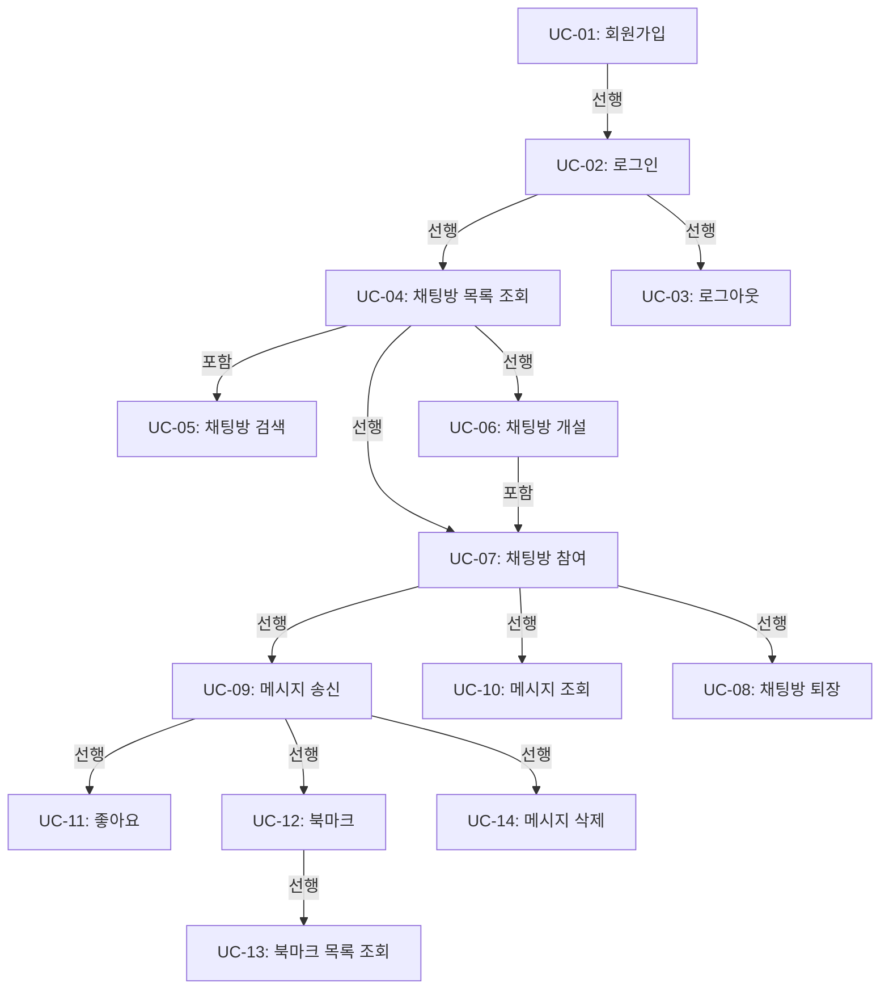

# Usecase 문서

## 1. Usecase 다이어그램

```mermaid
flowchart TB
    subgraph Actors
        Guest[Guest<br/>비인증 사용자]
        User[User<br/>인증된 사용자]
        System[System<br/>폴링/Webhook]
    end

    subgraph Auth[인증 관련]
        UC01[UC-01: 회원가입]
        UC02[UC-02: 로그인]
        UC03[UC-03: 로그아웃]
    end

    subgraph Room[채팅방 관련]
        UC04[UC-04: 채팅방 목록 조회]
        UC05[UC-05: 채팅방 검색]
        UC06[UC-06: 채팅방 개설]
        UC07[UC-07: 채팅방 참여]
        UC08[UC-08: 채팅방 퇴장]
    end

    subgraph Message[메시지 관련]
        UC09[UC-09: 메시지 송신]
        UC10[UC-10: 메시지 조회]
        UC14[UC-14: 메시지 삭제]
    end

    subgraph Interaction[상호작용 관련]
        UC11[UC-11: 좋아요 추가/취소]
        UC12[UC-12: 북마크 추가/삭제]
        UC13[UC-13: 북마크 목록 조회]
    end

    Guest --> UC01
    Guest --> UC02

    User --> UC03
    User --> UC04
    User --> UC05
    User --> UC06
    User --> UC07
    User --> UC08
    User --> UC09
    User --> UC10
    User --> UC11
    User --> UC12
    User --> UC13
    User --> UC14

    System --> UC10
```

---

## 2. 액터 정의

| 액터 | 설명 | 권한 |
|------|------|------|
| **Guest** | 인증되지 않은 사용자 | 회원가입, 로그인만 가능 |
| **User** | 인증된 사용자 | 모든 기능 사용 가능 |
| **System** | 시스템 자동 처리 | 폴링을 통한 메시지 동기화, Webhook 이벤트 처리 |

---

## 3. Usecase 상세

### UC-01: 회원가입

| 항목 | 내용 |
|------|------|
| **액터** | Guest |
| **설명** | 사용자가 이메일과 비밀번호로 새로운 계정을 생성한다 |
| **우선순위** | P0 (필수) |

#### 선행조건
- 사용자가 회원가입 페이지(`/signup`)에 접근한 상태
- 인증되지 않은 상태

#### 기본흐름
1. 사용자가 이메일 주소를 입력한다
2. 사용자가 비밀번호를 입력한다
3. 사용자가 비밀번호 확인을 입력한다
4. 사용자가 회원가입 버튼을 클릭한다
5. 클라이언트가 입력 유효성을 검증한다
6. 클라이언트가 `/api/auth/signup`으로 요청을 전송한다
7. Hono 미들웨어가 요청 데이터를 검증한다
8. Hono가 Supabase Auth API를 호출하여 계정을 생성한다
9. 계정 생성 성공 시 세션을 생성한다
10. 채팅방 목록 페이지(`/rooms`)로 리다이렉트한다

#### 대안흐름
- **A1**: 이미 로그인된 상태로 접근 시
  - 채팅방 목록 페이지로 즉시 리다이렉트

#### 예외흐름
- **E1**: 이메일 형식이 올바르지 않음
  - 클라이언트에서 "올바른 이메일 형식을 입력해주세요" 메시지 표시
- **E2**: 비밀번호가 최소 길이 미달
  - 클라이언트에서 "비밀번호는 최소 8자 이상이어야 합니다" 메시지 표시
- **E3**: 비밀번호와 비밀번호 확인 불일치
  - 클라이언트에서 "비밀번호가 일치하지 않습니다" 메시지 표시
- **E4**: 이미 가입된 이메일
  - Supabase Auth에서 반환한 에러를 "이미 사용 중인 이메일입니다" 메시지로 표시
- **E5**: 네트워크 오류
  - "일시적인 오류가 발생했습니다. 다시 시도해주세요" 메시지 표시

#### 후행조건
- 새로운 사용자 계정이 Supabase Auth에 생성됨
- 사용자가 인증된 상태로 전환됨
- 세션 토큰이 클라이언트에 저장됨

#### 외부 서비스 연동
- **Supabase Auth**: `signUp()` API를 통한 계정 생성
- **Hono 미들웨어**: 요청 검증 및 Supabase Auth 호출 대리

---

### UC-02: 로그인

| 항목 | 내용 |
|------|------|
| **액터** | Guest |
| **설명** | 등록된 사용자가 이메일과 비밀번호로 인증하여 서비스에 접근한다 |
| **우선순위** | P0 (필수) |

#### 선행조건
- 사용자가 로그인 페이지(`/login`)에 접근한 상태
- 유효한 계정이 존재하는 상태

#### 기본흐름
1. 사용자가 이메일 주소를 입력한다
2. 사용자가 비밀번호를 입력한다
3. 사용자가 로그인 버튼을 클릭한다
4. 클라이언트가 입력 유효성을 검증한다
5. 클라이언트가 `/api/auth/login`으로 요청을 전송한다
6. Hono 미들웨어가 요청 데이터를 검증한다
7. Hono가 Supabase Auth API를 호출하여 인증을 처리한다
8. 인증 성공 시 세션 토큰을 발급한다
9. 클라이언트에 세션을 저장한다
10. 채팅방 목록 페이지(`/rooms`)로 리다이렉트한다

#### 대안흐름
- **A1**: 이미 로그인된 상태로 접근 시
  - 채팅방 목록 페이지로 즉시 리다이렉트
- **A2**: 로그인 전 특정 페이지 접근 시도 후 리다이렉트된 경우
  - 로그인 성공 후 원래 접근하려던 페이지로 이동

#### 예외흐름
- **E1**: 이메일 형식이 올바르지 않음
  - 클라이언트에서 "올바른 이메일 형식을 입력해주세요" 메시지 표시
- **E2**: 비밀번호 미입력
  - 클라이언트에서 "비밀번호를 입력해주세요" 메시지 표시
- **E3**: 존재하지 않는 계정
  - "이메일 또는 비밀번호가 올바르지 않습니다" 메시지 표시
- **E4**: 비밀번호 불일치
  - "이메일 또는 비밀번호가 올바르지 않습니다" 메시지 표시
- **E5**: 네트워크 오류
  - "일시적인 오류가 발생했습니다. 다시 시도해주세요" 메시지 표시

#### 후행조건
- 사용자가 인증된 상태로 전환됨
- 세션 토큰이 클라이언트에 저장됨
- AuthContext의 상태가 업데이트됨

#### 외부 서비스 연동
- **Supabase Auth**: `signInWithPassword()` API를 통한 인증
- **Hono 미들웨어**: 요청 검증 및 Supabase Auth 호출 대리

---

### UC-03: 로그아웃

| 항목 | 내용 |
|------|------|
| **액터** | User |
| **설명** | 인증된 사용자가 현재 세션을 종료한다 |
| **우선순위** | P0 (필수) |

#### 선행조건
- 사용자가 인증된 상태
- 헤더의 사용자 메뉴에 접근 가능한 상태

#### 기본흐름
1. 사용자가 헤더의 사용자 메뉴를 클릭한다
2. 사용자가 로그아웃 버튼을 클릭한다
3. 클라이언트가 `/api/auth/logout`으로 요청을 전송한다
4. Hono가 Supabase Auth API를 호출하여 세션을 종료한다
5. 클라이언트의 세션 정보를 삭제한다
6. AuthContext의 상태를 초기화한다
7. 로그인 페이지(`/login`)로 리다이렉트한다

#### 대안흐름
- 없음

#### 예외흐름
- **E1**: 네트워크 오류
  - 로컬 세션을 강제 삭제하고 로그인 페이지로 이동
- **E2**: 이미 만료된 세션
  - 로컬 세션을 삭제하고 로그인 페이지로 이동

#### 후행조건
- 세션이 서버와 클라이언트 모두에서 삭제됨
- 인증 필요 페이지 접근 불가
- 사용자가 Guest 상태로 전환됨

#### 외부 서비스 연동
- **Supabase Auth**: `signOut()` API를 통한 세션 종료
- **Hono 미들웨어**: Supabase Auth 호출 대리

---

### UC-04: 채팅방 목록 조회

| 항목 | 내용 |
|------|------|
| **액터** | User |
| **설명** | 사용자가 공개된 채팅방 목록을 조회한다 |
| **우선순위** | P0 (필수) |

#### 선행조건
- 사용자가 인증된 상태
- 채팅방 목록 페이지(`/rooms`)에 접근

#### 기본흐름
1. 사용자가 채팅방 목록 페이지에 접근한다
2. 클라이언트가 `/api/rooms`로 GET 요청을 전송한다
3. Hono 미들웨어가 세션을 검증한다
4. Hono가 Supabase에서 공개 채팅방 목록을 조회한다
5. 각 채팅방의 이름, 설명, 참여자 수 정보를 반환한다
6. 클라이언트가 채팅방 카드 목록을 렌더링한다

#### 대안흐름
- **A1**: 채팅방이 없는 경우
  - "아직 개설된 채팅방이 없습니다" 안내 메시지와 방 만들기 버튼 표시

#### 예외흐름
- **E1**: 세션 만료
  - 로그인 페이지로 리다이렉트
- **E2**: 네트워크 오류
  - "채팅방 목록을 불러올 수 없습니다. 다시 시도해주세요" 메시지와 재시도 버튼 표시

#### 후행조건
- 채팅방 목록이 화면에 표시됨
- RoomContext의 상태가 업데이트됨

#### 외부 서비스 연동
- **Supabase SDK**: `rooms` 테이블에서 공개 방 목록 조회
- **Hono 미들웨어**: 세션 검증 및 Supabase SDK 호출 대리

---

### UC-05: 채팅방 검색

| 항목 | 내용 |
|------|------|
| **액터** | User |
| **설명** | 사용자가 키워드로 채팅방을 검색한다 |
| **우선순위** | P1 (중요) |

#### 선행조건
- 사용자가 인증된 상태
- 채팅방 목록 페이지(`/rooms`)에 접근

#### 기본흐름
1. 사용자가 검색 입력창에 키워드를 입력한다
2. 사용자가 검색을 실행한다 (Enter 또는 검색 버튼)
3. 클라이언트가 `/api/rooms?q={keyword}`로 GET 요청을 전송한다
4. Hono 미들웨어가 세션을 검증한다
5. Hono가 Supabase에서 키워드가 포함된 채팅방을 검색한다
6. 검색 결과를 반환한다
7. 클라이언트가 필터링된 채팅방 목록을 렌더링한다

#### 대안흐름
- **A1**: 검색 결과가 없는 경우
  - "검색 결과가 없습니다" 메시지 표시
- **A2**: 검색어를 지운 경우
  - 전체 채팅방 목록 표시

#### 예외흐름
- **E1**: 세션 만료
  - 로그인 페이지로 리다이렉트
- **E2**: 네트워크 오류
  - "검색에 실패했습니다. 다시 시도해주세요" 메시지 표시

#### 후행조건
- 검색 조건에 맞는 채팅방 목록이 화면에 표시됨

#### 외부 서비스 연동
- **Supabase SDK**: `rooms` 테이블에서 이름/설명 필드 검색 (ilike)
- **Hono 미들웨어**: 세션 검증 및 검색어 정규화

---

### UC-06: 채팅방 개설

| 항목 | 내용 |
|------|------|
| **액터** | User |
| **설명** | 사용자가 새로운 채팅방을 생성한다 |
| **우선순위** | P0 (필수) |

#### 선행조건
- 사용자가 인증된 상태
- 채팅방 목록 페이지(`/rooms`)에 접근

#### 기본흐름
1. 사용자가 "방 만들기" 버튼을 클릭한다
2. 채팅방 생성 모달/폼이 표시된다
3. 사용자가 채팅방 이름을 입력한다
4. 사용자가 채팅방 설명을 입력한다 (선택)
5. 사용자가 공개 범위를 설정한다
6. 사용자가 생성 버튼을 클릭한다
7. 클라이언트가 입력 유효성을 검증한다
8. 클라이언트가 `/api/rooms`로 POST 요청을 전송한다
9. Hono 미들웨어가 세션을 검증한다
10. Hono가 요청 데이터를 검증한다
11. Hono가 Supabase에 채팅방 레코드를 생성한다
12. 생성자를 채팅방 멤버로 자동 등록한다
13. 생성된 채팅방 상세 페이지(`/rooms/[roomId]`)로 이동한다

#### 대안흐름
- **A1**: 모달에서 취소 버튼 클릭
  - 모달을 닫고 채팅방 목록 상태 유지

#### 예외흐름
- **E1**: 채팅방 이름 미입력
  - "채팅방 이름을 입력해주세요" 메시지 표시
- **E2**: 채팅방 이름 길이 초과 (50자)
  - "채팅방 이름은 50자 이내로 입력해주세요" 메시지 표시
- **E3**: 세션 만료
  - 모달을 닫고 로그인 페이지로 리다이렉트
- **E4**: 네트워크 오류
  - "채팅방 생성에 실패했습니다. 다시 시도해주세요" 메시지 표시

#### 후행조건
- 새로운 채팅방이 `rooms` 테이블에 생성됨
- 생성자가 `room_members` 테이블에 등록됨
- 생성자가 해당 채팅방에 입장한 상태

#### 외부 서비스 연동
- **Supabase SDK**: `rooms` 테이블 INSERT, `room_members` 테이블 INSERT
- **Hono 미들웨어**: 세션 검증, 입력 검증, 트랜잭션 처리

---

### UC-07: 채팅방 참여

| 항목 | 내용 |
|------|------|
| **액터** | User |
| **설명** | 사용자가 기존 채팅방에 참여한다 |
| **우선순위** | P0 (필수) |

#### 선행조건
- 사용자가 인증된 상태
- 채팅방 목록에서 참여할 채팅방을 선택

#### 기본흐름
1. 사용자가 채팅방 카드를 클릭한다
2. 클라이언트가 `/api/rooms/[roomId]`로 GET 요청을 전송한다
3. Hono 미들웨어가 세션을 검증한다
4. Hono가 채팅방 존재 여부를 확인한다
5. Hono가 사용자의 기존 참여 여부를 확인한다
6. 미참여 상태라면 `room_members` 테이블에 등록한다
7. 채팅방 상세 페이지(`/rooms/[roomId]`)로 이동한다
8. 메시지 폴링을 시작한다

#### 대안흐름
- **A1**: 이미 참여 중인 채팅방
  - 멤버 등록 과정 생략 후 바로 채팅방 입장

#### 예외흐름
- **E1**: 존재하지 않는 채팅방
  - "존재하지 않는 채팅방입니다" 메시지 표시 후 목록으로 이동
- **E2**: 비공개 채팅방 접근 시도
  - "접근 권한이 없습니다" 메시지 표시
- **E3**: 세션 만료
  - 로그인 페이지로 리다이렉트
- **E4**: 네트워크 오류
  - "채팅방에 입장할 수 없습니다. 다시 시도해주세요" 메시지 표시

#### 후행조건
- 사용자가 `room_members` 테이블에 등록됨 (신규 참여 시)
- 사용자가 채팅방 상세 페이지에 진입함
- 메시지 폴링이 활성화됨

#### 외부 서비스 연동
- **Supabase SDK**: `rooms` 테이블 조회, `room_members` 테이블 조회/INSERT
- **Hono 미들웨어**: 세션 검증, 권한 확인

---

### UC-08: 채팅방 퇴장

| 항목 | 내용 |
|------|------|
| **액터** | User |
| **설명** | 사용자가 참여 중인 채팅방에서 나간다 |
| **우선순위** | P1 (중요) |

#### 선행조건
- 사용자가 인증된 상태
- 사용자가 채팅방에 참여 중인 상태

#### 기본흐름
1. 사용자가 채팅방 상세 페이지에서 "나가기" 버튼을 클릭한다
2. 퇴장 확인 모달이 표시된다
3. 사용자가 확인 버튼을 클릭한다
4. 클라이언트가 `/api/rooms/[roomId]/leave`로 POST 요청을 전송한다
5. Hono 미들웨어가 세션을 검증한다
6. Hono가 `room_members` 테이블에서 해당 레코드를 삭제한다
7. 메시지 폴링을 중지한다
8. 채팅방 목록 페이지(`/rooms`)로 이동한다

#### 대안흐름
- **A1**: 확인 모달에서 취소
  - 모달을 닫고 채팅방 유지

#### 예외흐름
- **E1**: 세션 만료
  - 로그인 페이지로 리다이렉트
- **E2**: 네트워크 오류
  - "퇴장 처리에 실패했습니다. 다시 시도해주세요" 메시지 표시

#### 후행조건
- 사용자가 `room_members` 테이블에서 제거됨
- 메시지 폴링이 중지됨
- 사용자가 채팅방 목록 페이지로 이동함

#### 외부 서비스 연동
- **Supabase SDK**: `room_members` 테이블 DELETE
- **Hono 미들웨어**: 세션 검증

---

### UC-09: 메시지 송신

| 항목 | 내용 |
|------|------|
| **액터** | User |
| **설명** | 사용자가 채팅방에서 텍스트/이모지 메시지를 전송한다 |
| **우선순위** | P0 (필수) |

#### 선행조건
- 사용자가 인증된 상태
- 사용자가 채팅방에 참여 중인 상태
- 채팅방 상세 페이지에서 메시지 입력창에 접근 가능

#### 기본흐름
1. 사용자가 메시지 입력창에 텍스트를 입력한다
2. (선택) 사용자가 이모지를 선택하여 추가한다
3. 사용자가 전송 버튼을 클릭하거나 Enter를 누른다
4. 클라이언트가 입력 유효성을 검증한다
5. 낙관적 UI 업데이트로 메시지를 목록에 즉시 표시한다
6. 클라이언트가 `/api/rooms/[roomId]/messages`로 POST 요청을 전송한다
7. Hono 미들웨어가 세션을 검증한다
8. Hono가 채팅방 참여 상태를 확인한다
9. Hono가 메시지 내용을 검증한다
10. Hono가 Supabase에 메시지를 저장한다
11. 저장된 메시지 정보를 반환한다
12. 낙관적 UI를 실제 데이터로 갱신한다

#### 대안흐름
- 없음

#### 예외흐름
- **E1**: 빈 메시지 전송 시도
  - 전송 버튼 비활성화 상태 유지
- **E2**: 메시지 길이 초과 (2000자)
  - "메시지는 2000자 이내로 입력해주세요" 메시지 표시
- **E3**: 세션 만료
  - 낙관적 UI 롤백 후 로그인 페이지로 리다이렉트
- **E4**: 채팅방에서 퇴장된 상태
  - 낙관적 UI 롤백 후 "채팅방 멤버가 아닙니다" 메시지 표시
- **E5**: Rate Limit 초과
  - 낙관적 UI 롤백 후 "잠시 후 다시 시도해주세요" 메시지 표시
- **E6**: 네트워크 오류
  - 낙관적 UI에 전송 실패 표시 및 재시도 버튼 제공

#### 후행조건
- 메시지가 `messages` 테이블에 저장됨
- 다른 참여자들이 폴링을 통해 메시지를 수신함
- Webhook을 통해 외부 알림 처리 가능

#### 외부 서비스 연동
- **Supabase SDK**: `messages` 테이블 INSERT
- **Supabase Webhook**: INSERT 이벤트 발생 시 `/api/supabase-webhook`으로 알림
- **Hono 미들웨어**: 세션 검증, 참여 상태 확인, Rate Limit, 입력 검증

---

### UC-10: 메시지 조회 (폴링)

| 항목 | 내용 |
|------|------|
| **액터** | User, System |
| **설명** | 주기적 폴링을 통해 새로운 메시지를 동기화한다 |
| **우선순위** | P0 (필수) |

#### 선행조건
- 사용자가 인증된 상태
- 사용자가 채팅방에 참여 중인 상태
- 채팅방 상세 페이지에 진입한 상태

#### 기본흐름
1. 채팅방 진입 시 초기 메시지 목록을 조회한다
2. System이 3초 간격으로 폴링을 시작한다
3. 클라이언트가 `/api/rooms/[roomId]/messages?after={lastMessageId}`로 GET 요청을 전송한다
4. Hono 미들웨어가 세션을 검증한다
5. Hono가 마지막 메시지 ID 이후의 새 메시지를 조회한다
6. 새 메시지가 있으면 반환한다
7. 클라이언트가 메시지 목록에 새 메시지를 추가한다
8. ChatContext의 상태를 업데이트한다
9. 3초 후 3번으로 돌아가 반복한다

#### 대안흐름
- **A1**: 새 메시지가 없는 경우
  - 빈 배열 반환 후 다음 폴링까지 대기
- **A2**: 채팅방을 떠난 경우
  - 폴링 중지

#### 예외흐름
- **E1**: 세션 만료
  - 폴링 중지 후 로그인 페이지로 리다이렉트
- **E2**: 네트워크 오류
  - 다음 폴링 주기에 재시도 (백오프 적용 가능)
- **E3**: 채팅방이 삭제됨
  - "채팅방이 삭제되었습니다" 메시지 표시 후 목록으로 이동

#### 후행조건
- 메시지 목록이 최신 상태로 유지됨
- ChatContext의 메시지 상태가 동기화됨

#### 외부 서비스 연동
- **Supabase SDK**: `messages` 테이블에서 조건부 조회 (created_at > lastMessageTime)
- **Hono 미들웨어**: 세션 검증, 쿼리 파라미터 검증

---

### UC-11: 좋아요 추가/취소

| 항목 | 내용 |
|------|------|
| **액터** | User |
| **설명** | 사용자가 메시지에 좋아요를 추가하거나 취소한다 |
| **우선순위** | P1 (중요) |

#### 선행조건
- 사용자가 인증된 상태
- 사용자가 채팅방에 참여 중인 상태
- 대상 메시지가 존재하는 상태

#### 기본흐름 (좋아요 추가)
1. 사용자가 메시지의 좋아요 버튼을 클릭한다
2. 낙관적 UI 업데이트로 좋아요 상태와 카운트를 변경한다
3. 클라이언트가 `/api/messages/[messageId]/reactions`로 POST 요청을 전송한다
4. Hono 미들웨어가 세션을 검증한다
5. Hono가 메시지 존재 여부를 확인한다
6. Hono가 기존 리액션 존재 여부를 확인한다
7. 리액션이 없으면 `reactions` 테이블에 INSERT한다
8. 메시지의 좋아요 집계 수를 갱신한다
9. 갱신된 상태를 반환한다

#### 대안흐름 (좋아요 취소)
- **A1**: 이미 좋아요한 상태에서 버튼 클릭
  - 클라이언트가 `/api/messages/[messageId]/reactions`로 DELETE 요청을 전송
  - `reactions` 테이블에서 해당 레코드 DELETE
  - 좋아요 집계 수 감소

#### 예외흐름
- **E1**: 삭제된 메시지에 좋아요 시도
  - 낙관적 UI 롤백 후 "삭제된 메시지입니다" 메시지 표시
- **E2**: 세션 만료
  - 낙관적 UI 롤백 후 로그인 페이지로 리다이렉트
- **E3**: 네트워크 오류
  - 낙관적 UI 롤백 후 재시도 안내

#### 후행조건
- `reactions` 테이블에 리액션이 추가/삭제됨
- 메시지의 좋아요 집계 수가 갱신됨
- UI에 변경된 상태가 반영됨

#### 외부 서비스 연동
- **Supabase SDK**: `reactions` 테이블 INSERT/DELETE, `messages` 테이블 집계 수 UPDATE
- **Hono 미들웨어**: 세션 검증, 메시지 존재 확인

---

### UC-12: 북마크 추가/삭제

| 항목 | 내용 |
|------|------|
| **액터** | User |
| **설명** | 사용자가 관심 메시지를 북마크하거나 해제한다 |
| **우선순위** | P1 (중요) |

#### 선행조건
- 사용자가 인증된 상태
- 대상 메시지가 존재하는 상태

#### 기본흐름 (북마크 추가)
1. 사용자가 메시지의 북마크 버튼을 클릭한다
2. 낙관적 UI 업데이트로 북마크 상태를 변경한다
3. 클라이언트가 `/api/bookmarks`로 POST 요청을 전송한다
4. Hono 미들웨어가 세션을 검증한다
5. Hono가 메시지 존재 여부를 확인한다
6. Hono가 기존 북마크 존재 여부를 확인한다
7. 북마크가 없으면 `bookmarks` 테이블에 INSERT한다
8. 생성된 북마크 정보를 반환한다

#### 대안흐름 (북마크 삭제)
- **A1**: 이미 북마크한 상태에서 버튼 클릭
  - 클라이언트가 `/api/bookmarks/[bookmarkId]`로 DELETE 요청을 전송
  - `bookmarks` 테이블에서 해당 레코드 DELETE

#### 예외흐름
- **E1**: 삭제된 메시지 북마크 시도
  - 낙관적 UI 롤백 후 "삭제된 메시지입니다" 메시지 표시
- **E2**: 세션 만료
  - 낙관적 UI 롤백 후 로그인 페이지로 리다이렉트
- **E3**: 네트워크 오류
  - 낙관적 UI 롤백 후 재시도 안내

#### 후행조건
- `bookmarks` 테이블에 북마크가 추가/삭제됨
- UI에 변경된 상태가 반영됨

#### 외부 서비스 연동
- **Supabase SDK**: `bookmarks` 테이블 INSERT/DELETE
- **Hono 미들웨어**: 세션 검증, 메시지 존재 확인

---

### UC-13: 북마크 목록 조회

| 항목 | 내용 |
|------|------|
| **액터** | User |
| **설명** | 사용자가 자신이 북마크한 메시지 목록을 조회한다 |
| **우선순위** | P1 (중요) |

#### 선행조건
- 사용자가 인증된 상태
- 북마크 목록 페이지(`/bookmarks`)에 접근

#### 기본흐름
1. 사용자가 북마크 목록 페이지에 접근한다
2. 클라이언트가 `/api/bookmarks`로 GET 요청을 전송한다
3. Hono 미들웨어가 세션을 검증한다
4. Hono가 사용자의 북마크 목록을 조회한다
5. 각 북마크에 연결된 원본 메시지 정보를 JOIN하여 조회한다
6. 북마크 목록을 반환한다
7. 클라이언트가 북마크 목록을 렌더링한다

#### 대안흐름
- **A1**: 북마크가 없는 경우
  - "북마크한 메시지가 없습니다" 안내 메시지 표시

#### 예외흐름
- **E1**: 세션 만료
  - 로그인 페이지로 리다이렉트
- **E2**: 네트워크 오류
  - "북마크 목록을 불러올 수 없습니다. 다시 시도해주세요" 메시지 표시

#### 후행조건
- 북마크 목록이 화면에 표시됨
- 원본 메시지가 삭제된 경우 "삭제된 메시지" 표시

#### 외부 서비스 연동
- **Supabase SDK**: `bookmarks` 테이블과 `messages` 테이블 JOIN 조회
- **Hono 미들웨어**: 세션 검증

---

### UC-14: 메시지 삭제

| 항목 | 내용 |
|------|------|
| **액터** | User |
| **설명** | 사용자가 본인이 작성한 메시지를 삭제한다 |
| **우선순위** | P1 (중요) |

#### 선행조건
- 사용자가 인증된 상태
- 삭제할 메시지가 본인이 작성한 메시지
- 메시지가 존재하는 상태

#### 기본흐름
1. 사용자가 본인 메시지의 삭제 버튼을 클릭한다
2. 삭제 확인 모달이 표시된다
3. 사용자가 확인 버튼을 클릭한다
4. 클라이언트가 `/api/messages/[messageId]`로 DELETE 요청을 전송한다
5. Hono 미들웨어가 세션을 검증한다
6. Hono가 메시지 존재 여부를 확인한다
7. Hono가 메시지 작성자와 요청자 일치 여부를 확인한다
8. Hono가 메시지를 삭제한다 (소프트 삭제 또는 하드 삭제)
9. 관련 리액션/북마크도 함께 처리한다
10. 클라이언트가 UI에서 메시지를 제거한다

#### 대안흐름
- **A1**: 확인 모달에서 취소
  - 모달을 닫고 현재 상태 유지

#### 예외흐름
- **E1**: 타인의 메시지 삭제 시도
  - "삭제 권한이 없습니다" 메시지 표시
- **E2**: 이미 삭제된 메시지
  - "이미 삭제된 메시지입니다" 메시지 표시 후 UI 갱신
- **E3**: 세션 만료
  - 로그인 페이지로 리다이렉트
- **E4**: 네트워크 오류
  - "삭제에 실패했습니다. 다시 시도해주세요" 메시지 표시

#### 후행조건
- 메시지가 `messages` 테이블에서 삭제됨 (또는 deleted_at 설정)
- 관련 리액션이 `reactions` 테이블에서 삭제됨
- 북마크된 경우 해당 북마크에서 "삭제된 메시지" 표시
- 다른 사용자에게 해당 메시지가 노출되지 않음

#### 외부 서비스 연동
- **Supabase SDK**: `messages` 테이블 DELETE (또는 UPDATE deleted_at), `reactions` 테이블 CASCADE DELETE
- **Hono 미들웨어**: 세션 검증, 작성자 권한 확인

---

## 4. Usecase 간 관계

---

## 5. 비기능적 요구사항 연관

| Usecase | 관련 비기능 요구사항 |
|---------|---------------------|
| UC-09, UC-10 | 메시지 전송 성공률 99.5% 이상, 동기화 지연 5초 이내 |
| UC-01, UC-02, UC-03 | HTTPS 암호화, Supabase Auth 기반 세션 관리 |
| 전체 | API 응답 시간 200ms 이내 (P95), 페이지 로드 3초 이내 |
| UC-09 | Rate Limit 적용 (연속 전송 제한) |
| 전체 | Hono 미들웨어에서 감사 로깅 |

---

## 6. 변경 이력

| 버전 | 날짜 | 작성자 | 변경 내용 |
|------|------|--------|-----------|
| 1.0 | 2025-11-23 | - | 최초 작성 |
