# Userflow 문서

## 1. 전체 사용자 흐름 개요

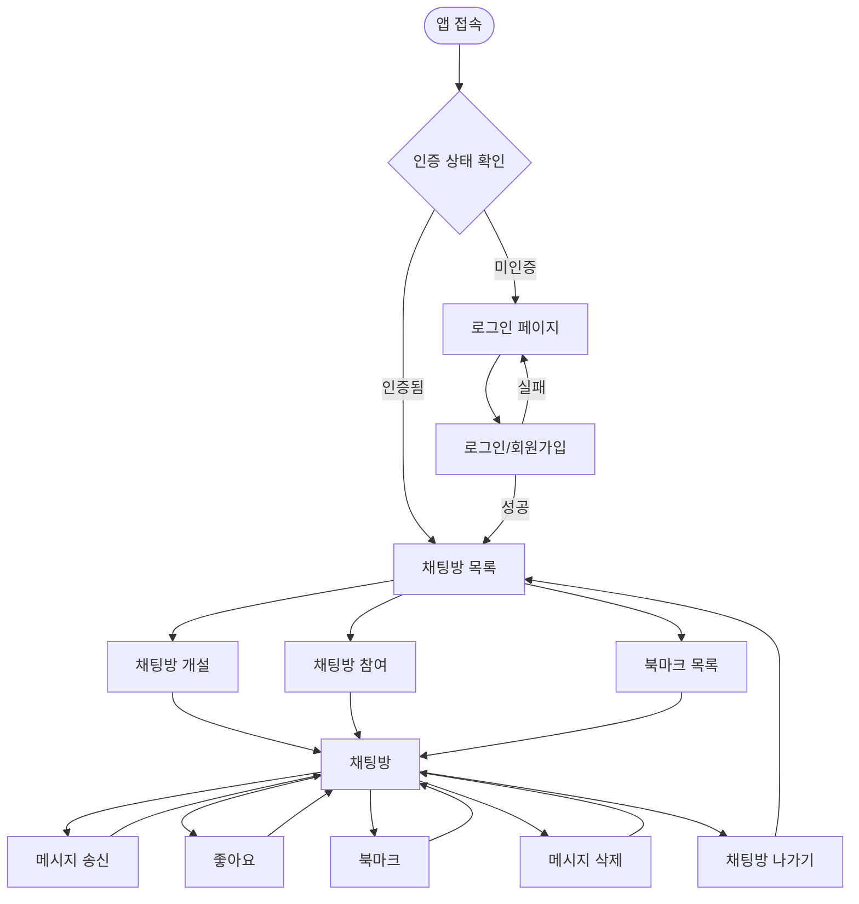

---

## 2. 기능별 상세 Userflow

### 2.1 회원가입

#### 입력
- 이메일 주소
- 비밀번호
- 비밀번호 확인

#### 처리
1. 클라이언트 측 입력 유효성 검증
   - 이메일 형식 검증
   - 비밀번호 최소 길이 검증
   - 비밀번호 일치 여부 확인
2. 서버로 회원가입 요청 전송
3. Hono 미들웨어에서 요청 데이터 검증
4. Supabase Auth를 통한 계정 생성
5. 이메일 중복 확인 (Supabase 내부 처리)
6. 계정 생성 성공 시 세션 생성

#### 출력
- 성공: 채팅방 목록 페이지로 리다이렉트
- 실패: 에러 메시지 표시 (중복 이메일, 유효성 오류 등)

#### 엣지케이스
- 이미 가입된 이메일로 재가입 시도
- 네트워크 오류 발생
- 비밀번호 정책 미충족

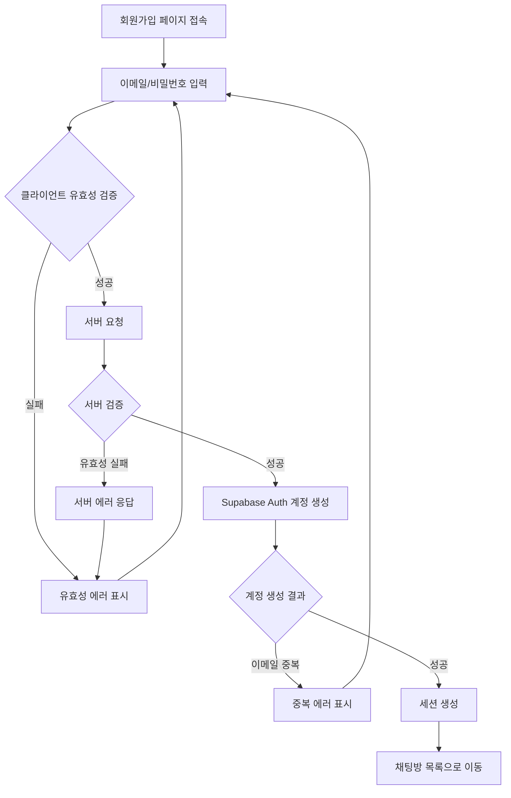

---

### 2.2 로그인

#### 입력
- 이메일 주소
- 비밀번호

#### 처리
1. 클라이언트 측 입력 유효성 검증
   - 이메일 형식 검증
   - 비밀번호 입력 여부 확인
2. 서버로 로그인 요청 전송
3. Hono 미들웨어에서 요청 데이터 검증
4. Supabase Auth를 통한 인증 처리
5. 인증 성공 시 세션 토큰 발급 및 저장

#### 출력
- 성공: 채팅방 목록 페이지로 리다이렉트
- 실패: 에러 메시지 표시 (잘못된 자격 증명 등)

#### 엣지케이스
- 존재하지 않는 계정으로 로그인 시도
- 잘못된 비밀번호 입력
- 세션 토큰 저장 실패
- 네트워크 오류 발생

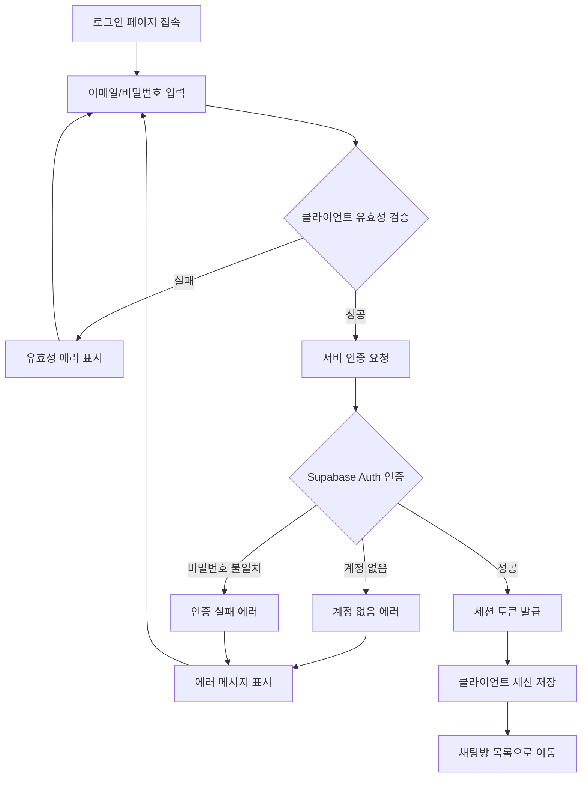

---

### 2.3 채팅방 개설

#### 입력
- 채팅방 이름
- 채팅방 설명 (선택)
- 공개 범위 설정

#### 처리
1. 클라이언트 측 입력 유효성 검증
   - 채팅방 이름 필수 입력 확인
   - 채팅방 이름 길이 제한 확인
2. 인증 상태 확인 (미들웨어)
3. 서버로 채팅방 생성 요청 전송
4. Hono 핸들러에서 데이터 검증
5. 채팅방 레코드 생성 (Supabase)
6. 생성자를 채팅방 멤버로 자동 추가

#### 출력
- 성공: 생성된 채팅방으로 이동
- 실패: 에러 메시지 표시

#### 엣지케이스
- 세션 만료 상태에서 생성 시도
- 중복된 채팅방 이름 (정책에 따라)
- 채팅방 생성 수 제한 초과

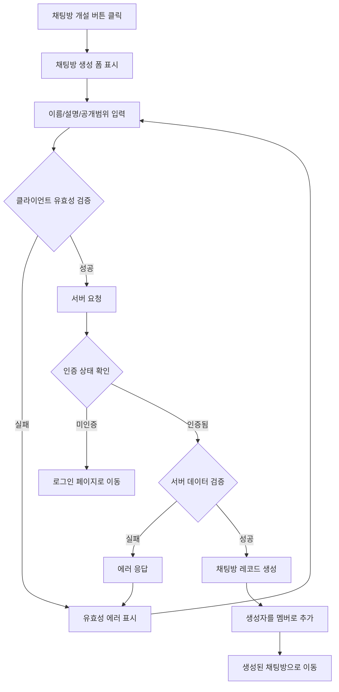

---

### 2.4 채팅방 참여

#### 입력
- 채팅방 목록 조회 요청
- 검색 키워드 (선택)
- 참여할 채팅방 선택

#### 처리
1. 인증 상태 확인
2. 채팅방 목록 조회 요청
   - 검색어가 있으면 필터링 적용
   - 공개 범위에 따른 접근 가능한 방만 조회
3. 채팅방 선택 시 참여 요청
4. 이미 참여 중인지 확인
5. 신규 참여 시 멤버 레코드 추가
6. 채팅방 입장

#### 출력
- 목록 조회 성공: 채팅방 목록 표시
- 참여 성공: 채팅방 화면으로 이동
- 실패: 에러 메시지 표시

#### 엣지케이스
- 삭제된 채팅방 참여 시도
- 비공개 채팅방 접근 시도
- 채팅방 인원 제한 초과
- 이미 참여 중인 채팅방 재참여

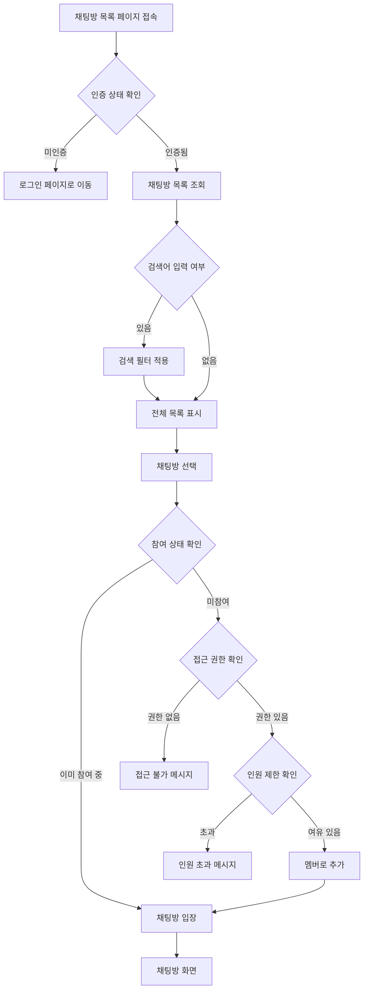

---

### 2.5 메시지 송신

#### 입력
- 메시지 내용 (텍스트/이모지)

#### 처리
1. 인증 상태 확인
2. 채팅방 참여 상태 확인
3. 클라이언트 측 메시지 유효성 검증
   - 빈 메시지 확인
   - 메시지 길이 제한 확인
4. 서버로 메시지 전송 요청
5. Hono 핸들러에서 데이터 검증
6. 메시지 레코드 생성 (Supabase)
7. 낙관적 UI 업데이트 (클라이언트)
8. 폴링을 통한 동기화

#### 출력
- 성공: 메시지가 채팅창에 표시
- 실패: 전송 실패 표시 및 재시도 옵션

#### 엣지케이스
- 세션 만료 상태에서 전송 시도
- 채팅방에서 퇴장된 상태에서 전송 시도
- 네트워크 오류로 인한 전송 실패
- 메시지 길이 초과
- 연속 전송으로 인한 Rate Limit

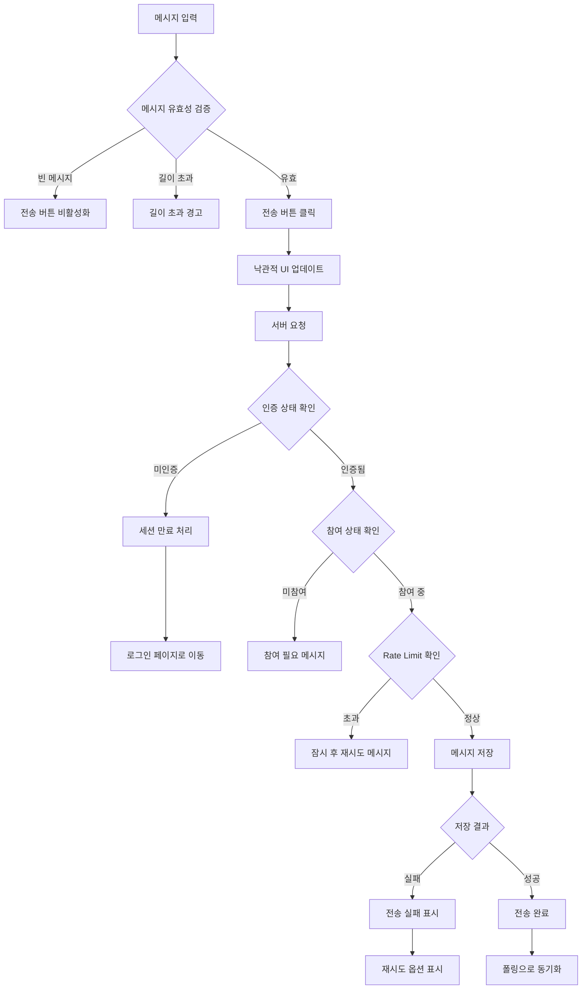

---

### 2.6 좋아요 (리액션)

#### 입력
- 대상 메시지 선택
- 좋아요 토글 액션

#### 처리
1. 인증 상태 확인
2. 대상 메시지 존재 여부 확인
3. 기존 리액션 상태 확인
4. 토글 처리
   - 리액션이 없으면 추가
   - 리액션이 있으면 제거
5. 리액션 집계 수 갱신

#### 출력
- 성공: 리액션 상태 및 집계 수 업데이트
- 실패: 에러 메시지 표시

#### 엣지케이스
- 삭제된 메시지에 리액션 시도
- 동시에 여러 리액션 요청
- 네트워크 지연으로 인한 중복 요청

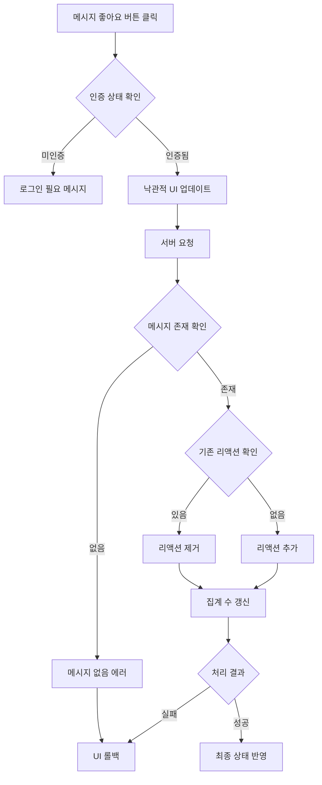

---

### 2.7 북마크

#### 입력
- 대상 메시지 선택
- 북마크 토글 액션

#### 처리
1. 인증 상태 확인
2. 대상 메시지 존재 여부 확인
3. 기존 북마크 상태 확인
4. 토글 처리
   - 북마크가 없으면 추가
   - 북마크가 있으면 제거
5. 북마크 목록 갱신

#### 출력
- 성공: 북마크 상태 업데이트
- 실패: 에러 메시지 표시

#### 엣지케이스
- 삭제된 메시지 북마크 시도
- 동시에 여러 북마크 요청
- 북마크 개수 제한 초과

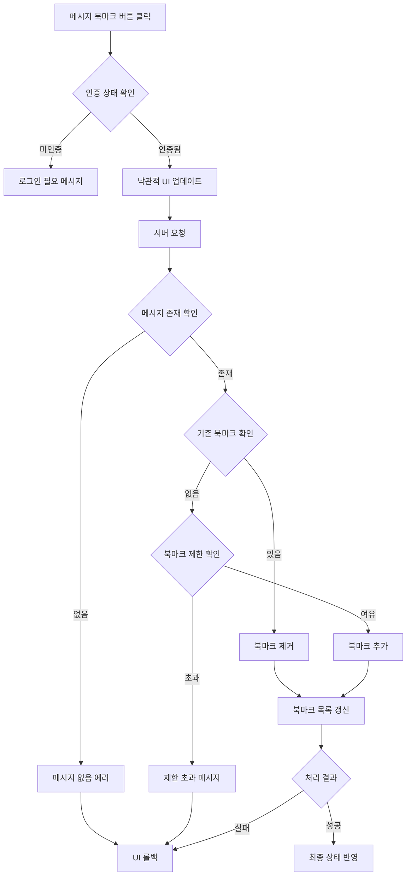

---

### 2.8 북마크 목록 조회

#### 입력
- 북마크 목록 페이지 접근

#### 처리
1. 인증 상태 확인
2. 사용자의 북마크 목록 조회
3. 각 북마크에 연결된 원본 메시지 정보 조회
4. 삭제된 메시지 처리 (표시 방식 결정)

#### 출력
- 성공: 북마크된 메시지 목록 표시
- 실패: 에러 메시지 표시

#### 엣지케이스
- 북마크가 없는 경우
- 원본 메시지가 삭제된 경우
- 원본 채팅방이 삭제된 경우

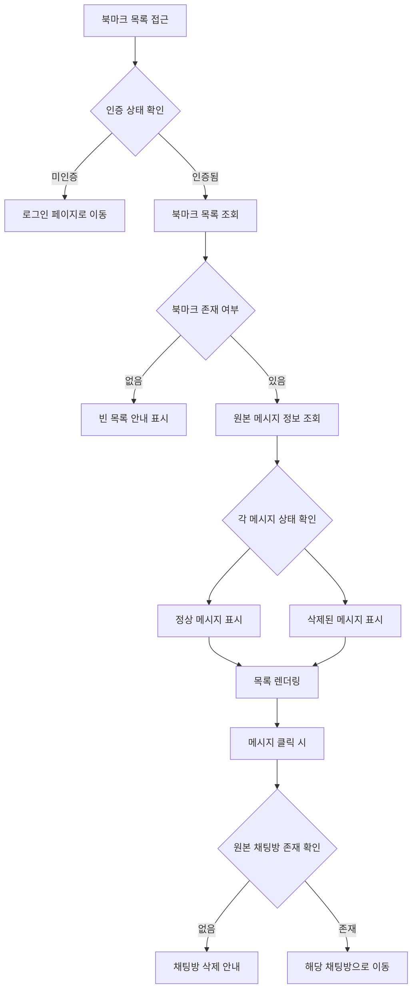

---

### 2.9 메시지 삭제

#### 입력
- 삭제할 메시지 선택
- 삭제 확인

#### 처리
1. 인증 상태 확인
2. 메시지 존재 여부 확인
3. 메시지 작성자 확인 (본인 여부)
4. 삭제 확인 프로세스
5. 소프트 삭제 또는 하드 삭제 수행
6. 관련 리액션/북마크 처리

#### 출력
- 성공: 메시지 삭제 완료 및 UI에서 제거
- 실패: 에러 메시지 표시

#### 엣지케이스
- 타인의 메시지 삭제 시도
- 이미 삭제된 메시지 재삭제 시도
- 삭제 중 네트워크 오류

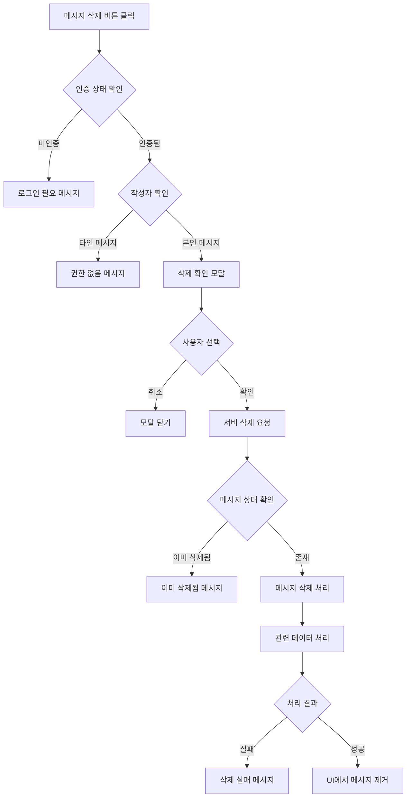

---

## 3. 화면 전환 흐름

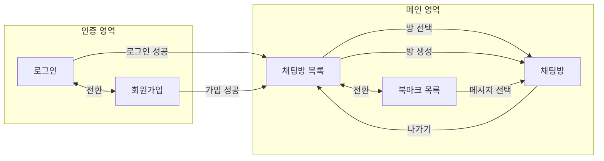

---

## 4. 인증 상태에 따른 분기 처리

### 4.1 인증 필요 페이지 접근 시

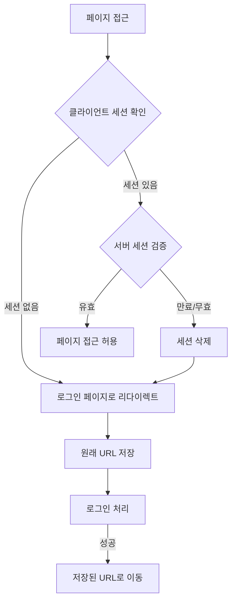

### 4.2 인증 상태 변경 시

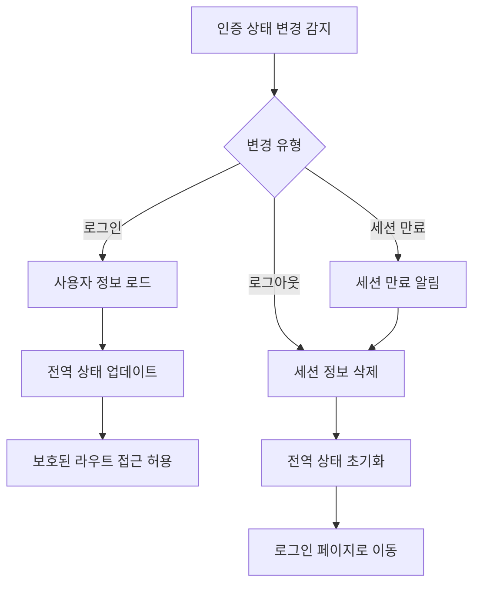

---

## 5. 에러 처리 흐름

### 5.1 네트워크 에러

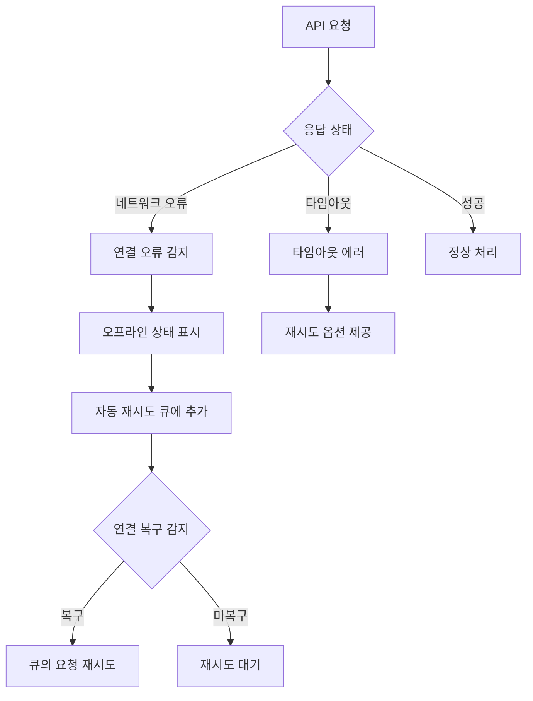

### 5.2 서버 에러

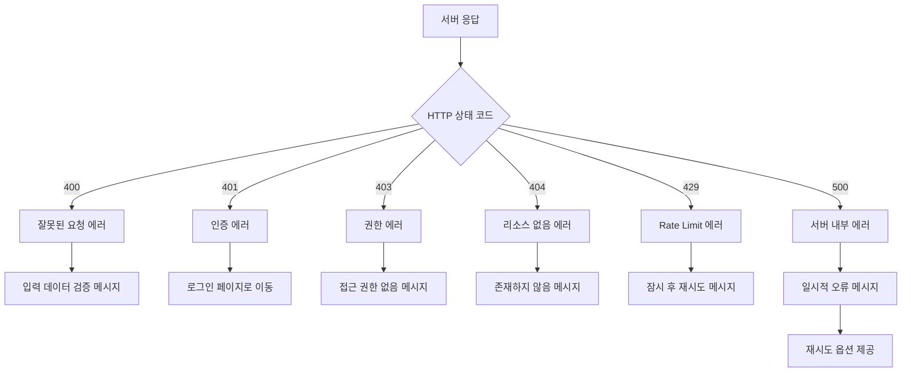

### 5.3 클라이언트 에러

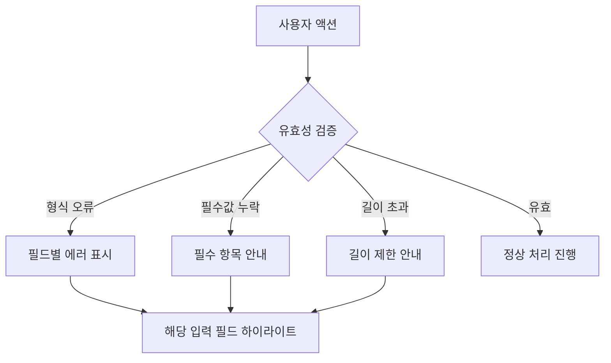

---

## 6. 폴링 기반 메시지 동기화 흐름

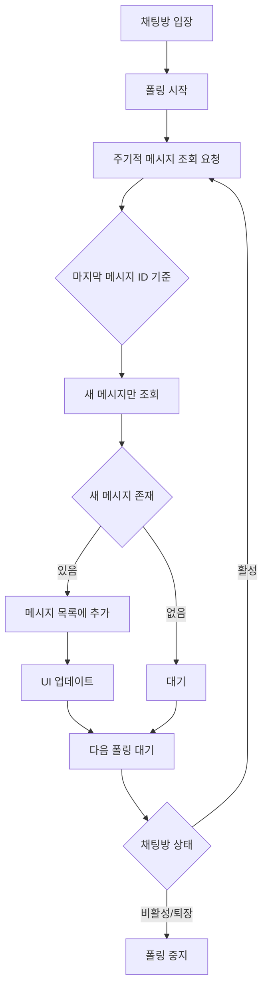

---

## 7. 상태 관리 흐름 (Flux 패턴)

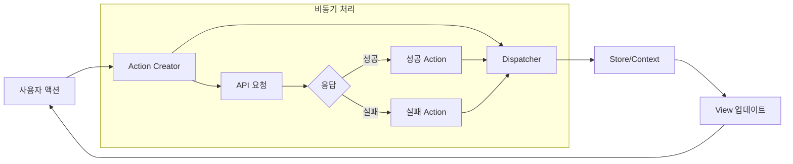
